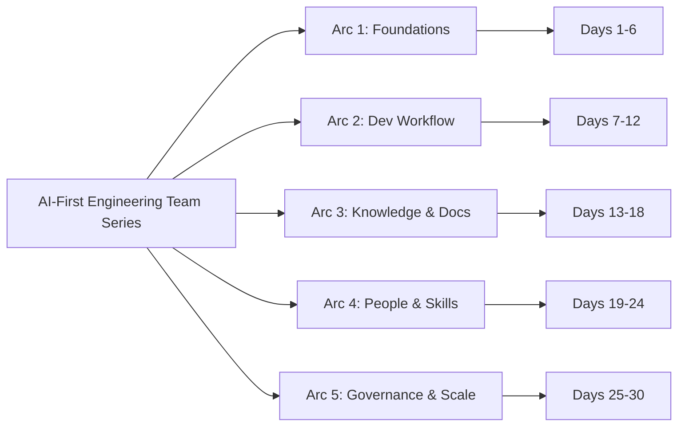

Thirty days of writing about AI tooling gave me the individual perspective — what changes for one engineer using Claude Code, GitHub Copilot, and Copilot Studio.

This series asks the harder question: **what changes for the team?**

Not the productivity of one engineer with AI. The culture, workflows, practices, and human dynamics of an entire engineering team that treats AI as a first-class part of how they build software. The AI-first engineering team.

---

## Why This Series

Most AI adoption content is individual-focused. "Here's how to use Copilot faster." "Here's my Claude Code workflow." That's useful, but it's not where the hard problems are.

The hard problems are team-level:
- How does code review change when half the code is AI-assisted?
- How do you onboard a junior engineer when AI is doing a lot of what used to be their learning work?
- What does seniority mean when a language model can generate correct code faster than a senior engineer?
- How do you maintain institutional knowledge when AI is mediating more and more of the knowledge work?

These are the questions I'm working through in practice. Thirty posts to think through them carefully.

---

## The Five Arcs

### Arc 1 — Foundations: What "AI-First Team" Actually Means (Days 1–6)

| Day | Post |
|-----|------|
| 1 | What Does "AI-First Engineering Team" Actually Mean? |
| 2 | The AI-First Team Maturity Model — Where Is Your Team Today? |
| 3 | The Full AI Toolchain for Engineering Teams |
| 4 | Rethinking Team Roles in an AI-First World |
| 5 | AI-First Team Culture: Norms, Expectations, and Psychological Safety |
| 6 | Measuring Progress — What Metrics Actually Matter for an AI-First Team |

### Arc 2 — The Development Workflow Reimagined (Days 7–12)

| Day | Post |
|-----|------|
| 7 | AI-First Sprint Planning and Task Breakdown |
| 8 | Writing Code as a Team with AI — Pair Programming Norms |
| 9 | Code Review Culture When AI Writes the Code |
| 10 | AI-First Pull Request and Commit Hygiene |
| 11 | Testing in an AI-First Team — Trust, Verification, and Coverage |
| 12 | AI in the CI/CD Pipeline — Automated Quality Gates |

### Arc 3 — Knowledge, Documentation, and Context (Days 13–18)

| Day | Post |
|-----|------|
| 13 | Documentation Culture in an AI-First Team — Better or Worse? |
| 14 | Architecture Decisions with AI — ADRs, Design Reviews, Technical Debt |
| 15 | Onboarding New Engineers into an AI-First Codebase |
| 16 | Knowledge Transfer and Institutional Memory with AI |
| 17 | AI-Assisted Incident Response — When Production Breaks |
| 18 | Cross-Functional Communication — PMs, Designers, and AI Engineers |

### Arc 4 — People, Skills, and the Human Side (Days 19–24)

| Day | Post |
|-----|------|
| 19 | Junior Engineers in an AI-First Team — Different, Not Lesser |
| 20 | Senior Engineers in an AI-First Team — What Seniority Means Now |
| 21 | The AI-Skeptic on Your Team — How to Bring Them Along |
| 22 | Hiring for an AI-First Engineering Team |
| 23 | Learning and Upskilling in an AI-First Culture |
| 24 | Avoiding Over-Reliance and the Skill Atrophy Problem |

### Arc 5 — Governance, Enterprise, and the Road Ahead (Days 25–30)

| Day | Post |
|-----|------|
| 25 | Enterprise AI Governance for Engineering Teams |
| 26 | Scaling AI Adoption Across a Larger Engineering Org |
| 27 | Security, IP, and Compliance in an AI-First Team |
| 28 | Measuring ROI and Making the Business Case for AI |
| 29 | What Doesn't Change — The Human Core of Great Engineering |
| 30 | One Year of Building an AI-First Team — What I Learned |

---

The series starts tomorrow. Day 1 sets the foundation: what "AI-first team" actually means, and why it's a different problem from "team that uses AI tools."
