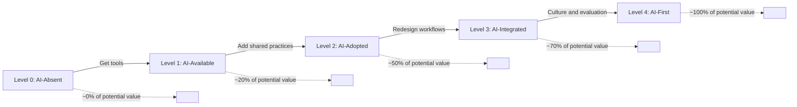

Most teams that call themselves "AI-first" aren't.

They have GitHub Copilot licences. Some engineers use them. Some don't. There's no policy, no shared practice, no intentional change to how the team works. They've added a tool without rethinking the workflow.

That's not AI-first. That's AI-available.

The distinction matters because AI-available teams capture maybe 20% of the value AI could deliver. The other 80% is locked behind workflow changes that most teams never make.

---

## The Spectrum

It helps to think about this as a spectrum rather than a binary:

**Level 0 — AI-absent**: No AI tools in use, or informal individual experimentation only. The team's workflows, norms, and processes were designed without AI in mind.

**Level 1 — AI-available**: Tools are licensed and available. Usage is individual and uncoordinated. Some engineers use Copilot for autocomplete; others don't. There are no shared practices. The team process hasn't changed.

**Level 2 — AI-adopted**: The team has made deliberate choices about which tools to use and when. There are shared practices — for code review, for documentation, for testing. Usage is consistent enough to have team-level norms.

**Level 3 — AI-integrated**: AI is embedded into the workflow at multiple stages. Planning, development, review, testing, documentation — each has AI touchpoints designed deliberately. The team has developed shared intuitions about when to trust AI output and when to verify it.

**Level 4 — AI-first**: The team's processes, roles, and practices were designed with AI as a first-class participant. Workflows start from the assumption that AI will be involved. The team actively manages AI usage, evaluates it, and improves it.

Most teams in 2026 are at Level 1 or early Level 2. A few are at Level 3. Level 4 is rare — not because the tools aren't there, but because the organisational and cultural work hasn't happened.

---

## What Actually Changes at Level 4

The surface change is tooling. The deep changes are:

**Workflow design.** AI-first teams design their workflows from scratch rather than bolting AI onto existing workflows. A code review process designed for humans writing every line is different from one designed for humans reviewing AI-assisted code. Sprint planning with AI-accelerated estimation is different from estimation without it.

**Norms and expectations.** When does AI-generated code need human review and to what depth? When is AI documentation good enough and when does it need editing? When should an engineer use AI to generate a solution vs. think through it themselves? AI-first teams have answered these questions and have shared answers.

**Role definitions.** What does a senior engineer's value-add look like when AI can generate correct code for many tasks? What does onboarding look like when AI is doing a lot of what used to be junior-level work? These questions don't resolve themselves — AI-first teams have worked through them.

**Evaluation.** AI-first teams measure AI's contribution and failure modes, not just its presence. They know which tasks AI helps with reliably, which tasks it helps with unreliably, and which tasks it hurts. This knowledge shapes how the team uses it.

---

## The Common Mistake

The most common mistake is thinking AI adoption is a technology problem. You buy the right tools, give engineers access, and it happens.

It doesn't. AI adoption is a change management problem. The tools are the easy part. The hard parts are:
- Getting consistent usage across engineers with different AI inclinations
- Developing shared norms about AI output quality and trust
- Redesigning workflows to capture AI's actual benefits rather than fitting AI into legacy workflows
- Managing the psychological dimensions — fear, over-reliance, status anxiety

Teams that treat this as a technology problem get the tools but not the benefits. Teams that treat it as an organisational change problem get both.

---

## Where This Series Goes

Over the next 29 posts, I'm going to work through what AI-first actually looks like in practice — from the development workflow to knowledge management, from junior engineer dynamics to governance at enterprise scale.

I'm writing from inside this transition, not from the outside. The team I lead is mid-Level 3, working toward Level 4. The posts will reflect what I'm actually working through, not a retrospective from a team that figured it all out.

---

*Day 1 of the [AI-First Engineering Team series](/posts/ai-first-engineering-team-30-day-plan/).*
