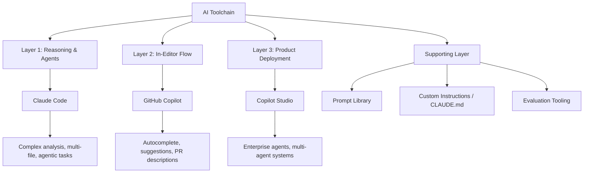

One of the first decisions an AI-first team lead makes is: what tools does the team use, and for what?

This sounds like a procurement question. It's actually an architectural question. The tools you choose, and how you assign them to different parts of the workflow, determine a lot of what's possible and what's hard.

---

## The Three-Layer Model

I covered this briefly in the April series, but it's worth revisiting with a team lens.

**Layer 1: Reasoning and agent work (Claude Code)**
Claude Code is for tasks that require deep reasoning, multi-file context, agentic execution, or complex analysis. Code modernisation, architectural review, complex debugging, documentation generation, writing agents. It's a reasoning partner, not an autocomplete tool.

Used by: individual engineers and leads. Not typically configured at the team level — it's personal tooling that varies by task.

**Layer 2: In-editor flow (GitHub Copilot)**
Copilot lives in the editor. Autocomplete, inline suggestions, test generation, PR descriptions. It accelerates the moment-to-moment writing work. Low friction, always available, high frequency.

Used by: every engineer, every day. This is the team's baseline AI layer.

**Layer 3: Product and deployment (Microsoft Copilot Studio)**
Copilot Studio is for building AI agents that other people use — customer-facing bots, internal tools, multi-agent workflows connecting enterprise systems. It's not a coding assistant; it's a deployment platform.

Used by: AI engineers and architects building agent solutions, not the broader team.

---

## The Duplication Trap

The most common mistake I see teams make: trying to use one tool for everything.

- Using Copilot Chat for deep reasoning tasks it's not suited for, because the team hasn't given engineers Claude Code access
- Using Claude Code for in-editor suggestions when Copilot would be faster and less interruptive
- Using generic LLM chat (ChatGPT, Copilot) for tasks that need an agentic agent with tool access

Each tool has a layer it's best at. Forcing one tool across all layers creates friction and underperformance. Engineers who don't have the right tool for a task either do the task badly with the wrong tool or don't use AI at all.

---

## What a Team Toolchain Decision Looks Like

When I'm thinking about the team toolchain, I work through these questions:

**1. What tasks are we trying to accelerate?**

Not "what AI tools should we buy" but "what are the high-friction, high-value tasks in our workflow?" Common answers: boilerplate generation, test writing, documentation, code review prep, PR descriptions, debugging.

**2. Which layer does each task belong to?**

In-editor flow tasks → Copilot. Reasoning/agentic tasks → Claude Code. Agent deployment → Copilot Studio.

**3. What's the team's baseline, and what's optional?**

I distinguish between baseline tools (everyone has access, everyone uses for their designated tasks) and optional tools (available for engineers who want them, not expected usage). This prevents the "AI tool graveyard" — a long list of tools nobody uses because there's no expectation.

**4. How do we prevent collision?**

When two tools could apply to the same task, make the choice explicit. "For test generation: use Copilot in-editor for unit tests from existing code; use Claude Code for complex integration tests requiring multi-file context." Clarity prevents engineers from spending time on tool choice instead of the task.

---

## The Supporting Layer

Beyond the three primary layers, most AI-first teams need:

**Prompt libraries.** A shared repository of prompts that work well for common tasks. Not a bureaucratic system — a simple document or wiki page. When an engineer finds a prompt that reliably generates good PR descriptions, it goes in the library.

**Custom instructions / system prompts.** Copilot and Claude Code both support custom instructions. A team-level instruction set that includes codebase conventions, architectural patterns, and team preferences makes AI output more consistent across engineers.

**Evaluation tooling.** At minimum, a lightweight way to track when AI output was used without modification vs. when it needed significant rework. Even simple signal informs better toolchain decisions.

---

## The Practical Starting Point

If I'm advising a team that's starting from scratch:

1. Get everyone on Copilot. Make it the expected baseline. Budget for it.
2. Give your senior engineers and leads Claude Code access. Identify the three tasks they'll use it for.
3. Don't buy more tools until the first two are actually used. Tool sprawl before adoption is a waste.
4. Write a one-page toolchain guide: what each tool is for, what it's not for, when to use each.

The one-page guide is more valuable than any amount of tool access. People use tools correctly when they understand the intent.

---

*Day 3 of the [AI-First Engineering Team series](/posts/ai-first-engineering-team-30-day-plan/). Previous: [The AI-First Team Maturity Model](/posts/ai-first-team-maturity-model/)*
