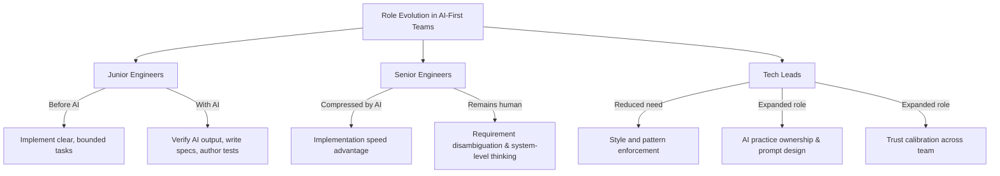

The most anxiety-producing question in AI adoption conversations is the one about roles. "What happens to junior engineers when AI can write code?" "Do we need as many senior engineers?" "What's a tech lead actually for now?"

These are real questions. I want to answer them honestly, without the "AI just creates more jobs" reassurance that sidesteps the actual change.

---

## What Changes for Junior Engineers

The traditional junior engineer role had a particular shape: given a clear, bounded task, implement it correctly. Write the CRUD endpoint. Fix the specified bug. Add the validation. Learn by doing lots of small things.

AI changes this by being genuinely good at the small, bounded, clearly-specified tasks. A junior engineer with Copilot can complete what used to be a day's work in a couple of hours. Which sounds like good news, but it has two complications.

**Complication 1: Learning curve.** A lot of what junior engineers learned by doing was the doing. Writing the same patterns repeatedly builds intuition about when something feels off. If AI is doing the repetitive work, what's building that intuition?

**Complication 2: Task distribution.** If AI accelerates the easy tasks, the tasks left for junior engineers to handle are the ones AI struggled with — ambiguous requirements, complex business logic, novel architectural decisions. These are harder tasks that juniors weren't traditionally expected to handle.

The junior role in an AI-first team needs reframing: not "implement the clear tasks" but "learn to direct AI effectively, verify AI output critically, and handle the tasks AI can't." That's a different skill development path. I'll come back to this on Day 19.

---

## What Changes for Senior Engineers

Senior engineers have historically justified their seniority through speed and correctness on implementation tasks, plus architectural judgment. AI commoditises a significant chunk of the implementation side.

What AI doesn't commoditise:
- **Requirement disambiguation.** Turning "make this faster" into a concrete specification AI can execute against. AI can't interrogate the business requirements; senior engineers can.
- **System-level thinking.** Knowing that the clean solution to this component creates coupling problems three layers up. AI optimises locally; senior engineers think systemically.
- **Trust calibration.** Knowing when the AI's suggested approach is subtly wrong and why. This requires the deep understanding that comes from having built things without AI.
- **Judgement on irreversible decisions.** Architecture choices, library selections, data model decisions. These require experience and context that AI doesn't have.

Senior engineers who can do these things well become more valuable, not less, in an AI-first team. They're the translators between the business and the AI-executable specification. They're the verification layer for AI output on high-stakes decisions.

Senior engineers who were mainly fast implementers are facing a real change. The pace advantage compresses. The differentiation has to come from somewhere else.

---

## What Changes for Tech Leads

The tech lead role is the one I think about most, because it's the one I occupy.

Traditional tech lead responsibilities: technical direction, architecture decisions, code quality enforcement, unblocking engineers, cross-team coordination.

In an AI-first team, the code quality enforcement part changes significantly. A lot of what tech leads spent time on — pointing out missing error handling, inconsistent patterns, suboptimal implementations — AI catches before it gets to review. If you're spending most of your review time on things Copilot should have flagged, the team isn't using AI well.

What the tech lead role gains:
- **AI practice ownership.** Deciding what the team uses, how, and with what norms. This is a real technical leadership responsibility that didn't exist two years ago.
- **Prompt and instruction design.** Designing the custom instructions, prompt libraries, and workflow integrations that make AI useful at the team level. This is craft work that benefits from technical judgment.
- **AI output trust calibration.** The tech lead needs the deepest understanding of where AI is reliable and where it needs verification, because that judgment propagates through team practices.

---

## The Question Nobody Wants to Ask

Does an AI-first team need fewer people?

Sometimes, yes. A team of five engineers with effective AI tooling can deliver what a team of seven delivered without it. This is real and it's not comfortable to say.

But the more common pattern I've observed is not headcount reduction — it's scope expansion. The same team takes on more complex work because the routine work is handled faster. The opportunity cost of individual engineer time drops, which means more things are worth doing.

Whether that's good or bad depends on whether the scope expansion is meaningful work or padding. That's a management question, not an AI question.

---

*Day 4 of the [AI-First Engineering Team series](/posts/ai-first-engineering-team-30-day-plan/). Previous: [The Full AI Toolchain for Engineering Teams](/posts/the-full-ai-toolchain-for-engineering-teams/)*
