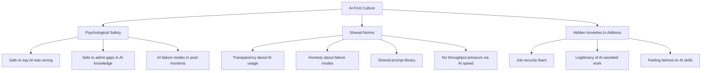

You can have the right tools, the right access, the right training. If the culture isn't right, adoption stalls.

I've seen this pattern more than once: an organisation invests in Copilot licences, runs a launch event, and three months later half the team isn't using it. The tools are fine. The culture didn't change.

---

## The Hidden Anxieties

Most AI adoption culture problems trace back to anxiety that doesn't get surfaced and addressed directly.

**"If AI does my job, will I lose my job?"**
This is the most common anxiety and the one most leads are worst at addressing. The bad answer is dismissive reassurance: "AI isn't replacing anyone, it's just a tool." Engineers don't believe this, and they're right not to.

A better answer is honest: "AI is changing what we need from people. It's making some things faster and changing what high-value work looks like. I'll tell you what I think that means for this team as I understand it better." This doesn't resolve the anxiety, but it opens a real conversation.

**"If AI helps me, does it mean my work isn't really mine?"**
Some engineers feel like using AI is cheating or makes their contributions less legitimate. This is particularly common among engineers who derived a lot of identity from their ability to write clean code quickly.

This anxiety is worth taking seriously rather than dismissing. The honest response: the value was always in the judgment, not the keystrokes. AI is changing what the keystrokes look like, not what the judgment is worth.

**"I'm already behind on AI — I'll look incompetent if I ask basic questions."**
Gaps in AI adoption widen if engineers who aren't using tools feel embarrassed to ask for help. Creating space for "I haven't figured this out yet" is active leadership work.

---

## The Norms That Matter

**Transparency about AI usage.** The team should be able to discuss which parts of a PR were AI-generated, which were written by hand, and why — without judgment in either direction. Hiding AI usage creates a fake picture of individual productivity and prevents learning.

**Honesty about AI failure modes.** When AI gives bad output, that should be discussable. If an engineer can't say "Copilot suggested something wrong here and it would have been subtle to catch," the team loses signal about where AI needs more verification.

**Shared learning rather than individual hoarding.** When someone finds a prompt that works well for a common task, it goes in the shared library. When someone discovers a class of tasks where AI is unreliable, it gets documented. The team's AI capability should grow collectively, not just individually.

**No performance pressure around AI speed.** If engineers feel their manager is expecting them to deliver twice as fast because "you have Copilot," the rational response is to use AI on everything regardless of quality and cut verification corners. The expectation pressure should be on quality, not throughput.

---

## What Psychological Safety Looks Like Here

In a standard engineering team, psychological safety means being able to raise concerns, ask questions, and disagree without fear. In an AI-first team, it has a specific additional dimension: the safety to say AI did something wrong, AI isn't helping here, or I don't understand what AI produced.

The signals that psychological safety is present:
- Engineers say in reviews "this was AI-generated and I'm not fully confident in it — can someone else verify the logic?"
- Post-mortems include "the AI suggested this approach and we accepted it without adequate verification" as a named failure mode
- Team retrospectives include "here's where AI made our week harder, not easier"
- Engineers ask openly how to use AI for tasks they haven't tried before

The signals it's absent:
- Engineers quietly fix AI mistakes without mentioning them
- Reviews never mention AI involvement
- Engineers who aren't using AI hide that fact
- Nobody talks about what AI does wrong

---

## The Conversation Most Teams Avoid

At some point a team that's being honest with each other will have this conversation: "Are we using AI well, or are we using it in ways that are degrading the team's capabilities?"

The concern is real. A team that uses AI to generate code nobody fully understands, that skips the learning work because AI does it faster, that accepts AI output without verification — that team is building technical debt in the form of reduced capability, not increased productivity.

This conversation requires trust and honesty, which is why most teams avoid it. The teams that have it, and act on what they learn, are the ones that build sustainable AI-first practice rather than brittle AI-dependent practice.

---

*Day 5 of the [AI-First Engineering Team series](/posts/ai-first-engineering-team-30-day-plan/). Previous: [Rethinking Team Roles in an AI-First World](/posts/rethinking-team-roles-in-an-ai-first-world/)*
