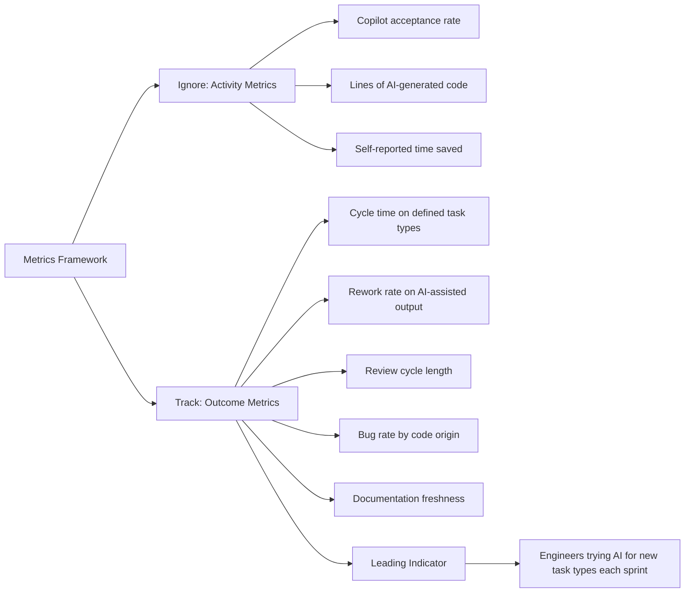

When a manager asks "how is AI adoption going?", they usually want a number. And the numbers that are easiest to produce — Copilot acceptance rate, lines of AI-generated code, hours reported as saved — are the numbers that tell you the least.

Here's the measurement problem: AI adoption is not a goal. It's a means to business and engineering outcomes. The metrics that matter are the ones that track whether AI is actually improving those outcomes.

---

## The Metrics to Ignore

**Copilot acceptance rate.** How often engineers accept Copilot suggestions. This measures usage frequency, not value. An engineer who accepts 80% of Copilot suggestions for boilerplate and deletes 80% of them during review is scoring well on acceptance rate while getting negative value.

**Lines of AI-generated code.** Measures volume, not quality. More AI-generated code is not better; correctly AI-generated code that doesn't need rework is better.

**Self-reported time saved.** Surveys asking engineers to estimate hours saved are optimistic and inconsistent. Engineers want to justify the tool investment, so they round up. The numbers aren't actionable.

**Licence utilisation.** Whether engineers are logging in and using the tool. This measures whether people are trying the tool, not whether the tool is working.

---

## The Metrics Worth Tracking

**Cycle time on defined task types.** Pick a class of tasks — write a unit test for an existing function, generate a PR description, add input validation to an existing endpoint — and measure how long they take on average before and after AI tooling. This is concrete, comparable, and directly linked to velocity.

**Rework rate on AI-assisted output.** What fraction of AI-generated code needs significant modification before it's committed? "Significant" means more than style fixes — logic changes, missing edge cases, architectural rework. Tracking this tells you whether AI output quality is high enough to be net positive.

**Review cycle length.** How many review rounds does a PR go through on average? If AI is making PRs cleaner, review cycles should shorten. If review length stays constant or increases, AI may be adding subtle errors that take more review time to catch.

**Bug rate by origin.** A harder metric to track but valuable: do bugs in production correlate with AI-assisted code segments? This requires tagging code at commit time (AI-assisted vs. human-written). The data tells you whether AI is introducing bugs at a different rate than human-written code.

**Documentation freshness.** If AI is helping with documentation, are docs being updated more frequently than before? Is the gap between code change and documentation update shrinking?

---

## The Leading Indicator I Use Most

The metric I find most useful in practice is simpler than any of the above: **"How often do engineers reach for AI for a new task type vs. a task type they've used AI for before?"**

When the answer is "mostly familiar task types," the team has hit a local optimum — AI is useful for known use cases and engineers haven't pushed into new territory. The value is real but bounded.

When the answer is "engineers regularly try AI for tasks they haven't before," the team is in a growth phase — capability is still expanding, and the ceiling hasn't been found.

This doesn't require tooling. It requires a conversation at retrospective: "What did you try AI for this sprint that you hadn't tried before? What worked, what didn't?"

---

## A Warning About Gaming

Any metric you track publicly will be gamed, usually inadvertently.

If you measure acceptance rate, engineers will accept suggestions they then immediately edit, because accepting and editing looks better than rejecting.

If you measure lines generated, engineers will use AI for more boilerplate rather than higher-value tasks, because boilerplate is high-volume.

This isn't malicious — it's human. People optimise for what they're measured on.

The safeguard is: measure outcomes, not activity. And measure outcomes that matter to the business, not outcomes that matter to the AI adoption programme. "Cycle time for feature delivery" is harder to game than "Copilot acceptance rate." It's also the number that actually matters.

---

*Day 6 of the [AI-First Engineering Team series](/posts/ai-first-engineering-team-30-day-plan/). Previous: [AI-First Team Culture: Norms, Expectations, and Psychological Safety](/posts/ai-first-team-culture-norms-and-psychological-safety/)*
