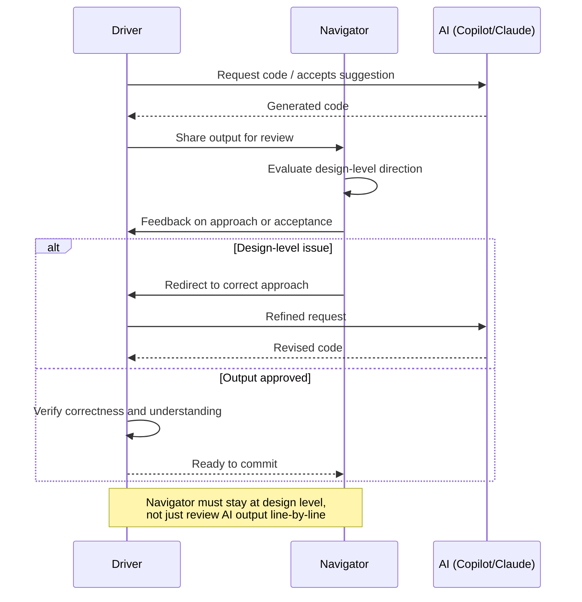

Traditional pair programming: two engineers, one keyboard, one screen. The driver writes; the navigator thinks ahead. Roles rotate. Learning happens bidirectionally.

AI changes the shape of this. Now there's a third party — always available, fast, doesn't get tired, and has no stake in whether the code is good.

---

## How AI Changes the Driver-Navigator Dynamic

When the driver has Copilot active, the flow of the session changes:

The driver is now partially responding to AI suggestions rather than purely implementing their own ideas. Good suggestions pull the driver in directions that might not be what the navigator expected. The navigator's job becomes harder: they're reviewing both the human's implementation intent and the AI's suggestions simultaneously.

The benefit: AI suggestions can be a useful third opinion. When both the driver and navigator aren't sure about an approach, a Copilot suggestion that handles it a different way can trigger a better discussion than either engineer's initial instinct.

The risk: AI suggestions can distract from the higher-level thinking that makes pairing valuable. If both engineers are engaged with the line-by-line AI output, nobody is thinking about the architectural pattern or the edge cases three steps ahead.

A norm that works: the navigator's role in an AI-assisted pairing session explicitly includes "evaluate whether we're going in the right direction at the design level, not just reviewing the AI output the driver is accepting."

---

## AI-Assisted Pairing Patterns

**Pattern 1: AI as the driver**

One engineer describes what needs to be written; the other engineers their Copilot or Claude Code to generate it. Both engineers evaluate the output together. This is fast for well-understood tasks and keeps the humans in the judgment role rather than the typing role.

Best for: implementing a pattern the team has done before, writing boilerplate that's low-risk, generating tests for existing code.

**Pattern 2: Human-first, AI-polish**

Humans write the core logic; AI fills in the surrounding code (error handling, logging, tests). Both engineers write the parts that require judgment; AI handles the parts that don't.

Best for: new features with non-trivial logic, code that needs to interact with existing complex systems.

**Pattern 3: AI scaffolds, humans critique**

AI generates a complete first draft; both engineers review it critically, identify what's wrong or missing, and revise. The AI draft is an input to the thinking, not a conclusion.

Best for: exploratory work where neither engineer is sure of the best approach. The AI draft makes the design space concrete.

---

## The Ownership Question

When AI writes a significant portion of the code in a pairing session, who owns it?

The technical answer: the engineer who authored the commit. The practical answer: the pair who directed, reviewed, and accepted the code.

The more important question is: does the pair understand the code they're shipping? If the answer is "not fully," that's a problem regardless of whether AI wrote it or a junior engineer wrote it.

I've made this a norm in our team: "If you can't explain why this code is correct in a code review, it's not ready to ship. That's true whether you wrote it, a colleague wrote it, or AI wrote it."

This sounds obvious. It's frequently violated when AI produces something that looks clean and passes tests but contains a subtle logic error nobody examined closely.

---

## When Pairing With AI Is Better Than Human Pairing

I'll say something that might be unpopular: for certain tasks, AI-assisted solo work is more productive than human pair programming.

Specifically: routine implementation tasks with clear specifications, test writing, documentation generation. For these, a single engineer with AI produces output of similar quality to two engineers without AI, faster.

This doesn't make human pairing obsolete. Human pairing is uniquely valuable for:
- Architectural decisions requiring joint judgment
- Debugging complex, non-obvious issues
- Knowledge transfer (junior to senior, or across team domains)
- Tasks where the spec itself needs collaborative refinement

Using human pairing time for what AI can't do, and using AI-assisted solo work for what it can, is a more efficient allocation than applying human pairing uniformly across all task types.

---

*Day 8 of the [AI-First Engineering Team series](/posts/ai-first-engineering-team-30-day-plan/). Previous: [AI-First Sprint Planning and Task Breakdown](/posts/ai-first-sprint-planning-and-task-breakdown/)*
