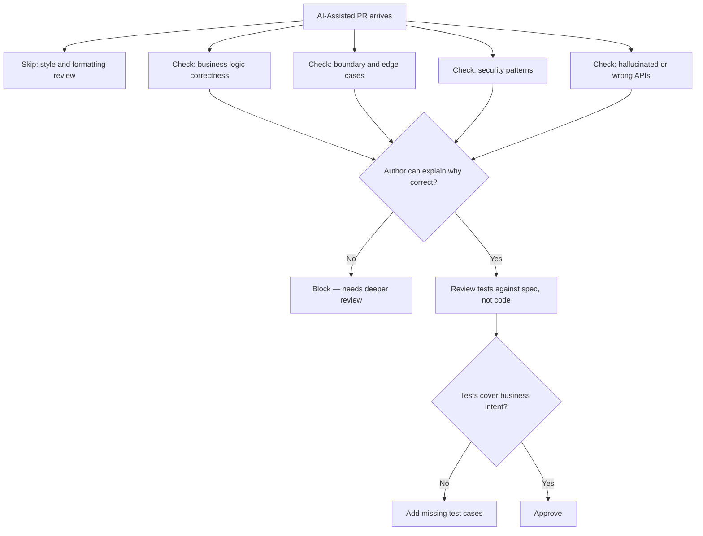

Code review is where AI-first teams most often underinvest.

There's a subtle psychological dynamic at play: AI-generated code looks clean. It follows style conventions, handles common error cases, passes lint checks. It looks like the output of a careful engineer. So reviewers give it less scrutiny than handwritten code that looks rougher.

This is backwards. The categories of mistakes AI makes are different from human mistakes, and reviewers need to know what to look for.

---

## What AI Gets Right (That Reviewers Can Skip)

Style and formatting: AI follows your code style conventions if they're in the prompt context. You can mostly skip checking indent size, naming conventions, and similar mechanical issues in AI-generated code.

Boilerplate correctness: error handling patterns, logging calls, standard validation — AI gets these right consistently for common patterns.

API surface: AI generally uses library APIs correctly for well-documented libraries.

These are the things junior engineers historically needed review time on. They're not where reviewer effort should go in AI-assisted PRs.

---

## What AI Gets Wrong (That Reviewers Must Check)

**Off-by-one and boundary conditions.** AI frequently generates code that's correct for the common case and wrong at boundaries. The loop that processes n items correctly but has a fence-post error. The date calculation that works except at year boundaries. These look correct in a quick read.

**Business logic correctness.** AI doesn't know your business rules unless you tell it. It fills gaps with plausible defaults that may or may not match intent. "Process the refund" might generate code that processes a full refund when the intent was a partial refund. The code is syntactically correct and logically coherent; it's just wrong for the specific business case.

**Subtle security issues.** SQL injection is easy to catch; AI rarely makes the obvious mistakes. The subtle ones — overly permissive queries, missing authorization checks in internal paths, logging sensitive data — are harder to catch and AI does make them.

**Context-specific assumptions.** AI generates code that assumes the normal case. If your system has unusual invariants — a field that can be null in production data even though the type says non-null, a service that behaves differently in multi-tenant mode — AI won't know unless told, and the resulting code will be fragile.

**Hallucinated APIs.** Less common with well-known libraries, more common with internal libraries or less-documented ones. The code compiles but calls a method that doesn't exist, or calls a method with the wrong signature. Catch these before merge, not in production.

---

## Review Norms for AI-Assisted PRs

**Annotate AI-assisted sections in the PR description.** "The validation logic in `validatePayment()` was AI-generated — I've reviewed the happy path but would appreciate a second look at the error conditions." This tells reviewers where to focus.

**Require explanation of business logic.** For any non-trivial business logic, the author should be able to explain why it's correct. "Copilot generated this" is not an explanation. "This handles the edge case where the order is partially fulfilled because..." is.

**Test coverage isn't enough.** AI-generated tests often test what AI generated, not what the code should do. If AI wrote the code and AI wrote the tests, the tests may be internally consistent but incorrectly specified. Require a human to review whether the tests are testing the right things.

**Time-box review differently.** Spending 30 minutes on style review and 5 minutes on business logic review is the wrong allocation for AI-assisted code. Flip it. Set a norm: spend less time on "does this look clean" and more on "is this doing the right thing."

---

## The Meta-Review Question

I've started adding one question to reviews of AI-assisted PRs that I don't always ask for handwritten code: "Did the author understand this well enough to ship it?"

This isn't about competence. It's about whether the engineer who authored the PR can be the on-call owner of the code when it breaks in production. If the answer is "they accepted AI output they didn't fully understand," we have a problem regardless of whether the code looks correct today.

The standard: you are responsible for the code you ship, whether you wrote it or AI wrote it. Review time is the moment to verify you understand it well enough to own it.

---

*Day 9 of the [AI-First Engineering Team series](/posts/ai-first-engineering-team-30-day-plan/). Previous: [Writing Code as a Team with AI — Pair Programming Norms](/posts/writing-code-as-a-team-with-ai/)*
