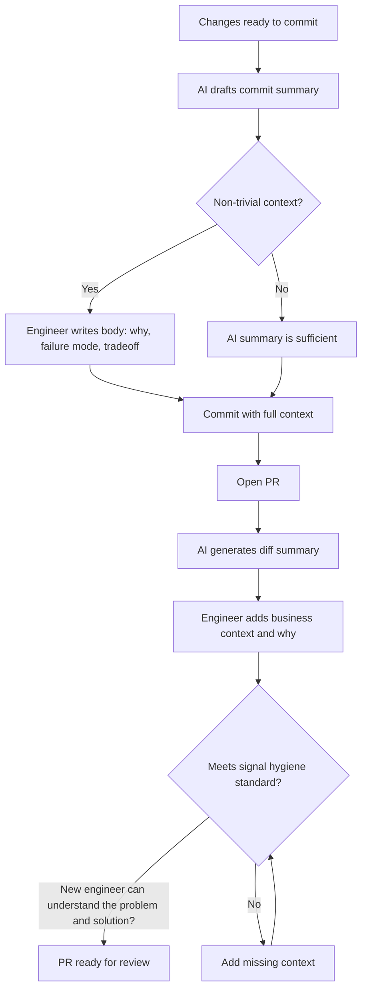

Pull requests and commits are communication artefacts. They tell reviewers what changed and why. They tell future engineers what the intent was when the code was written.

AI can help write these. It can also pollute them with text that looks thorough but contains no real signal. The difference depends entirely on how the team uses it.

---

## AI-Generated PR Descriptions

GitHub Copilot's PR description generation is genuinely useful. It reads the diff and produces a structured summary. For many PRs, this saves 10 minutes of writing and produces a description that's more comprehensive than what the engineer would have written.

The problem: the generated description summarises what changed, not why. "Added validation to the payment processor" tells a reviewer what the diff shows. "Added validation because the payment processor was accepting negative amounts, which caused downstream ledger corruption" tells a reviewer why it matters.

**The norm I use:** AI generates the first draft. The engineer adds the "why" — the business context, the failure mode being fixed, the tradeoff that was made. The diff summary stays; the context gets added by hand.

This takes three minutes instead of ten, and produces a better description than the engineer would have written from scratch. The AI handles the "what"; the engineer provides the "why."

---

## Commit Messages

Commit messages are where AI assistance is most mixed.

AI-generated commit messages tend to be descriptive at the file level: "Update PaymentProcessor.cs to add amount validation." This is marginally better than "fix stuff" but doesn't help future engineers understand the intent.

Good commit messages follow the rule: describe what the commit does in the imperative mood, and if the why isn't obvious, explain it. "Reject negative payment amounts to prevent ledger corruption" is a commit message. "Update payment validation logic" is a file description.

AI doesn't know your business domain, your failure modes, or your architectural intent. These things can't be generated — they have to come from the engineer.

My approach: use AI to draft the first line (the summary), then write the body myself if there's context worth preserving. For obvious changes, AI's summary is fine. For anything with non-trivial history, the body is worth writing.

---

## Commit Granularity

AI tooling changes the practical question of commit granularity.

Without AI: atomic commits required discipline. Engineers often squashed "WIP" commits before merging because the commit history of the development process was messy.

With AI: more fine-grained commits can happen naturally if engineers commit as they verify AI output. "AI generated the scaffold; this commit is after I verified the happy path. Next commit is after I verified the error cases." This produces a commit history that reflects the verification process, which is actually useful.

This isn't a standard practice yet, but it's a pattern worth experimenting with. A commit history that shows "AI generated → verified core logic → added missing edge case → fixed discovered bug" tells a clearer story than a single squashed "implement feature" commit.

---

## The CLAUDE.md Connection

For teams using AI coding tools, the repository's documentation context matters. I recommend keeping a `CLAUDE.md` (or equivalent) that includes:
- Commit message conventions
- PR description expectations
- What "done" means for this codebase
- Key patterns and architectural decisions that AI shouldn't deviate from

When engineers give AI this context, the generated descriptions and suggested code align with team conventions. Without it, AI generates generically correct output that doesn't reflect your specific context.

This is the team investment that compounds. A well-maintained context document improves every AI interaction across every engineer. A few hours of documentation work multiplies across the whole team.

---

## The Signal Hygiene Principle

The underlying principle: every commit message, every PR description, every comment is a communication to a future engineer who doesn't know what you were thinking. AI can generate text quickly. It can't generate the context that makes that text useful.

The measure: could a new engineer reading this PR description understand what problem was solved and why this was the right solution? If yes, it's good hygiene. If no, it needs the human layer that AI can't provide.

---

*Day 10 of the [AI-First Engineering Team series](/posts/ai-first-engineering-team-30-day-plan/). Previous: [Code Review Culture When AI Writes the Code](/posts/code-review-culture-when-ai-writes-the-code/)*
