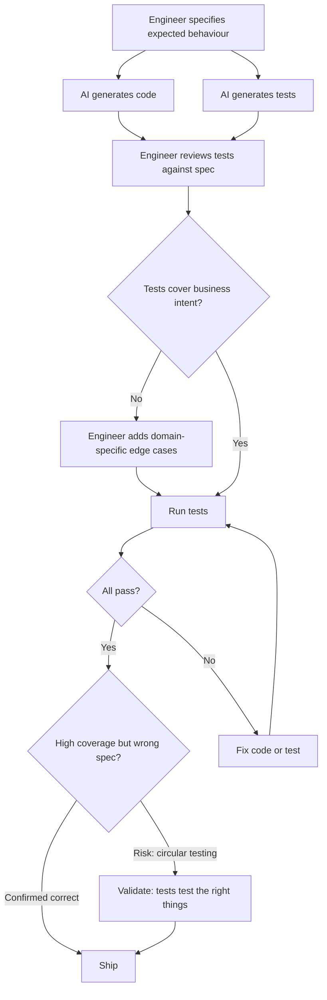

Test generation is one of the clearest wins in AI-assisted development. An engineer can generate a reasonable unit test suite for a function in seconds rather than minutes. Coverage increases, the tedious work of writing assertions decreases.

The problem nobody talks about enough: when AI writes the code and AI writes the tests, the test suite may be internally consistent and completely wrong.

---

## The Circular Testing Problem

If AI generates code that handles the happy path correctly but has a subtle edge case bug, and then AI generates tests for that code, the tests will test the happy path thoroughly and likely test the edge case by calling the same flawed logic.

The tests pass. The bug ships.

This isn't hypothetical. It's the natural failure mode when AI generates both code and tests without a human who understands the expected behavior doing the verification.

The safeguard: tests must be written against a specification of expected behaviour, not against an implementation. When AI generates tests, the engineer must verify that the test cases reflect business intent, not just implementation correctness.

---

## What AI Does Well in Testing

**Unit test boilerplate.** The setup, teardown, mock configuration, assertion structure. These are mechanical and AI generates them correctly and consistently. The time savings here are real.

**Happy path coverage.** AI reliably generates test cases for the documented, expected flow. If your function receives valid inputs, AI will generate tests that verify correct outputs.

**Common error cases.** Null inputs, empty collections, negative numbers — AI knows these are common edge cases and generates tests for them. Not all edge cases, but the common ones.

**Test naming and structure.** AI generates well-named, well-structured tests that follow testing conventions. The readability of AI-generated test suites is often higher than hurriedly-written human tests.

---

## What AI Gets Wrong in Testing

**Business rule edge cases.** Your domain has specific rules that aren't obvious from the code. The order that can be cancelled unless it's been partially shipped. The discount that applies unless the customer account is in arrears. AI doesn't know these rules and won't test them unless told explicitly.

**Integration boundary conditions.** How your code behaves when the external service returns an unexpected response format, when the database returns zero rows vs. returning null, when a message arrives out of order. These require domain knowledge of your system's integration surfaces.

**Negative-space tests.** Tests that verify the system does NOT do something, or that a side effect does NOT occur. AI focuses on what code does, not on what it should prevent. Missing these tests means missing an important category of behaviour verification.

**The test that would fail.** AI is trained to write tests that pass against the code it just generated. It's not incentivised to write a test that would fail to reveal a bug. A human writing tests for code they're suspicious of will write different tests than AI writing tests for code it generated.

---

## The Verification Practice

The practice that works: human review of AI-generated tests against the specification, not against the code.

Concretely:
1. Engineer specifies the expected behaviour (in ticket, comments, or conversation with AI)
2. AI generates both code and tests
3. Engineer reviews tests against the specification, not by running them
4. Engineer adds test cases for domain-specific edge cases AI wouldn't know
5. Tests run to confirm pass

Step 3 is where most teams skip. "Tests are green" is not the same as "tests are correct." A minute of reviewing whether the test cases cover what the code is supposed to do is worth more than high coverage on tests that test the wrong things.

---

## Test Coverage Metrics in an AI-First Team

Coverage metrics become less meaningful when AI generates tests. AI can drive coverage to 90% quickly by generating tests for every code path — but coverage that high on AI-generated tests is not strong evidence of correctness.

I've moved toward looking at: what percentage of business requirements in the story have corresponding test cases? This is harder to measure but more meaningful. It requires the tests to be connected to intent, not just to code paths.

---

*Day 11 of the [AI-First Engineering Team series](/posts/ai-first-engineering-team-30-day-plan/). Previous: [AI-First Pull Request and Commit Hygiene](/posts/ai-first-pull-request-and-commit-hygiene/)*
