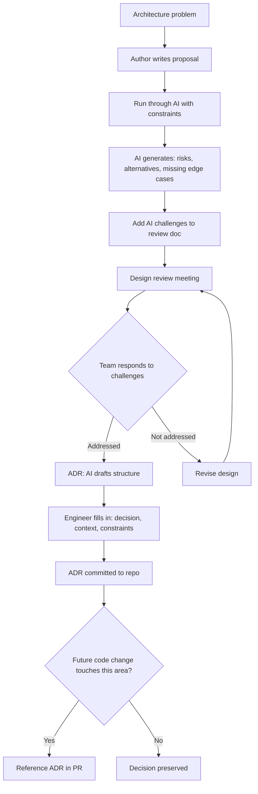

Architecture decisions are where AI assistance gets most interesting and most dangerous at the same time.

Interesting because AI can reason about architectural tradeoffs with genuine sophistication — surfacing options the team hasn't considered, identifying coupling risks, comparing approaches against known patterns.

Dangerous because architectural decisions are irreversible, context-dependent, and require knowledge of your specific constraints that AI doesn't have unless you provide it explicitly.

---

## Where AI Adds Real Value in Architecture Work

**Option generation.** Given a problem description, AI generates a range of approaches the team might not have considered. The value isn't that AI picks the right approach — it's that AI expands the option space the team evaluates. Teams have a limited number of patterns in their active working memory; AI draws from a much larger set.

**Tradeoff analysis.** "Compare these three approaches against our constraints: latency requirement of P95 < 100ms, eventual consistency acceptable, team familiarity with Azure services." AI produces structured tradeoff analysis that's a useful input to the design discussion. It's not the final decision, but it's a better starting point than team members arguing from intuition.

**ADR drafting.** Architecture Decision Records are important and almost never written because they're tedious to produce. AI drafts ADRs competently given the decision, the context, and the outcome. Engineers add the specifics; AI handles the structure. This lowers the barrier enough that teams actually write them.

**Identifying coupling.** Given a proposed design, AI can identify where components are tightly coupled in ways that might not be obvious, where abstractions are leaking, or where a design creates patterns that are hard to test. This doesn't replace a good architecture review, but it catches the common issues before the meeting.

---

## Where AI Gets Architecture Wrong

**Constraint blindness.** AI doesn't know your constraints unless you tell it. Budget limits, team skill constraints, existing vendor relationships, regulatory requirements, operational complexity limits — these shape every real architectural decision and are invisible to AI unless explicitly provided. AI-generated architectures without constraints tend to be academically correct and practically inapplicable.

**Organisational context.** "Use a service mesh" is the right answer in many systems. It may be the wrong answer for a team that doesn't have the operational expertise to run one, or for an organisation that doesn't have the cloud budget. AI reasons about technical tradeoffs; the non-technical constraints that determine "right for this situation" are invisible to it.

**Existing system knowledge.** AI doesn't know your legacy integrations, your deployment topology, the systems you're constrained by. It reasons about the greenfield case. Real architectural decisions are made in brownfield systems with historical constraints.

**Risk calibration.** AI can identify risks, but it doesn't have a good model for your organisation's risk tolerance, your team's debugging capacity, or your on-call load. A microservices architecture is technically correct for many systems; it may be wrong for a team that's already overwhelmed by operational complexity.

---

## The AI-Assisted Design Review

A pattern that works well: bring AI into the design review as a challenger, not a presenter.

Before the review:
1. Author writes the design proposal
2. Author runs it through Claude Code with the prompt: "What are the risks, the missing edge cases, and the alternatives I haven't considered?"
3. AI output gets included in the review document as "challenges to address"

In the review:
- The team responds to the AI-generated challenges
- Engineers can add their own challenges
- The design is defended or revised

This produces better reviews than starting from a blank page. The AI challenges force the author to think more carefully before presenting. The review meeting focuses on the substantive questions rather than discovering obvious issues.

---

## Technical Debt and AI

AI accelerates code production, which can accelerate technical debt accumulation if you're not careful.

The pattern: AI generates code quickly, corners get cut on design because velocity pressure is high and AI makes it easy to ship fast, the codebase accumulates shortcuts that make future work harder.

This is an existing problem that AI amplifies. The counter-practice: include architectural review in the definition of done for significant features, use AI to identify technical debt early rather than only to generate code, and treat AI-generated code with the same architectural standards you'd apply to human-written code.

"AI wrote it fast" is not a justification for skipping the design work. It just means you have more time to do the design work before implementation, not less.

---

*Day 14 of the [AI-First Engineering Team series](/posts/ai-first-engineering-team-30-day-plan/). Previous: [Documentation Culture in an AI-First Team — Better or Worse?](/posts/documentation-culture-in-an-ai-first-team/)*
