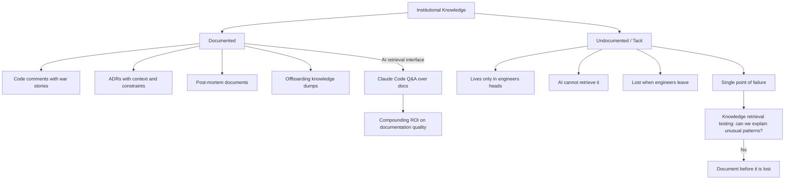

Every team has knowledge that lives in people's heads rather than in systems. Why the authentication service uses the unusual session management approach. Why the order processor has that seemingly redundant idempotency check. What happened the last time someone removed the rate limiter.

This knowledge is what separates a team that can debug a novel production incident in 30 minutes from a team that takes two days. And it's the knowledge that evaporates when engineers leave.



---

## What AI Can and Can't Do for Institutional Memory

AI is excellent at retrieving documented knowledge. "What does this service do?" "What are the dependencies?" "Explain this code." When knowledge is in the codebase, documentation, or commit history, AI can surface it quickly.

AI cannot retrieve undocumented knowledge. The architectural decision that was made in a meeting and never written down. The failure mode that was discovered in a production incident and fixed but never documented. The business rule that exists because of a contractual obligation nobody remembered to document.

This is the most important knowledge in most systems, and it's the knowledge AI can't help with unless someone wrote it down first.

---

## The Turnover Risk in AI-First Teams

Here's a failure mode that's not obvious: AI-first teams can develop the illusion of documented knowledge because AI retrieval is so good.

A new engineer joins. They use Claude Code to understand the codebase. Everything they ask about gets a good answer. They conclude the system is well-documented and well-understood.

Then the senior engineer who built the system leaves. The new engineer's questions get worse answers because the good answers were coming from the code, not from documentation of the real constraints. The tacit knowledge is gone.

This is worse than a traditional team in some ways. In a traditional team, the new engineer reads the code directly and notices when something looks unusual. "Why is this check here?" They ask the senior engineer, who explains the war story. With AI mediation, the unusual check gets a plausible technical explanation, and the engineer never learns the real reason.

---

## Practices for Preserving Institutional Memory

**Decision documentation in code, not just documents.** When an architectural or implementation decision is made, the context goes in the code comment, the commit message, or the ADR. Not in a wiki that will be stale in 12 months.

```
// This redundant check exists because the payment provider occasionally
// returns HTTP 200 with an error body. Removing it caused $50k in duplicate
// charges in March 2024. Do not remove without load-testing against the
// payment provider's test environment.
```

This is the kind of comment that saves the next engineer from a production incident. AI can generate a lot of things. It can't generate this.

**Structured offboarding documentation.** When an engineer leaves, their last contribution should be a document: "Here's what I knew that isn't written down anywhere." This sounds obvious; almost nobody does it. Make it a non-optional part of the offboarding process.

**Post-mortem investment.** Production incidents are the richest source of institutional knowledge. Every post-mortem should produce a document that a future engineer can read and understand what failed, why, and what was learned. AI can help write these; the knowledge has to come from the engineers who were there.

**Knowledge retrieval testing.** Periodically ask: "Can we explain why this unusual thing exists?" If the answer requires talking to one specific engineer, it's a knowledge single-point-of-failure. Document it before that engineer is unavailable.

---

## AI as a Knowledge Retrieval Interface

One thing AI does enable that's genuinely new: a conversational interface to documented knowledge.

If your team documents well — ADRs, good commit messages, inline context comments, post-mortems — then Claude Code becomes a surprisingly good interface for retrieving that knowledge. "What's the history of the payment processor architecture?" with access to your commit history and ADRs produces useful answers.

This means documentation investment compounds in AI-first teams in a way it didn't before. Good documentation used to require people to read it. Good documentation in an AI-first team can be retrieved conversationally. The ROI on documentation quality is higher than it was.

Which makes the investment in writing the institutional knowledge down, rather than leaving it in people's heads, more valuable than ever.

---

*Day 16 of the [AI-First Engineering Team series](/posts/ai-first-engineering-team-30-day-plan/). Previous: [Onboarding New Engineers into an AI-First Codebase](/posts/onboarding-engineers-into-an-ai-first-codebase/)*
