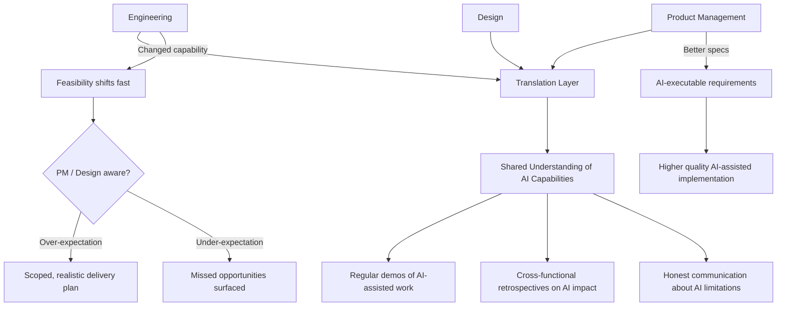

Cross-functional communication is always a translation problem. Engineers speak in technical constraints; product managers speak in user outcomes; designers speak in experience flows. Getting these three groups to produce a coherent outcome requires constant translation.

AI adds a new dimension to this translation problem. Engineering capabilities are changing faster than product and design have updated their mental models of what's possible. And the AI literacy gap between functions is significant.

---

## The Expectation Gap

The most common cross-functional friction in AI-first teams: PMs and stakeholders have heard that AI can do amazing things, but they don't have accurate models of what specifically it can do, on what timeline, with what reliability.

This produces two failure modes:

**Over-expectation.** "Can't you just use AI to build this entire feature in a day?" — from a stakeholder who saw a demo of GitHub Copilot generating a small app. The demo was real; the transfer to a complex enterprise codebase is not automatic. Managing this expectation requires specific, concrete communication rather than general deflection.

**Under-expectation.** "I figured this would take weeks, so I didn't even ask you about it" — from a PM who hadn't realised that an AI-assisted approach made something feasible that wasn't before. Opportunities missed because the team didn't communicate changed capabilities.

Both are real. The solution to both is the same: regular, specific communication about what AI has changed in the team's capabilities. Not "AI makes us faster" — "here are three things we can do in a sprint that would have taken three sprints before."

---

## Specification Quality Becomes More Important

AI makes under-specified requirements more expensive, not less.

Here's why: without AI, a developer encounters a vague requirement, uses judgment to fill in the gaps, and ships something that's usually close enough. The developer's familiarity with the codebase and domain fills in what the spec didn't say.

With AI, vague specifications produce confidently-wrong implementations. AI fills gaps with plausible defaults, not with your specific domain knowledge. The more underspecified the requirement, the larger the gap between what AI builds and what was intended.

This means AI-first teams need better requirements than traditional teams, not looser ones. The investment in clear user stories, detailed acceptance criteria, and explicit edge case handling pays back directly in the quality of AI-assisted implementation.

The message for PMs and designers: the effort you put into specifying requirements well is no longer optional overhead. It's directly leveraged by the AI-assisted development process.

---

## AI-Assisted Product Discovery

Going in the other direction: engineering can use AI to contribute to product work more effectively.

Rapid prototyping: AI allows engineering to build working prototypes in a fraction of the previous time. Designs that would have stayed in Figma can become interactive prototypes. User testing can happen earlier with more fidelity.

Feasibility assessment: "Is this technically feasible?" conversations are faster and more informed when AI can generate a sketch implementation to evaluate. The question moves from "probably, but let me look into it" to "here's a rough implementation — the constraints are X."

Requirements analysis: AI can identify edge cases in product requirements that product managers haven't considered. "Your spec says users can change their email address — here are the downstream implications: session management, notification preferences, third-party integrations." This shifts discovery work earlier.

---

## AI Literacy as a Shared Responsibility

The teams that handle the AI communication problem best treat AI literacy as a shared organisational investment, not an engineering-only concern.

PMs who understand what AI can and can't do write better specifications. Designers who understand AI constraints design better AI-assisted features. Stakeholders who have accurate AI mental models make better prioritisation decisions.

This doesn't mean everyone needs deep technical knowledge. It means the engineering team invests in communication that builds accurate mental models across functions, not just reports outputs.

Regular demos of AI-assisted work, shared retrospectives on where AI helped and where it didn't, and cross-functional conversations about capability changes — these are the practices that close the literacy gap over time.

---

*Day 18 of the [AI-First Engineering Team series](/posts/ai-first-engineering-team-30-day-plan/). Previous: [AI-Assisted Incident Response — When Production Breaks](/posts/ai-assisted-incident-response/)*
