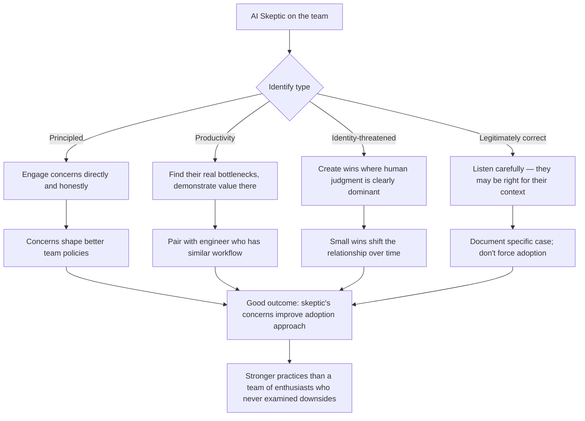

Every team has one. The engineer who doesn't use the AI tools, or uses them minimally and apologetically. Who raises objections in team meetings. Who completes their work reliably but outside the AI-assisted workflow the rest of the team is building.

How you handle this person matters more than it might seem. Get it wrong and you either marginalise a legitimate voice or let one person block a transition the team needs to make.

---

## The Taxonomy of AI Skeptics

Not all AI skepticism is the same. The most useful thing you can do as a lead is identify which type you're dealing with.

**Type 1: The principled skeptic.** This engineer has real concerns about AI — intellectual property, correctness, job displacement, the ethics of how training data was gathered. They're not opposed to AI in principle; they want their concerns addressed before they adopt it.

**Type 2: The productivity skeptic.** This engineer tried the tools, found them unhelpful for their specific workflow, and rationally concluded the ROI isn't there. They're not ideologically opposed; they need a different demonstration of value.

**Type 3: The identity-threatened.** This engineer's professional identity is closely tied to their coding ability. AI feels like a threat to the thing they're proud of. The resistance isn't rational; it's emotional.

**Type 4: The legitimately correct.** For some tasks, in some contexts, AI genuinely isn't helpful. This engineer may have correctly assessed that AI adds friction to their specific workflow.

Each type requires a different response.

---

## Responding to Each Type

**For principled skeptics:** engage with the concerns directly. Don't dismiss them. "You're right that the IP question isn't fully resolved — here's our legal team's current position, and here's why we've decided to proceed with these guardrails." Principled skeptics who feel heard often become the team's most thoughtful AI practitioners, because they've done the hard thinking others skipped.

**For productivity skeptics:** ask what they've tried and for what tasks. Often the answer is "I tried Copilot for the thing I'm already fast at." The demonstration of value needs to be for their actual bottlenecks, not the tasks they already do well. Pair them with an engineer who's found their workflow for similar work.

**For identity-threatened engineers:** this requires the most care. Direct confrontation of the emotional resistance ("you're afraid AI is replacing you") backfires. Instead, create opportunities for them to use AI in ways that feel like augmenting their judgment rather than replacing their skill. Complex tasks where the human direction is clearly dominant. Over time, small wins shift the relationship.

**For engineers who are correctly skeptical:** this is the one to listen to most carefully. If someone has done the work and concluded AI isn't adding value for their specific role, they may be right. Don't force adoption where it doesn't fit. But ask them to articulate the specific case — "AI isn't helpful for debugging legacy assembly code" is a legitimate position; "AI isn't helpful for any of my work" requires more scrutiny.

---

## The One Thing That Doesn't Work

Mandating AI adoption without addressing concerns.

"Everyone needs to be using Copilot by end of quarter" — this produces compliance without adoption. Engineers go through the motions, accept suggestions without verification, and either confirm their skepticism when it goes wrong or build surface-level habits that don't represent real integration.

You can mandate access. You can mandate training. You can mandate that engineers demonstrate familiarity. You can't mandate genuine integration; that requires buy-in.

---

## What Good Outcome Looks Like

A team where the skeptic's legitimate concerns have shaped better practices. Not a team where the skeptic converted to enthusiasm, but one where:

- Their IP concerns led to clearer policies about what data goes into AI prompts
- Their correctness concerns led to stronger verification practices in code review
- Their workflow concerns led to better guidance about which tools to use for which tasks

The skeptic's resistance, taken seriously, often produces a stronger adoption approach than a team of enthusiasts who never examined the downsides.

---

*Day 21 of the [AI-First Engineering Team series](/posts/ai-first-engineering-team-30-day-plan/). Previous: [Senior Engineers in an AI-First Team — What Seniority Means Now](/posts/senior-engineers-in-an-ai-first-team/)*
