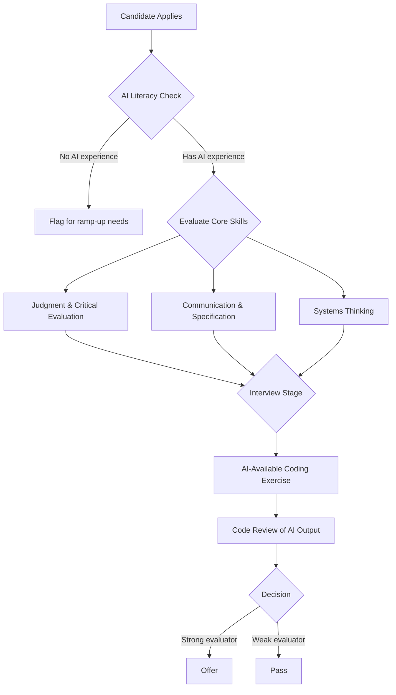

Hiring is where team culture and capability get set. In an AI-first team, the criteria that make someone a strong candidate have shifted — not completely, but meaningfully.

The engineers who thrive in AI-first environments have different strengths than the engineers who thrived in pre-AI environments. Hiring for the old profile misses some of what the new environment needs.

---

## What Matters More

**Judgment and critical evaluation.** The ability to look at AI-generated output and quickly assess whether it's correct, appropriate for the context, and complete. This requires deep enough understanding to evaluate rather than just accept. Engineers who can evaluate well are more valuable than engineers who are fast at generating.

**Communication and specification quality.** The ability to communicate clearly — to translate business intent into precise technical specifications, to write prompts that produce useful output, to describe what they want in a way that an AI (or another engineer) can act on. Vague thinkers produce vague results from AI.

**Intellectual curiosity and learning orientation.** AI tools change fast. The engineers who will do best are the ones who actively explore new capabilities, update their workflows based on what they learn, and stay current. An engineer who's done the same thing the same way for five years, even if they're skilled, may struggle with the continuous adaptation AI requires.

**Systems thinking.** AI executes well locally but doesn't understand systems. Engineers who naturally think about how their component interacts with the rest of the system, who ask "what breaks if this changes?" — these engineers provide the system-level oversight AI doesn't.

**Comfort with uncertainty.** AI output has reliability distributions rather than reliable correctness. Engineers who are uncomfortable with uncertain output, who want certainty before acting, may find AI-first environments frustrating. Engineers who are comfortable reasoning under uncertainty, verifying what they need to verify, and making judgment calls — these engineers thrive.

---

## What Matters Less

**Synthesis speed.** The ability to write code quickly from a blank page. This was a strong signal of senior engineering ability before. It's being commoditised. Still valuable, but less differentiating.

**Encyclopedic pattern knowledge.** Knowing the correct implementation of a singleton, or how to write a particular SQL optimisation from memory. AI retrieves this more reliably than any engineer. The engineer who "just knows" these patterns has an advantage; the engineer who uses AI to retrieve them has roughly the same output.

**Typing speed and editor proficiency.** Less relevant when AI is generating a significant fraction of the code.

---

## Interviewing for AI Collaboration

Most engineering interviews test raw coding ability without AI. This is increasingly disconnected from how engineers will work.

One approach: give candidates a problem with AI available and observe how they use it. What prompts do they write? How do they verify the output? Do they catch the subtle error in the generated code? Do they know when to override AI's suggestion?

Another: give a code review of AI-generated code and ask them to identify issues. This tests evaluation ability directly.

Technical questions worth asking:
- "Tell me about a time you used AI for a complex technical task. Where did it help? Where did you override it?"
- "How do you decide when to trust AI output and when to verify it?"
- "Describe a time AI generated something that seemed right but was actually wrong."

Engineers who've done real AI-assisted work have clear answers to these. Engineers who've only used AI for autocomplete will give shallow answers.

---

## The AI Literacy Floor

For senior roles, I now treat AI literacy as a baseline requirement. Not enthusiasm, not expertise — literacy. They should understand what the tools do, have used them for real work, and have opinions about where they help and where they don't.

An experienced engineer who's never engaged with AI tools is missing context that affects their technical judgment in 2026. This doesn't disqualify them, but it's relevant to how quickly they can contribute to an AI-first team and what ramp-up support they'll need.

---

*Day 22 of the [AI-First Engineering Team series](/posts/ai-first-engineering-team-30-day-plan/). Previous: [The AI-Skeptic on Your Team — How to Bring Them Along](/posts/the-ai-skeptic-on-your-team/)*
