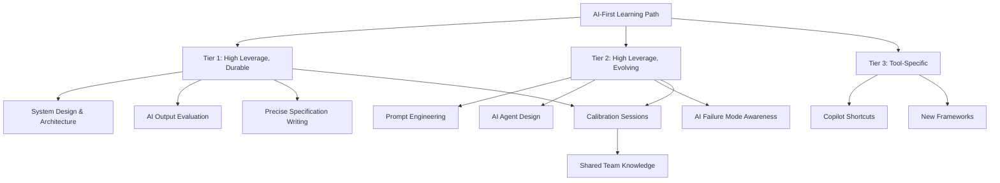

Learning has always been central to engineering. The tools change, the languages evolve, the patterns update. Engineers who stop learning become outdated.

AI accelerates this dynamic significantly. The pace of change in AI tooling alone requires ongoing learning just to keep current with the tools you're using, let alone to develop new skills. Teams that don't invest in structured learning fall behind fast.

---

## What to Learn: The Skill Hierarchy

Not all learning investments are equal in an AI-first environment. A rough hierarchy:

**Tier 1 — High leverage, durable:**
- System design and architecture (more important as AI handles implementation)
- AI output evaluation and verification (the skill AI can't substitute)
- Clear thinking and precise specification writing
- Debugging complex, non-obvious system failures

**Tier 2 — High leverage, evolving:**
- Prompt engineering for specific tools and tasks
- AI agent design and orchestration
- Understanding AI failure modes and reliability characteristics

**Tier 3 — Lower leverage, still relevant:**
- Tool-specific features (Copilot shortcuts, Claude Code slash commands)
- New programming languages and frameworks
- Domain-specific technical knowledge

The mistake most teams make: investing heavily in Tier 3 and almost nothing in Tier 1. Tool features are easy to learn and feel immediately applicable. System design and evaluation skills require more investment and pay off more slowly. But they're the durable advantage.

---

## Structured Team Learning

Individual learning compounds slowly. Team learning compounds faster because knowledge spreads.

**Weekly AI learnings share.** Five minutes at the end of standup: one person shares one thing they learned about using AI this week. What worked, what didn't, what they tried. This doesn't require preparation; it just requires making it a habit. After a month, the team has a shared vocabulary of AI usage patterns.

**AI failure post-mortems.** When AI produces significant wrong output that reaches a review or production — not to assign blame, but to understand the failure mode. "What did we ask? What did AI produce? Why was it wrong? What would have caught it?" This builds the team's collective calibration faster than individual experience.

**Practice problem sessions.** Structured sessions where engineers use AI on defined problems and compare approaches. Not for evaluation — for learning. "Here's a problem. Use AI. Let's compare what each of us produced and how." The variation in approaches is instructive.

**External signal sharing.** Someone on the team tracks what's happening in AI tooling. New capabilities, new patterns, significant failures in the industry. This doesn't need to be comprehensive — a five-minute summary at monthly planning is enough to keep the team's external awareness current.

---

## The AI-Accelerated Learning Loop

AI changes how engineers learn, not just what they use.

The traditional learning loop: encounter a problem, try to solve it, look it up if stuck, implement, learn by doing.

The AI-accelerated loop: encounter a problem, ask AI to explain the relevant concepts, try the AI-suggested approach, verify it, understand it deeply enough to explain it without AI.

The key is the last step. Engineers who use AI as a learning accelerator — to get to understanding faster — develop skills faster. Engineers who use AI as a shortcut around learning don't develop skills at all.

The difference is whether you understand what you shipped. "AI suggested this and it worked" is a shortcut. "AI suggested this, I understood why, and I verified it was correct for our context" is accelerated learning.

---

## The Calibration Investment

One learning investment I recommend making explicitly: calibration sessions.

Take a set of tasks the team does regularly. Have engineers do them with AI and without AI, comparing results. Where is AI faster? Where is AI reliable? Where does human-only outperform AI? Where is the combination clearly best?

This produces a shared empirical understanding of AI capability on your specific work. It takes a day. It informs every future toolchain decision the team makes.

---

*Day 23 of the [AI-First Engineering Team series](/posts/ai-first-engineering-team-30-day-plan/). Previous: [Hiring for an AI-First Engineering Team](/posts/hiring-for-an-ai-first-engineering-team/)*
