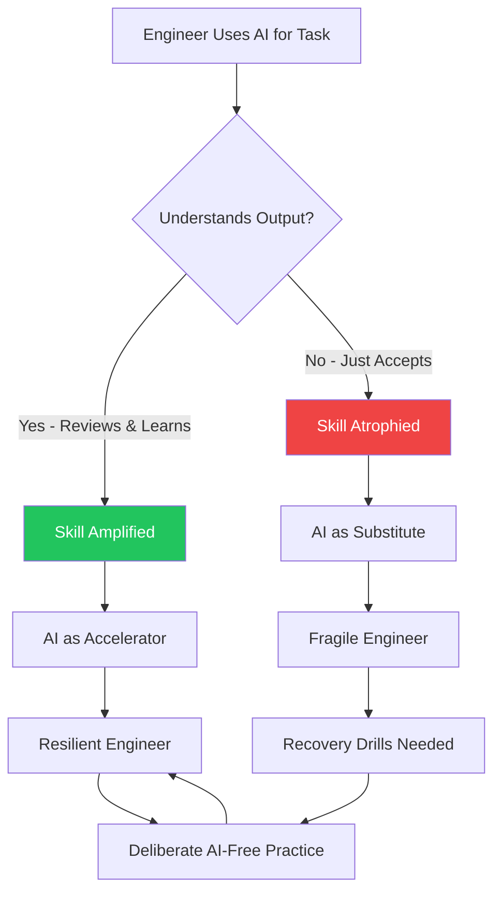

Skill atrophy is what happens when you stop practicing something. It's been understood for decades in physical skills — athletes who stop training lose conditioning. It applies to cognitive skills too.

AI introduces a new version of this problem: when AI does a task well enough, engineers stop practicing it. Over time, they can no longer do it without AI. If AI becomes unavailable or unreliable for that task, the team's capability has degraded.

This isn't hypothetical. I've seen it happen in specific, small ways already.

---

## The Observed Failure Mode

An engineer on the team was a fast, accurate mental debugger. Given a stack trace, they could reason through the likely cause quickly and accurately.

After using Claude Code for debugging assistance for several months, I noticed their debugging speed without AI had dropped. Not their effectiveness with AI — that was excellent. Their ability to debug efficiently without AI was slower than it used to be.

This is skill atrophy. The neural pathways for debugging from first principles are maintained by practice. If AI replaces the practice, the skill weakens.

---

## Categories of At-Risk Skills

**Algorithmic reasoning.** When AI generates the algorithm, the engineer doesn't practice the reasoning that produces algorithms. Over time, the ability to reason from scratch about algorithmic problems — without AI generating a starting point — weakens.

**Debugging from first principles.** The systematic, hypothesis-driven debugging process that finds root causes in complex systems. When AI provides hypotheses, engineers may stop developing this process.

**Architecture from scratch.** When AI generates an architectural scaffold, the engineer doesn't practice the design choices that produce good architecture. Over time, they may become dependent on having a scaffold to start from.

**Code reading without explanation.** When AI explains code rather than the engineer reading it directly, the deep comprehension skills for reading unfamiliar code weaken.

---

## It's Not Black and White

Over-reliance doesn't mean "using AI is bad." It means using AI in ways that replace skill development rather than augmenting it.

The distinguishing question: after using AI for a task, does the engineer understand the output well enough to have produced it themselves? If yes, AI is accelerating learning. If no, AI may be replacing it.

An engineer who uses AI to generate the first draft of an algorithm, then carefully reads and understands it, then tests edge cases, is learning. An engineer who accepts the AI-generated algorithm, ships it, and moves on, may not be.

---

## Practices That Prevent Atrophy

**Deliberate AI-free practice.** Some tasks should be done without AI on a regular basis. Not as punishment or as AI-skepticism — as deliberate practice. A senior engineer who does one debugging session per week without AI keeps the skill sharp. A junior engineer who writes one module per sprint from scratch, before using AI for the rest, maintains the foundational skills.

**Understand before accepting.** The rule: you can use AI output, but you must be able to explain it. Every time. For anything non-trivial. "I accepted it because it looked right" is not sufficient. This single practice prevents a large category of atrophy.

**Regular skill inventory.** Periodic reflection: "What skills am I using with AI that I used to do without it? Could I do them without AI if I had to?" This keeps the question alive. It doesn't require always doing things without AI — just maintaining awareness of what's being outsourced.

**Recovery drills.** Deliberately practice skills you've outsourced to AI. Run a debugging session without AI. Design a small system from scratch before consulting AI. Write a module without suggestions. This keeps the muscle memory active.

---

## The Right Relationship with AI

The goal is AI as an amplifier of genuine capability, not a substitute for it.

An engineer who can debug well and uses AI to debug faster is amplified. An engineer who can only debug with AI has substituted. The former is resilient; the latter is fragile.

The teams that build this correctly are the ones that treat AI adoption as a skills investment, not just a productivity tool. The productivity gains are real and worth capturing. But the skill foundation has to remain — because AI is not reliable enough, nor universal enough, to be the only thing the team can depend on.

---

*Day 24 of the [AI-First Engineering Team series](/posts/ai-first-engineering-team-30-day-plan/). Previous: [Learning and Upskilling in an AI-First Culture](/posts/learning-and-upskilling-in-an-ai-first-culture/)*
