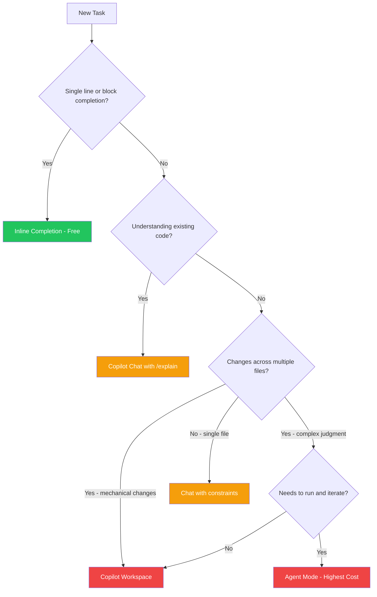

One of the clearest cost-control wins in the new Copilot pricing model is matching the tool to the task. Using Copilot Workspace for a task that inline completion handles is like hiring a senior consultant to do data entry — it's not that the consultant can't do it, it's that it's the wrong tool and you're paying the wrong rate.

Here's a decision framework for the four main Copilot modalities.



---

## The Four Modalities

**Inline completion** — autocomplete suggestions as you type, accepted with Tab. Free under base subscription. Fast, low-friction, no explicit interaction required.

**Copilot Chat** — conversational AI in the IDE sidebar or inline. Premium requests. You ask questions, give instructions, get explanations. Includes `/explain`, `/fix`, `/test`, `/doc` slash commands.

**Copilot Workspace** — agentic multi-file editing. High cost. You describe a task; Copilot plans and implements changes across multiple files. Requires review before applying.

**Agent mode (in VS Code)** — Copilot operates autonomously, makes edits, runs terminal commands, iterates based on results. Highest cost per task. For complex, multi-step work.

---

## The Decision Tree

```
Is the task a single line or block completion?
  → YES: Use inline completion. Don't open Chat.

Is the task about understanding existing code?
  → YES: Use Chat with the code selected.
      Is the question simple ("what does this do")?
        → Use /explain. One request.
      Is the question complex ("why is this designed this way")?
        → Use Chat with context. One focused question.

Is the task generating new code for a clearly specified purpose?
  → Is it a standard pattern you've done before?
      → YES: Use inline completion or a one-shot Chat prompt.
      → NO (novel logic): Use Chat with constraints and format specified.

Does the task require changes across multiple files?
  → Are the changes mechanical and well-defined (rename, restructure)?
      → YES: Use Copilot Workspace.
  → Are the changes complex and require judgment at each step?
      → YES: Use agent mode — but consider whether a senior engineer
              should own this rather than delegating to AI.

Does the task require running code, testing, and iterating?
  → YES: Agent mode is appropriate. Set clear acceptance criteria first.
```

---

## The Matrix Version

| Task | Right tool | Why |
|------|-----------|-----|
| Complete a method signature | Inline | Tab to accept, zero cost |
| Complete a standard pattern (loop, LINQ, async/await) | Inline | AI knows the pattern; no need for Chat |
| Write a simple unit test for an obvious case | Inline or `/test` | Low complexity, standard pattern |
| Explain what a complex function does | `/explain` | Single request, scoped to selection |
| Fix a compiler error | `/fix` with error selected | Targeted, one-request fix |
| Generate a full test suite for a service | Chat with spec | Premium request, but worth it for thoroughness |
| Write a PR description | PR summary | Built-in, moderate cost, high value |
| Refactor a single class | Chat with constraints | Moderate cost, single file |
| Add a feature across 3+ files | Copilot Workspace | Multi-file justified; review output |
| Implement a complete user story | Agent mode | High cost — ensure task is well-defined first |
| Debug a subtle production issue | Chat (diagnostic) | Not agent — you want to understand, not delegate |

---

## The Common Mismatches (Where Cost Gets Wasted)

**Using Chat when inline would have done it.** Opening Chat to ask "write a null check for this variable" when pressing Tab would have produced the same result. If you're not sure whether inline will handle it, try Tab first.

**Using Workspace for single-file changes.** Copilot Workspace is optimised for multi-file, and its overhead (planning, review) isn't worth it for a change that's logically contained in one file. Chat with the file open is faster and cheaper.

**Using agent mode for well-defined simple tasks.** Agent mode shines for open-ended tasks where the AI needs to figure out the steps. For tasks where you know exactly what you want, a direct Chat prompt with constraints is faster, cheaper, and gives you more control.

**Using Chat without slash commands when a slash command applies.** `/explain`, `/fix`, `/test`, and `/doc` are optimised for their specific tasks. "Can you explain this code?" is a general prompt; `/explain` with code selected is a scoped, efficient request. Use the purpose-built commands when they apply.

---

## Making the Framework Stick

A framework only helps if engineers use it under the natural time pressure of the workday.

The practical implementation: put a short version (the table above, or the decision tree) in your team's wiki or Copilot prompt library. Reference it during onboarding. Mention it in code review when you see a mismatch — "this looks like it could have been an inline completion; let's discuss".

The goal isn't rigid rule-following — it's building intuition about tool appropriateness. Engineers who've thought through the framework once apply it instinctively.

---

*Day 4 of the Copilot pricing series. Previous: [Prompt Patterns That Cut Copilot Costs Without Cutting Value](/posts/prompt-patterns-that-cut-copilot-costs/)*
