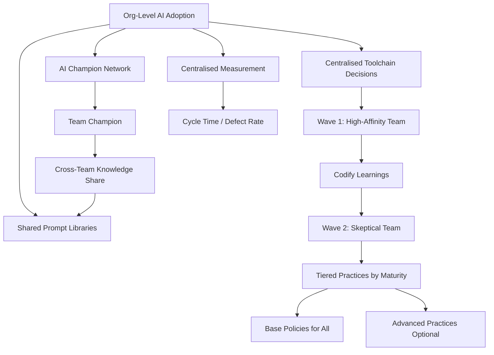

Everything in this series has been written primarily at the team level — 6 to 20 engineers, operating under a single technical lead, able to establish shared norms through direct conversation.

Scaling that to a larger engineering organisation is a different problem. The direct relationship between lead and every engineer doesn't exist. Norms can't spread through conversation alone. Measurement becomes harder. And the variance in AI maturity across teams creates coordination challenges.

---

## Why Team-Level Practices Don't Auto-Scale

In a 10-person team, AI norms spread through osmosis. Engineers see each other working, share what they've learned, and converge on shared practices organically.

In a 100-person org with 10 teams, this doesn't happen. Each team develops its own practices. Some teams advance quickly; others don't. The practices diverge. Shared infrastructure (prompt libraries, custom instructions, governance policies) can't emerge because there's no shared practice to build from.

Scaling requires a different approach: intentional infrastructure and coordination, not just organic spread.

---

## The Scaling Stack

**Centralised toolchain decisions.** At team level, tool selection can be informal. At org level, it needs to be explicit: which tools, which licences, which configuration standards. This isn't about uniformity for its own sake — it's about creating the coordination surface that enables shared practice.

**An AI champion network.** In each team, identify an engineer who's advanced in AI adoption and give them a cross-team role: sharing what their team has learned, coordinating with other AI champions, feeding signal back to the central AI governance function. This creates horizontal spread without requiring central coordination of every decision.

**Shared prompt and instruction libraries.** The prompt libraries and custom instruction documents that work at the team level become more valuable at org level. A well-maintained org-wide prompt library for common tasks (PR descriptions, test generation, documentation) means every team benefits from every team's learning.

**Centralised measurement.** What metrics mean something at the org level? Cycle time by team (adjusted for team size and task complexity), escalation rates for AI-assisted vs. non-AI-assisted code, defect rates. These need consistent definitions across teams to be comparable.

---

## The Rollout Sequencing Question

In my experience, the sequencing of AI adoption across teams matters significantly.

**Start with the highest-AI-affinity team.** The team most likely to adopt well and be honest about what works and what doesn't. Not the team most likely to be enthusiastic — the most enthusiastic team will be uncritical, and you need honest signal.

**Codify learnings before the second wave.** What the first team learned should be documented before the second wave rolls out. Not a 50-page guide — a 5-page guide that captures the most important decisions and anti-patterns.

**Second wave includes a skeptical team.** A team that's less enthusiastic will test whether the approach actually works without confirmation bias. Their friction points are the real ones, not the enthusiast team's.

**Don't mandate; demonstrate.** Teams that are shown clear evidence from peer teams outperform teams that are mandated to adopt. The evidence has to be credible — peer teams they respect, not cherry-picked success stories.

---

## The Variance Problem

The hardest part of org-level AI adoption: teams advance at different rates, and the gap creates problems.

Teams at Level 3 or 4 maturity are frustrated by org-wide policies designed for Level 1 teams. Teams at Level 1 are confused by guidance designed for Level 3. One-size-fits-all governance and practices end up serving nobody well.

The solution: tiered practices. Base-level policies that apply to everyone, advanced practices that are optional for teams ready for them. Let teams self-select into the tier that matches their maturity. Review tiers quarterly.

This is more administrative overhead than uniform policies. It's less overhead than managing the problems that come from forcing everyone into the same box.

---

*Day 26 of the [AI-First Engineering Team series](/posts/ai-first-engineering-team-30-day-plan/). Previous: [Enterprise AI Governance for Engineering Teams](/posts/enterprise-ai-governance-for-engineering-teams/)*
