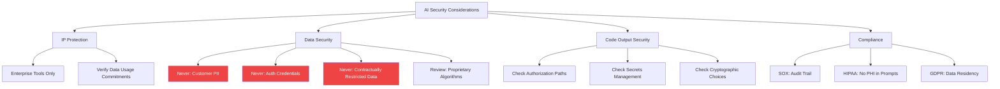

Security and compliance questions come up early in every enterprise AI adoption conversation, and they're often handled in one of two dysfunctional ways: either dismissed ("just don't put sensitive stuff in") or over-managed ("we need approval for every AI interaction").

Neither works. Here's the practical middle.

---

## The IP Question

The most common IP concern: does code I put into an AI prompt get used to train the model, potentially showing up in another customer's AI output?

The honest answer depends entirely on the tool and configuration.

**GitHub Copilot Enterprise / Business:** with telemetry opt-out configured, Microsoft commits that your code is not used to train Copilot. Verify this is configured in your tenant.

**Claude Code / Anthropic API:** Anthropic's enterprise agreements include data usage commitments. With the API, your inputs are not used for training by default.

**Consumer AI tools (ChatGPT free tier, Copilot free tier, browser plugins):** these often do use inputs for training. These should not be on the approved list for enterprise use.

The practical rule: use enterprise-tier tools with confirmed data handling commitments for work code. Consumer tools for learning and personal use only.

---

## Data Security in AI Workflows

The risk that matters most in practice: sensitive data inadvertently included in AI prompts.

Engineers build muscle memory with AI tools. They get used to asking AI for help. Under time pressure, they include more context than necessary — sometimes including data that shouldn't cross an enterprise boundary.

The categories to explicitly train on:
- **Customer PII.** Names, emails, account numbers, health data. Never in AI prompts.
- **Proprietary algorithms.** Core IP that gives competitive advantage. Generally not in AI prompts without explicit approval.
- **Authentication credentials.** API keys, passwords, tokens. Absolutely never in AI prompts. (This sounds obvious; it happens more than you'd think.)
- **Contractually restricted data.** Data your contracts say can't be shared with third parties.

The training approach that works: concrete examples, not abstract policy. "Here are three example prompts. Which ones have data that shouldn't be in an AI prompt?" Engineers learn faster from cases than from principles.

---

## Code Quality and Security in AI Output

AI-generated code has a different security failure mode profile than human-written code.

AI is generally good at avoiding the obvious vulnerabilities — SQL injection, basic XSS. It's less reliable on:

- **Authorization checks in internal paths.** AI generates happy-path code. Authorization checks on internal APIs that "only we call" are frequently missing.
- **Secrets management.** AI sometimes hardcodes credentials or configuration values that should be environment variables or secret manager lookups.
- **Cryptographic choices.** AI uses common cryptographic patterns. "Common" isn't always right for your context — deprecated algorithms, wrong key lengths, insecure random number generation.
- **Input validation at internal boundaries.** Validation at external boundaries, AI handles well. Validation between internal services is frequently missing.

Include security review in the definition of done for AI-assisted features. Not a full security audit — a checklist review of the categories AI is known to miss.

---

## Compliance-Specific Considerations

For regulated industries:

**Financial services / SOX:** code changes affecting financial calculations may need an audit trail demonstrating appropriate review. AI-assisted code doesn't change this requirement — the human reviewer is still responsible. Document accordingly.

**Healthcare / HIPAA:** PHI (Protected Health Information) is clearly off-limits for AI prompts. Beyond that, audit trail requirements for software handling PHI may require logging of who reviewed AI-generated code and when.

**GDPR / CCPA:** personal data in AI prompts raises data transfer questions. Most enterprise AI tools have EU data residency options; verify this is configured if relevant.

The general principle: AI assistance doesn't change your compliance obligations. It changes how you meet them, because the review and judgment that used to happen during writing now needs to happen during review of AI output.

---

*Day 27 of the [AI-First Engineering Team series](/posts/ai-first-engineering-team-30-day-plan/). Previous: [Scaling AI Adoption Across a Larger Engineering Org](/posts/scaling-ai-adoption-across-a-larger-engineering-org/)*
