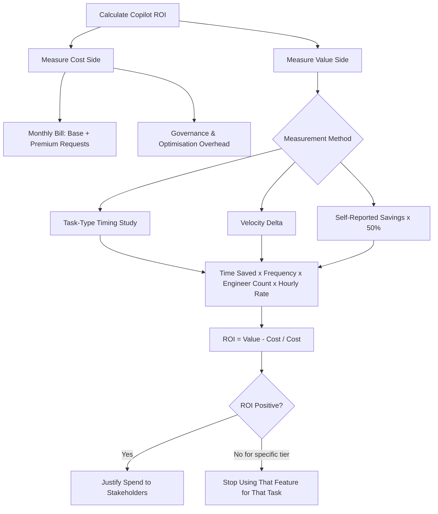

Under flat-rate pricing, ROI calculations for Copilot were a formality. The cost was fixed; any productivity gain was pure upside. Under consumption-based pricing, the cost scales with usage, and the ROI calculation becomes a real operational question.

This post is the honest version of that calculation — without the analyst-report inflation that typically surrounds AI productivity claims.

---

## The Basic Model

ROI = (Value Generated − Cost) ÷ Cost

For Copilot, the challenge is quantifying both sides accurately.

**Cost (easier side):**
- Monthly Copilot bill (base subscription + premium request charges)
- Engineer time spent on Copilot-specific activities (prompt writing, output review, toolchain setup)
- Management overhead for governance and optimisation

**Value (harder side):**
- Engineer time saved on tasks Copilot accelerates
- Quality improvements (fewer defects, better documentation, faster review)
- Scope expansion (work the team could now do that wasn't feasible before)

The cost side is measurable. The value side requires choices about what to measure and how.

---

## Measuring the Value Side

**Method 1: Task-type timing study**

Pick 5–8 task types the team does regularly:
- Write unit tests for an existing class
- Generate a PR description
- Explain an unfamiliar code section
- Add input validation to an endpoint
- Write an API integration

Time engineers doing each task with Copilot enabled, then without (in a controlled session, not in production work). Calculate average time difference.

Multiply time savings by task frequency (how many times per engineer per week) by engineer count by hourly fully-loaded cost.

This is the most credible methodology because it's based on direct measurement, not self-report.

**Method 2: Velocity delta**

Compare sprint velocity (story points or features completed) before and after AI adoption, controlling for team size and scope complexity.

The limitation: many things change over time — team experience, requirements clarity, tech debt levels. Isolating the AI contribution is hard. Use this as a directional indicator, not a precise measurement.

**Method 3: Self-reported time savings (use cautiously)**

Ask engineers how much time they save per day using Copilot. Average the answers. Multiply by hourly cost.

The limitation: self-reported savings are systematically optimistic. Engineers want to justify the tool. A reasonable correction: use 50% of self-reported savings as your working estimate. If the ROI is still positive at 50%, it's real.

---

## A Worked Example

**Team:** 8 engineers, fully-loaded cost £80/hour, 8 hours/day, 20 working days/month.

**Copilot cost (new pricing):**
- Base subscription: 8 × £40/month = £320
- Premium requests: 8 engineers × 200 premium requests/month × £0.05/request = £80
- Total: £400/month

**Measured time savings (method 1):**
- Unit test writing: 25 minutes/test → 8 minutes with Copilot = 17 minutes saved
- Each engineer writes 3 tests/day on average = 51 minutes/day saved
- PR descriptions: 15 minutes → 4 minutes = 11 minutes saved, 1 PR/day
- Code explanation: 20 minutes → 5 minutes = 15 minutes saved, 2 times/day

Total per engineer: ~1.9 hours/day in measured savings.

For 8 engineers at £80/hour, 1.9 hours/day, 20 days:
**Value = 8 × 1.9 × £80 × 20 = £24,320/month**

**ROI = (£24,320 − £400) ÷ £400 = 5,980%**

Even if you discount by 70% for methodological conservatism: (£7,296 − £400) ÷ £400 = **1,724% ROI.**

The cost of Copilot is not the problem for most teams. The maths work easily even with aggressive discounting.

---

## When the Maths Don't Work

There are scenarios where Copilot's new pricing makes the ROI marginal or negative:

**Low-volume usage on high-cost features.** If your team primarily uses Copilot Workspace and agent mode for a small number of tasks, the per-task premium cost can exceed the per-task time saving if those tasks don't take long manually. Calculate task by task.

**High usage with low utilisation of output.** If engineers are generating a lot of Copilot output but discarding or significantly rewriting most of it, the premium requests are buying less value than the nominal time-saving would suggest.

**Teams with very low base cost.** At very low engineer hourly rates, the time saving multiplier is smaller. The ROI still works but the margin is thinner.

If the maths don't work for specific feature tiers, the answer is to stop using those features for those tasks — not to stop using Copilot entirely.

---

## The ROI Conversation in Practice

When presenting ROI to non-technical stakeholders:

Lead with the cost, not the savings. "Copilot costs us £400/month for a team of 8" is the anchor. Then show the value: "Based on timed measurements of common tasks, we estimate engineers save an average of 1.5–2 hours per day." Then the maths. Then the caveat: "We've applied a conservative adjustment to self-reported estimates."

A conservative, well-sourced ROI case is more credible than an optimistic, unsourced one. Decision-makers trust honest uncertainty more than inflated confidence.

---

*Day 6 of the Copilot pricing series. Previous: [Copilot Cost Governance for Enterprise Teams](/posts/copilot-cost-governance-for-enterprise-teams/)*
