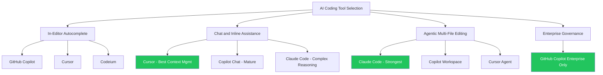

The new Copilot pricing has reactivated a conversation that went quiet when Copilot became the obvious default: is it still the best value, or does the new cost structure make alternatives worth a fresh look?

I'll give you my honest assessment — not as a Copilot advocate or detractor, but as someone who uses multiple tools and has specific views about what each does well.

---

## The Comparison Set

**GitHub Copilot (Business/Enterprise)** — the market incumbent. Deep GitHub integration, broad IDE support, the most mature product. New pricing: base subscription + metered premium requests.

**Claude Code (Anthropic)** — terminal-based, agentic, strong reasoning. Not an in-editor autocomplete tool; positioned at the reasoning/agent layer. Separate product from Copilot, not a direct replacement.

**Cursor** — VS Code fork with AI deeply integrated throughout. Subscription pricing (not consumption-based). Strong context management, native multi-file editing, competitive quality.

**Codeium (Windsurf)** — completion and chat tool, growing fast. Has a generous free tier; enterprise pricing is competitive.

**JetBrains AI** — native integration if your team uses IntelliJ/Rider/PyCharm. Quality has improved significantly. Worth evaluating if you're already in the JetBrains ecosystem.

---

## Honest Assessment by Category

### In-Editor Autocomplete Quality
**Best:** GitHub Copilot and Cursor are roughly equivalent on modern models. JetBrains AI is close. Codeium is competitive.

**Verdict:** Copilot isn't differentiated enough on raw completion quality to justify premium pricing on this dimension alone.

### Chat and Inline Assistance
**Best:** Cursor has strong context management that makes chat more effective for large codebases. Copilot Chat is mature and well-integrated. Claude Code is a different paradigm (terminal-based) that excels at complex reasoning tasks.

**Verdict:** Cursor is a credible alternative to Copilot Chat for teams that primarily use VS Code.

### Agentic / Multi-File Editing
**Best:** Claude Code is the strongest reasoning agent for complex, multi-step tasks. Copilot Workspace is improving but not at the same reasoning level. Cursor's agent mode is competitive.

**Verdict:** Copilot Workspace is not the best agentic tool — Claude Code is — but it's well-integrated into the GitHub workflow. The comparison depends on how much you value GitHub-native integration vs. raw capability.

### Enterprise Integration and Governance
**Best:** GitHub Copilot Enterprise. No close second for teams deeply embedded in GitHub. Org-level policy controls, SSO integration, audit trails, and the GitHub PR/review integration are genuinely valuable.

**Verdict:** If enterprise governance and GitHub integration are requirements, Copilot is hard to replace. These are structural advantages, not feature advantages.

### Pricing Predictability
**Best:** Cursor (flat subscription) and Codeium (flat subscription) offer more predictable costs than Copilot's new consumption model.

**Verdict:** If cost predictability is a requirement, Cursor and Codeium have a structural advantage. Copilot's consumption model is better value at low usage, worse value at high usage.

---

## The Layered Toolchain Answer

The honest answer to "Copilot vs. alternatives" is: the question is framed wrong.

The right toolchain for most enterprise engineering teams isn't one AI tool — it's multiple tools at different layers:

- **In-editor autocomplete and chat:** GitHub Copilot or Cursor (both are good; pick based on GitHub integration needs)
- **Complex reasoning and agentic tasks:** Claude Code (doesn't overlap with Copilot; additive)
- **Enterprise product/agent deployment:** Microsoft Copilot Studio

Copilot and Claude Code are not competing for the same jobs. Teams that replace Copilot with Claude Code are misunderstanding what each does. Teams that replace Claude Code with Copilot are also misunderstanding.

The consumption pricing increase doesn't change this analysis. It changes the economics of Copilot Chat and Workspace specifically. If those features are where you're seeing cost pressure, Cursor is worth evaluating as an alternative or supplement for the chat layer.

---

## When Switching Makes Sense

**Switch to Cursor if:**
- Your team is VS Code-native
- You primarily use Chat (not agent mode) and want flat-rate pricing
- You're not heavily invested in GitHub's PR and review workflow integrations
- You've found Copilot Chat's context management limiting for large codebases

**Add Claude Code if:**
- Your senior engineers do complex agentic tasks (multi-file, multi-step implementation)
- You want stronger reasoning for architecture-level work
- You're comfortable with a terminal-based workflow
- You're not trying to replace Copilot — you're supplementing it

**Stay on Copilot if:**
- GitHub integration is a genuine requirement (enterprise SSO, audit trails, org policy)
- Your usage is primarily completions and moderate Chat (new pricing is fair at this level)
- You're in a mixed-IDE environment and need consistent tooling

**Consider Codeium if:**
- Budget is the primary constraint
- You don't need enterprise governance features
- Your team primarily needs completion and basic chat

---

## The Switch Cost

One factor that's easy to underestimate: switching AI tools has a real productivity cost. Engineers develop workflows, prompt habits, and expectations around a specific tool. Switching tools while maintaining productivity takes 2–4 weeks.

Factor this into any "we'd save X% by switching" calculation. The savings need to outrun the transition cost, and transition costs are real.

---

*Day 7 of the Copilot pricing series. Previous: [Calculating Copilot ROI Under the New Pricing](/posts/calculating-copilot-roi-under-new-pricing/)*
