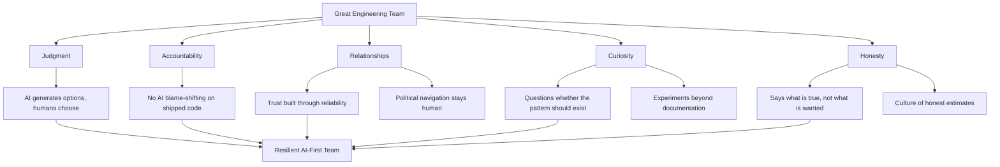

This series has been about change. What changes for junior engineers, for senior engineers, for team culture, for workflow, for governance.

Before the final post, I want to write about what doesn't change. Because in the urgency of adapting to AI, teams can lose sight of the foundations that made them good before — and those foundations don't need to change.

---

## Judgment Is Still Human

AI generates options. Humans choose among them, in context.

The judgment to know which approach is right for this team, this codebase, this business constraint — this has always been the most valuable engineering skill and still is. AI making generation faster doesn't diminish the value of the person choosing well among what's generated.

This is as true for a line of code as for an architectural decision. AI suggests; engineers decide.

---

## Accountability Is Still Human

When something ships and it works, the engineers who built it get the credit. When something ships and it breaks, the engineers who built it carry the responsibility.

AI doesn't change this. "AI generated it" doesn't transfer responsibility. Engineers who accepted AI output without understanding it are responsible for that output. This isn't unfair — it's the correct framing for maintaining quality. Accountability creates care.

The team that takes ownership of everything it ships, regardless of how it was generated, is the team that maintains high standards over time.

---

## Relationships Are Still Human

The best engineering work I've been part of has been built on trust: between engineers, between engineering and product, between the team and the organisation. Trust that's built through reliability, honesty about what's hard, willingness to work through disagreements, and delivering on commitments.

AI doesn't change any of this. It doesn't build trust. It doesn't navigate the political dimension of a cross-team dependency. It doesn't know when to push back on a timeline and when to absorb it. It doesn't know when to have the difficult conversation and when to let something go.

These are the human relational skills that determine whether a team functions well. They have nothing to do with AI.

---

## Curiosity Is Still Human

The question that drives good engineering — "why does it work this way, and is there a better way?" — is something AI produces variations of but doesn't actually ask.

AI finds patterns. It doesn't question whether the pattern should exist. Engineers who stay genuinely curious, who question assumptions, who wonder if the whole approach is wrong — these are the engineers who produce the improvements AI can't generate.

Curiosity is also self-renewing. Engineers who are curious about AI tools themselves — who experiment, who push at the boundaries, who try things that might not work — are the ones who find the uses that aren't in the documentation.

---

## Honesty Is Still Human

AI will generate plausible text for positions you've asked it to support. It's not honest in the sense of telling you what it thinks is true regardless of what you want to hear.

The engineering culture that produces good outcomes is the one where engineers can say "I think we're doing this wrong" and be heard. Where estimates are honest rather than optimistic. Where failure modes are discussed openly. Where "this AI output is not good enough to ship" is said without apology.

This culture is built by humans, maintained by humans, and defended by humans. AI doesn't help with it; it's orthogonal.

---

## The Long Game

AI tooling will continue to change. The tools in use five years from now will be significantly more capable than today's tools. Some of what seems hard about AI assistance now will become easy.

The teams that will be in the best position five years from now are the ones that are building the human foundations that remain valuable regardless of the tool evolution. Judgment. Accountability. Relationships. Curiosity. Honesty.

These are worth investing in not despite the AI transition — but especially because of it.

---

*Day 29 of the [AI-First Engineering Team series](/posts/ai-first-engineering-team-30-day-plan/). Previous: [Measuring ROI and Making the Business Case for AI](/posts/measuring-roi-and-making-the-business-case-for-ai/)*
