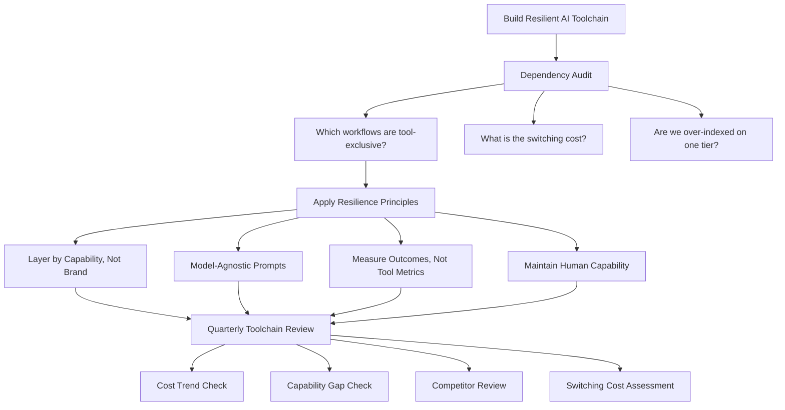

GitHub's pricing change isn't unique. It's the first of many.

The AI tool market is in a phase where vendors are figuring out how to monetise mature products. The race to capture market share with low or flat-rate pricing is giving way to usage-based models that capture more value from heavy users. This is economically rational for vendors, and it's coming for every major AI tool.

The teams that handle Copilot's pricing change well are the ones that built their toolchain with deliberate flexibility. The teams that scramble are the ones that built deep dependencies on a single tool's specific features and pricing structure.

Here's how to build for flexibility.

---

## The Dependency Audit

Before you can future-proof, you need to know what you're dependent on.

For each AI tool in your stack, ask:

1. **Which workflows depend exclusively on this tool's specific features?** (Not "which workflows use this tool" — which workflows break or degrade significantly if this tool's pricing doubles or the feature is removed)

2. **How much of your team's AI capability is in institutional knowledge about this tool?** (Prompt libraries tuned to Copilot's specific behaviour, workflows built around Copilot Chat's specific UX)

3. **What's the switching cost?** (Time to re-train, rebuild workflows, adjust prompt libraries)

4. **Are we over-indexed on any one tier of features?** (If 80% of your AI value comes from Copilot Workspace, and Workspace pricing doubles, that's a concentrated risk)

The audit tells you where you're exposed. High dependency on specific features of one tool at one pricing tier is the exposure to manage.

---

## Principles for a Resilient Toolchain

**Principle 1: Layer by capability, not by brand.**

A toolchain built as "use Copilot for everything" is fragile. A toolchain built as "use [best-in-class tool] for completions, [best-in-class tool] for reasoning, [best-in-class tool] for deployment" is resilient. When one layer's pricing changes, the others aren't affected.

This is the argument for the layered toolchain I've described across this blog: Claude Code at the reasoning layer, Copilot at the in-editor layer, Copilot Studio at the deployment layer. Each layer can be swapped without affecting the others.

**Principle 2: Build prompts that are model-agnostic.**

Prompts tuned to specific model quirks ("Copilot tends to add extra error handling, so I don't need to specify it") are fragile when the model changes or the tool changes. Prompts that are fully specified — "add null checks for all parameters, handle the case where X is zero, throw ArgumentException with a specific message" — work regardless of which model executes them.

The prompt library that will survive tool transitions is the one built on clear specification, not on model-specific behaviour.

**Principle 3: Measure outcomes, not tool-specific metrics.**

If your success metric is "Copilot acceptance rate" or "Copilot Chat requests per week," you're measuring tool activity. If your metric is "cycle time for feature delivery" or "defect rate," you're measuring outcomes. Outcome metrics survive tool transitions; tool-specific metrics don't.

Teams that measure outcomes can evaluate new tools against a clear standard. Teams that measure tool activity lose their measurement framework every time they change tools.

**Principle 4: Maintain human capability in parallel.**

The skill atrophy problem I wrote about earlier in the AI-first team series is also a toolchain resilience problem. Engineers who can only perform at their current level with a specific AI tool are fragile. Engineers who are using AI to amplify genuine capability retain that capability if the tool becomes unavailable or uneconomical.

This isn't an argument against AI — it's an argument for using AI in ways that build capability rather than replace it.

---

## The Vendor Evaluation Cadence

Build a quarterly toolchain review into your team's rhythm:

1. **Cost trend:** are costs trending in the direction we expected, or has something changed?
2. **Capability gap:** are there tasks we're not doing well because we're missing a tool or feature?
3. **Competitor review:** has anything changed in the competitive landscape that warrants reconsideration?
4. **Switching cost assessment:** if we were to change tools, what would it cost and how long would it take?

This review doesn't need to produce action every quarter. Mostly it produces awareness: "things are fine" or "we should watch X closely." The value is preventing surprise — the same surprise that hit teams when Copilot's pricing changed without a plan for handling it.

---

## What's Coming

The Copilot pricing change is a preview of the pattern for the broader AI tool market:

- Flat-rate pricing transitions to consumption-based as products mature
- Freemium features become paid as adoption scales
- Enterprise tiers add governance features at premium prices
- New model capabilities (better reasoning, longer context) are priced above base tier

Teams that are calibrated to this pattern respond adaptively. Teams that expected AI tooling costs to stay flat are going to have the same surprise conversation with finance every 18 months.

Build for the pricing environment that's coming, not the one that existed 18 months ago.

---

## The Week's Synthesis

This week-long series on Copilot's new pricing covered: [the overview](/posts/github-copilot-new-pricing-model-token-economy/), [auditing usage](/posts/auditing-your-copilot-usage-before-the-bill-arrives/), [prompt patterns](/posts/prompt-patterns-that-cut-copilot-costs/), [feature decision framework](/posts/copilot-feature-decision-framework/), [cost governance](/posts/copilot-cost-governance-for-enterprise-teams/), [ROI calculation](/posts/calculating-copilot-roi-under-new-pricing/), and today's toolchain resilience.

The through-line: the teams that handle this well are the teams that treat AI tooling like any other infrastructure investment — with visibility, governance, measurement, and deliberate planning. The teams that struggle are the ones that adopted tools without the management layer to understand and control them.

The pricing change is a forcing function. Teams that use it to build better AI tooling practices come out ahead.

---

*Day 7 — closing post of the Copilot pricing week series.*
