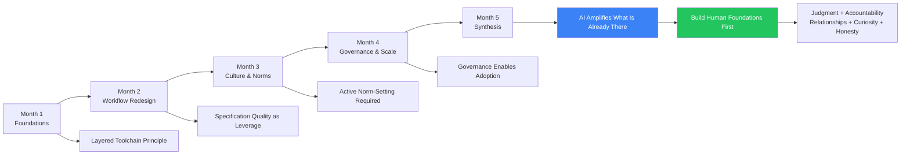

Thirty posts. One arc.

This series was an attempt to think carefully about the team-level problems in AI adoption — not the individual productivity gains, but the cultural, workflow, and human dynamics that determine whether an engineering team builds something durable or something brittle.

Here's the synthesis.

---

## What I Was Wrong About at the Start

**I underestimated how much governance is an enabler.**

Going into this series I expected governance to be the section I'd have to defend, the necessary-but-unwelcome constraint. Writing Days 25–27 changed my view. Governance done well isn't an obstacle to AI adoption — it's what makes confident AI adoption possible. Teams without it proceed tentatively, always unsure what's allowed. Teams with clear policies move faster.

**I was too optimistic about natural culture change.**

I started with the assumption that good practices would spread naturally if you modelled them. Writing Days 5 and 21 forced me to confront how much active, intentional work is required to move team culture. Modelling isn't enough. You have to name norms, write them down, and create accountability for them.

**The skill atrophy problem is more urgent than I initially thought.**

I knew it was real. I didn't appreciate how quickly it manifests. Engineers can lose meaningful debugging depth in months, not years. The proactive counter-practices aren't optional safeguards — they're active maintenance of a perishable resource.

---

## What I'm More Confident About

**The layered toolchain principle is right.**

Claude Code, GitHub Copilot, and Copilot Studio operate at different layers. Teams that try to use one tool for everything get worse results at every layer. This principle from April held up across every team-level discussion in this series.

**Specification quality is the leverage point.**

The recurring theme across workflow redesign, AI-assisted development, and cross-functional communication: the quality of the specification determines everything downstream. AI amplifies good input and amplifies bad input. The investment in writing clear requirements, precise acceptance criteria, and explicit context has a higher return in an AI-first team than it ever did before.

**The human foundations are genuinely non-negotiable.**

Judgment. Accountability. Relationships. Curiosity. Honesty. I wrote Day 29 half expecting it to feel like sentiment. It doesn't. These are the foundations that make AI-first teams resilient rather than fragile. Teams that optimise for AI productivity while letting the human foundations erode are building on sand.

---

## The Open Questions

**What does AI-first look like for different team types?**

This series has been written from the context of a product engineering team. The dynamics for a platform team, an infrastructure team, a data engineering team are different. The principles hold; the specifics vary significantly.

**How do AI-first practices scale to organisations of 500+ engineers?**

I've written about scaling (Day 26) but I'm working at the scale of hundreds, not thousands. The coordination problems at larger scale are genuinely different and I don't have direct experience with them.

**What happens to the engineers who don't adapt?**

I've been careful to write about AI skeptics and about change management. But the honest downstream question — what happens over a 3–5 year horizon to engineers who don't develop AI collaboration skills — is one I don't have a confident answer to.

---

## The One Principle

If I had to distil this series to one principle:

**AI-first teams amplify what's already there.**

Clear thinkers become more effective. Vague thinkers produce more vague output. High-trust cultures build on the collaboration AI enables. Low-trust cultures use AI individually, hoarding advantages. Engineers who are curious accelerate. Engineers who aren't fall behind.

AI doesn't fix the underlying culture or the underlying thinking. It amplifies it.

Build the foundations first. The AI tooling is the easy part.

---

*Day 30 — the final post of the [AI-First Engineering Team series](/posts/ai-first-engineering-team-30-day-plan/).*

*The full archive of both series begins at [Why I'm Writing 30 Days of AI Engineering](/posts/why-im-writing-30-days-of-ai-engineering/).*
