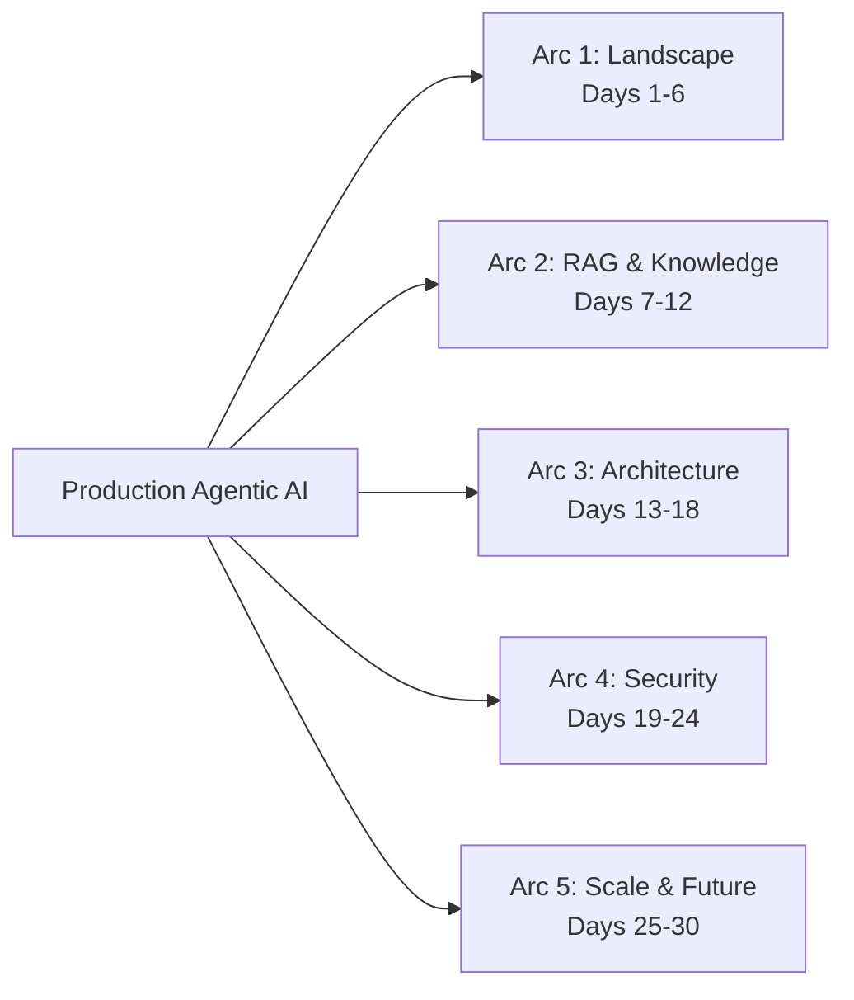

Two series done. The first covered the tools — Claude Code, GitHub Copilot, Copilot Studio, coding agents — from an individual engineer's perspective. The second covered what changes at the team level when AI is adopted seriously.

This series goes deeper into the engineering layer that both series touched but didn't fully cover: **building agentic AI systems that work in production at scale**.

The timing is deliberate. The 2026 agentic AI landscape has crystallised enough to write about it with specificity. MCP has become the de facto standard for tool connectivity. LangGraph and CrewAI have clear production identities. The LLM pricing collapse has changed what's economically viable. The EU AI Act is fully in force. And the gap between frontier models has narrowed to the point where model selection is no longer the primary architectural decision.

This series is for engineers who've moved past "AI is interesting" and are now asking "how do I build this reliably at scale?"

---

## The Five Arcs

### Arc 1 — The 2026 Agentic AI Landscape (Days 1–6)

| Day | Post |
|-----|------|
| 1 | The Model Wars Are Over — What Model Convergence Means for Engineers |
| 2 | MCP Explained — The Protocol That Connects AI to Everything |
| 3 | A2A Protocol — Agent-to-Agent Communication at Enterprise Scale |
| 4 | LangGraph vs CrewAI — Picking the Right Agent Framework in 2026 |
| 5 | The 13% Problem — Why Enterprise AI Adoption Is Failing |
| 6 | The LLM Pricing Collapse — How $0.10/Million Tokens Changes Architecture |

### Arc 2 — RAG and Knowledge Architecture for Agents (Days 7–12)

| Day | Post |
|-----|------|
| 7 | RAG in Production — Beyond the Basics |
| 8 | RAG vs Fine-Tuning — The Hybrid Answer in 2026 |
| 9 | Context Window Management in Production Agents |
| 10 | Vector Databases in 2026 — Which to Use and When |
| 11 | Chunking Strategies That Actually Work in Production RAG |
| 12 | Evaluating RAG Pipelines — The Metrics That Matter |

### Arc 3 — Advanced Agent Architecture Patterns (Days 13–18)

| Day | Post |
|-----|------|
| 13 | Stateful Agents — Managing State in Production |
| 14 | Computer Use Agents — The New Agentic Paradigm |
| 15 | Reasoning Models for Agents — When Thinking Tokens Are Worth It |
| 16 | Multi-Model Orchestration — SLM + LLM Hybrid Architectures |
| 17 | Long-Term Memory Patterns for Production Agents |
| 18 | Tool Orchestration at Scale — Beyond Simple Function Calling |

### Arc 4 — Security, Safety, and Reliability (Days 19–24)

| Day | Post |
|-----|------|
| 19 | The 62% Problem — Security Flaws in AI-Generated Code |
| 20 | Prompt Injection in Production Agents — Attack Patterns and Defences |
| 21 | Agent Containment — Controlling Blast Radius in Autonomous Systems |
| 22 | EU AI Act for Engineers — What You Actually Need to Do |
| 23 | Evaluating Agent Quality at Production Scale |
| 24 | Observability for Complex Agentic Systems |

### Arc 5 — Scaling, Frameworks in Depth, and the Road Ahead (Days 25–30)

| Day | Post |
|-----|------|
| 25 | Scaling Agentic Systems — Cost, Latency, and Reliability |
| 26 | Building Production Agents with LangGraph — A Hands-On Walkthrough |
| 27 | CrewAI for Enterprise Multi-Agent Workflows |
| 28 | The Reasoning Model Revolution — Beyond Next-Token Prediction |
| 29 | Open-Source vs Commercial Models — The 2026 Decision |
| 30 | Where Agentic AI Goes Next — The Honest View |

---

Day 1 starts tomorrow. The series runs through July 9.
