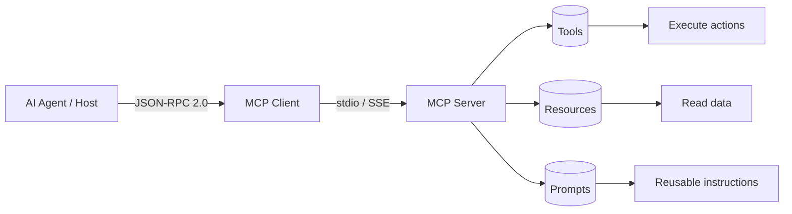

If you've been building AI agents in the past 12 months, you've almost certainly encountered MCP — or you've been building the same thing it does, less standardised.

Model Context Protocol is the JSON-RPC 2.0 based protocol that governs how AI models connect to external tools and data sources. Originally developed by Anthropic and now governed by the Linux Foundation with support from OpenAI, Google, Microsoft, and AWS, it's become the de facto standard for tool connectivity in AI systems.

This post is the practical explanation — what MCP is, how it works, and what you need to know to build with it.



---

## The Problem MCP Solves

Before MCP, every AI tool integration was bespoke. You'd write custom code to connect your agent to a database, a file system, an API, or a search index. Every integration was different. Every agent had its own tool format. Sharing tools between agents or models was painful.

MCP standardises this. It defines a protocol that any AI client (your agent) and any tool server (your database connector, API wrapper, file system) can speak. Write an MCP server once; any MCP-compatible client can use it. Build an MCP-compatible agent; it can use any MCP server without custom integration work.

The analogy: MCP is to AI tools what HTTP is to web resources. It's a standard that decouples clients from servers.

---

## How MCP Works

The architecture is a client-server model with three participants:

**MCP Host** — the AI application (Claude Code, an agent you've built, an IDE extension). The host manages connections to multiple servers.

**MCP Client** — lives inside the host; handles the protocol communication with a specific MCP server.

**MCP Server** — an external process that exposes capabilities (tools, resources, prompts) through the MCP protocol.

The communication uses JSON-RPC 2.0 over one of three transports:
- `stdio` — standard I/O, for local process communication (common for CLI tools)
- HTTP with SSE (Server-Sent Events) — for remote servers and long-running connections
- WebSocket — for bidirectional real-time communication

---

## What MCP Servers Expose

Three capability types:

**Tools** — functions the AI can call. Defined with a name, description, and JSON Schema for parameters. The AI reads the description to understand when to use the tool; the schema governs what it can pass.

```json
{
  "name": "query_database",
  "description": "Execute a read-only SQL query against the production database",
  "inputSchema": {
    "type": "object",
    "properties": {
      "query": { "type": "string", "description": "SQL SELECT statement" },
      "limit": { "type": "integer", "default": 100 }
    },
    "required": ["query"]
  }
}
```

**Resources** — data the AI can read. Files, database schemas, API documentation. Resources are identified by URI and accessed on demand.

**Prompts** — reusable prompt templates that servers can expose to clients. Useful for standardising how agents approach common tasks.

---

## Building a Minimal MCP Server

A minimal Python MCP server using the official SDK:

```python
from mcp.server import Server
from mcp.server.stdio import stdio_server
from mcp import types

app = Server("my-tools")

@app.list_tools()
async def list_tools() -> list[types.Tool]:
    return [
        types.Tool(
            name="get_order_status",
            description="Get current status and tracking info for an order",
            inputSchema={
                "type": "object",
                "properties": {
                    "order_id": {"type": "string"}
                },
                "required": ["order_id"]
            }
        )
    ]

@app.call_tool()
async def call_tool(name: str, arguments: dict) -> list[types.TextContent]:
    if name == "get_order_status":
        order_id = arguments["order_id"]
        # Your actual implementation here
        status = fetch_order_from_db(order_id)
        return [types.TextContent(type="text", text=str(status))]
    raise ValueError(f"Unknown tool: {name}")

async def main():
    async with stdio_server() as (read_stream, write_stream):
        await app.run(read_stream, write_stream, app.create_initialization_options())

if __name__ == "__main__":
    import asyncio
    asyncio.run(main())
```

This server exposes one tool. Any MCP-compatible client — Claude Code, your custom agent, an MCP-compatible IDE — can now call `get_order_status` without any custom integration code.

---

## Why the Ecosystem Matters

The Linux Foundation governance means MCP is infrastructure, not a product feature that could be deprecated or changed unilaterally. The major AI vendors all support it. Tool servers built to MCP today will be compatible with models and agents built tomorrow.

The practical benefit for enterprise teams: you build your MCP servers once — your CRM connector, your order management system wrapper, your internal knowledge base interface — and reuse them across any AI tool that adopts MCP. The investment compounds.

The existing MCP server ecosystem is growing rapidly: database connectors, search providers, cloud service wrappers, browser automation, and development tools are all available. Before building a custom server, check the registry.

---

## MCP vs Direct API Calls

When should you use MCP vs calling APIs directly?

**Use MCP when:**
- The tool will be used by multiple agents or AI clients
- You want standardised discoverability and documentation
- You're building for an ecosystem (other teams, external consumers)
- You want the model to self-select tools from a catalogue

**Call APIs directly when:**
- The integration is used by exactly one agent and will not be reused
- The overhead of MCP protocol is not worth it for a simple integration
- You need capabilities MCP's tool schema can't express

For most enterprise systems, MCP is the right default. The discoverability and reusability benefits compound over time.

---

*Day 2 of the [Production Agentic AI series](/posts/production-agentic-ai-30-day-plan/). Previous: [The Model Wars Are Over](/posts/the-model-wars-are-over-what-convergence-means-for-engineers/)*
