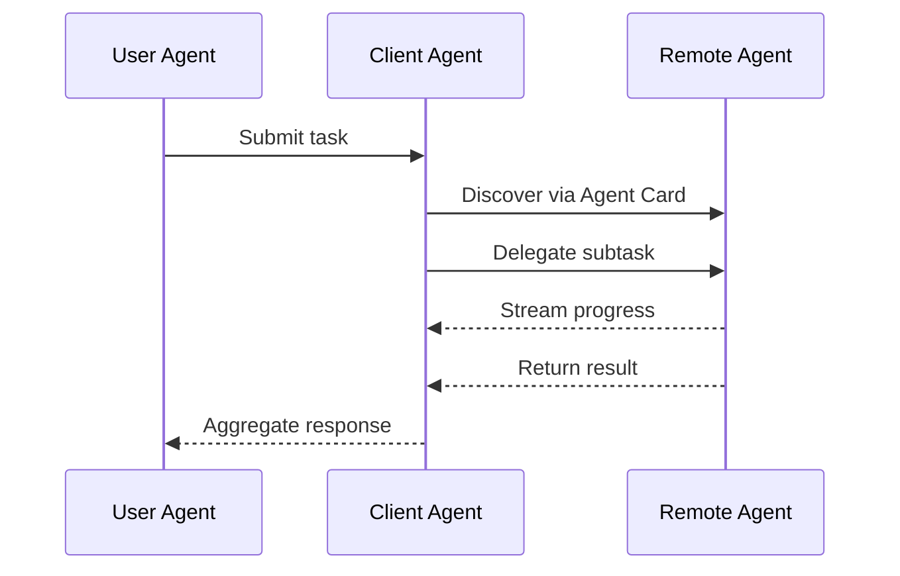

Yesterday I covered MCP — the protocol for connecting agents to tools and data. Today is A2A — the protocol for connecting agents to each other.

These two protocols are complementary, not competing. MCP handles agent-to-tool communication. A2A handles agent-to-agent communication. Together, they form the protocol stack for enterprise multi-agent systems.



---

## What Problem A2A Solves

In a multi-agent system, agents need to delegate work to other agents. The orchestrator routes a user request to a specialist. The specialist needs to call a sub-agent for a subtask. A customer-facing agent needs to hand off to an internal process agent.

Without a standard protocol, each of these interactions is custom-built. The orchestrator knows the specific API of each specialist. Handoffs are bespoke. Agents built by different teams, or different vendors, can't communicate without integration work.

A2A standardises agent-to-agent communication the same way MCP standardised agent-to-tool communication. An agent that speaks A2A can communicate with any other A2A-compatible agent, regardless of which vendor built it or which model powers it.

---

## The A2A Architecture

A2A uses an HTTP-based request/response model with optional streaming. The key concepts:

**Agent Cards** — a JSON document each agent publishes that describes its capabilities. Think of it as the agent's API contract plus service advertisement.

```json
{
  "name": "OrderManagementAgent",
  "description": "Handles order status queries, modifications, and cancellations",
  "url": "https://agents.internal/order-management",
  "capabilities": {
    "streaming": true,
    "pushNotifications": false
  },
  "skills": [
    {
      "id": "order_status",
      "name": "Order Status Query",
      "description": "Returns current status and tracking information for an order",
      "inputModes": ["text"],
      "outputModes": ["text", "data"]
    }
  ]
}
```

**Tasks** — the unit of work. An agent sends a task to another agent; the receiving agent executes it and returns results. Tasks have a lifecycle: submitted, working, completed, failed.

**Three agent roles:**
- **User Agent** — represents the human user; initiates the top-level task
- **Client Agent** — delegates to other agents; acts on behalf of a user agent
- **Remote Agent** — executes tasks; receives requests from client agents

In an enterprise deployment, the orchestrator is a client agent. Specialists are remote agents. The user-facing layer is the user agent.

---

## How A2A Complements MCP

The two protocols work at different layers and are designed to be used together:

```
User Request
    ↓
User Agent (A2A client)
    ↓ [A2A: task delegation]
Orchestrator Agent (A2A client + server)
    ↓ [A2A: specialist handoff]
Specialist Agent (A2A server)
    ↓ [MCP: tool calls]
Enterprise Systems (MCP servers: CRM, ERP, etc.)
```

MCP connects agents to systems. A2A connects agents to agents. The agent in the middle uses both protocols.

---

## The Discovery Problem A2A Solves

One underappreciated feature of Agent Cards: they enable dynamic discovery. An orchestrator can discover available specialists at runtime by querying a registry of Agent Cards, rather than having the specialist endpoints hardcoded.

This matters for enterprise deployments where agent capabilities evolve. A new specialist can register its Agent Card; orchestrators that query the registry automatically have access to it without redeployment.

---

## A2A in Practice: What to Design For

**Authentication and authorisation.** A2A supports standard HTTP authentication. In enterprise deployments, agent-to-agent calls should use service principal credentials with the minimum necessary permissions. Don't use broad credentials because it's convenient.

**Task timeouts and cancellation.** Long-running agent tasks need explicit timeout handling and cancellation support. A2A's task lifecycle model handles this, but you need to implement the handlers.

**Structured results.** Design your agent's output schema explicitly. Downstream agents that receive your output will parse it; vague or inconsistently structured output creates fragile integrations.

**Error communication.** Failed tasks should include structured error information — error type, user-safe message, retry guidance. The receiving agent needs to handle failures gracefully rather than propagating opaque errors to the user.

---

## The Ecosystem in 2026

A2A launched with 50+ partner companies and is seeing rapid adoption. The practical implication: agents from different vendors can now interoperate. Your Copilot Studio orchestrator can delegate to a LangGraph specialist. Your Claude Code agent can call a CrewAI workflow. The cross-vendor agent ecosystem is becoming real.

For enterprise teams, this changes the build-vs-buy question for specialist agents. If your CRM vendor ships an A2A-compatible agent that handles customer data queries, you might not need to build that specialist yourself.

---

*Day 3 of the [Production Agentic AI series](/posts/production-agentic-ai-30-day-plan/). Previous: [MCP Explained](/posts/mcp-explained-the-protocol-that-connects-ai-to-everything/)*
