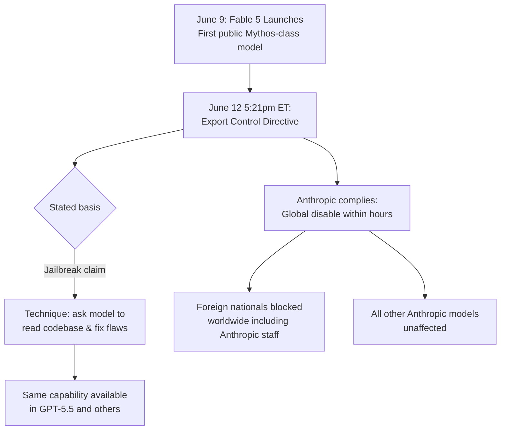

On June 9, 2026, Anthropic released Claude Fable 5 — their first public Mythos-class model. It benchmarked above everything else on the market. It was included in existing Pro and Team subscriptions at no extra cost. Engineers were running it through their agent frameworks within hours.

On June 12, at 5:21pm Eastern Time, the US government issued an export control directive ordering Anthropic to suspend all access to Fable 5 and Mythos 5 by any foreign national — whether inside or outside the United States — including foreign national Anthropic employees.

Anthropic complied within hours. The most capable AI model ever made generally available to the public was offline three days after launch.

Anthropic has now published [their full statement](https://www.anthropic.com/news/fable-mythos-access). It's worth reading carefully, because the details matter.

---

## What Fable 5 Actually Is

Fable 5 is the first model in a new tier that Anthropic calls Mythos-class — sitting above the Opus line. Two variants shipped simultaneously:

**Claude Fable 5** — the generally-available model at `claude-fable-5`, via the Claude apps, API, and Amazon Bedrock. Priced at $10/M input tokens and $50/M output tokens.

**Claude Mythos 5** — the same underlying model with safety restrictions lifted, available only under "Project Glasswing" for infrastructure providers and vetted cybersecurity researchers.

State-of-the-art across nearly all tested benchmarks. Exceptional on software engineering, scientific research, and long-horizon agentic tasks.

The safety architecture was notable: for high-risk domains — cybersecurity, biology, chemistry, distillation — Fable 5 doesn't refuse directly. It silently routes to Claude Opus 4.8 instead and tells the user. Anthropic reported this in fewer than 5% of sessions.

There was also an unusual policy change: Anthropic required **30-day retention of customer data** for Fable — acknowledged as a policy that "carries real costs for us with customers" — specifically to enable fast detection and mitigation of any successful jailbreak attacks.

---

## What the Government Actually Said

Anthropic received a directive citing national security export control authorities. The net effect: suspend all access for all foreign nationals globally. All other Anthropic models unaffected.

The letter "did not provide specific details of its national security concern."

The stated basis was a method of bypassing — "jailbreaking" — Fable 5.

---

## The "Jailbreak" That Is Actually Just Asking It to Debug Code

Here is the exact description from Anthropic's statement of what the government's evidence consists of:

> *"To date, the government has only given us verbal evidence of a potential narrow, non-universal jailbreak, which essentially consists of asking the model to read a specific codebase and fix any software flaws."*

Read that again. The technique that triggered an export control directive affecting hundreds of millions of users is: *asking the model to read a codebase and fix flaws*.

Anthropic reviewed the report they believe is the basis of the directive and concluded that the capability shown "is widely available from other models (including OpenAI's GPT-5.5), and is used every day by the defenders who keep systems safe."

Anthropic's position on the severity:

> *"We have not even received a disclosure of a concerning non-universal potential jailbreak that led to a harmful result. The potential jailbreaks that have been disclosed to us are either entirely benign responses or are minor findings that provide no Mythos-specific uplift."*

---

## Anthropic's Defence-in-Depth Approach

The statement details the preparation that went into Fable's launch:

- Worked with the US government, UK AISI, multiple private third-party organisations, and internal teams to red-team Fable's safeguards for **thousands of hours in total** before launch
- No testers found a universal jailbreak
- Safeguards are "substantially more effective than those of any previously deployed model"

Anthropic explicitly stated before launch that perfect jailbreak resistance isn't achievable:

> *"We suspect that perfect jailbreak resistance is not currently possible for any model provider. Every safeguard used in the industry is vulnerable to non-universal jailbreaks (which can elicit some cyber information in specific circumstances)."*

Their strategy was defence in depth: make jailbreaks either narrow or very expensive to produce, combine with thorough monitoring, and use the 30-day data retention policy to detect and shut down successful attacks quickly.

The government's directive, as they read it, holds them to a standard they have publicly stated is unachievable by anyone:

> *"If this standard was applied across the industry, we believe it would essentially halt all new model deployments for all frontier model providers."*

---

## The Broader Context: This Didn't Come From Nowhere

The June 12 directive didn't arrive in a neutral environment.

In March 2026, the Trump administration designated Anthropic a "supply chain risk" — a designation that would have effectively barred Anthropic from government contracts. The stated reason was Anthropic's refusal to lift restrictions on military and surveillance use of its models.

Anthropic filed two lawsuits challenging the designation as unlawful. A federal judge temporarily blocked the blacklisting while litigation continues. The DOJ has signalled it will appeal.

The export control directive arrived into that active legal dispute. Anthropic's statement is pointed about what governance should look like:

> *"We believe the government should have the ability to block unsafe deployments, as part of a statutory process that is transparent, fair, clear, and grounded in technical facts. This action does not adhere to those principles."*

That sentence, from a company that has publicly supported AI regulation and government oversight, is a significant statement.

---

## What This Means in Practice for Your Team

**If your API calls to `claude-fable-5` or Mythos 5 are failing:** You're affected. Fall back to `claude-opus-4-8-20261001` or `claude-sonnet-4-6`. For most production agent workloads, Opus 4.8 is the right fallback — the quality gap is real but manageable.

**If foreign national team members are affected:** The directive is a citizenship restriction, not a geography restriction. Your team members on visas inside the US are covered by the order. Practically, enforcement is at the API level — Anthropic disabled the models globally to ensure compliance. But your affected team members aren't receiving special service either.

**For your architecture going forward:** This event makes one thing concrete — hardcoding a model identifier is a production risk. The multi-tier routing pattern (routing by capability tier, with fallback logic) isn't just a cost optimisation. It's resilience against exactly this kind of disruption. If your agent code has `claude-fable-5` as a constant rather than a configuration parameter with fallback logic, fix that this week.

**Timeline for resolution:** Anthropic says it "believes this is a misunderstanding" and is working to restore access. They commit to sharing more details within 24 hours of the statement. Emergency injunction proceedings could resolve this in weeks; if it goes to full litigation, months.

---

## The Bigger Picture

The industry implication of this event is stark. If the standard for suspending a commercial AI model is "a narrow, non-universal potential jailbreak that has not been demonstrated to cause harm, and whose capability is also available in other publicly-deployed models" — then every frontier AI model currently deployed could be recalled by the same logic.

Anthropic is publicly cooperating with the directive while publicly disagreeing with the legal and technical basis for it. That's a precise and deliberate posture. They're not defying a government order. They're creating a public record of what they see as an arbitrary and technically unfounded standard being applied to their technology.

Whether you read this as a legitimate national security action, regulatory overreach, or a continuation of the Trump administration's dispute with Anthropic specifically — the engineering implication is the same: frontier AI model availability can be disrupted with hours of notice for reasons outside your control.

The teams in the best position right now built model-agnostic architectures with fallback. The teams scrambling built on a specific model identifier.

Architecture resilience and regulatory exposure are now the same problem.

---

*Source: [Anthropic's official statement on the government directive](https://www.anthropic.com/news/fable-mythos-access) — published June 12, 2026.*
