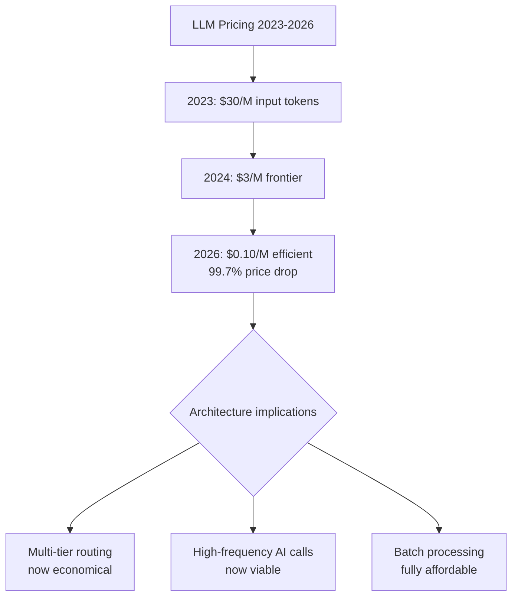

The most dramatic economic shift in AI infrastructure has been almost entirely underreported: the cost of LLM inference has collapsed.

March 2023: GPT-4 API input tokens at $30 per million. April 2026: Gemini 3.1 Flash at $0.10 per million input tokens. That's a 99.7% price reduction in three years.

This is not primarily a cost-reduction story, though it is that. It's an architecture story. What was economically unviable in 2023 is routine in 2026. And the architecture decisions that made sense at $30/million don't make sense at $0.10/million.



---

## The Current Pricing Landscape

The market has stratified clearly:

**Efficient tier** (high volume, cost-sensitive tasks):
- Gemini 3.1 Flash: ~$0.10/M input, ~$0.40/M output
- Claude Haiku 4.5: ~$0.25/M input, ~$1.25/M output
- GPT-4o Mini: ~$0.15/M input, ~$0.60/M output

**Premium reasoning tier** (complex tasks, frontier capability):
- Claude Opus 4.8: ~$3/M input, ~$15/M output
- GPT-5.5: ~$5/M input, ~$25/M output
- Gemini 3.1 Ultra: ~$4/M input, ~$20/M output

The ratio between tiers is roughly 30–50x. This gap is the key number for architecture decisions.

---

## What Changed: The Economically Viable Architecture

**Before the price collapse:** Every LLM call was expensive enough to deserve optimisation. Engineers cached aggressively, minimised context window usage, used cheap models for everything possible. The architecture was shaped by token cost as a primary constraint.

**After the price collapse:** Token cost for efficient-tier models is negligible for most applications. A 10,000 token prompt to Gemini Flash costs $0.001. You can call it 1,000 times for $1. The constraint that shaped architecture for three years has effectively disappeared for the efficient tier.

This changes the build decisions:

**What's now economically trivial:**
- Sending full document context on every call (no more aggressive chunking for cost reasons)
- Re-running inference when you're not confident in the output
- Using AI for tasks that would have been "too expensive" at 2023 prices
- Agentic loops with multiple tool calls per task

**What's still constrained:**
- Premium reasoning model usage at scale (still $3–5/M input)
- Long-context calls at high volume
- Streaming inference for real-time applications

---

## The New Architecture Decision

The primary architecture question is no longer "how do I minimise tokens?" It's: **which tasks need the premium tier, and which can run on the efficient tier?**

This changes system design:

```
Task Router
    ├── Routing logic: is this task complex?
    │
    ├── Simple tasks (classification, extraction, summarisation, 
    │   standard generation): → Efficient tier model
    │                              ~$0.10-0.25/M input
    │
    └── Complex tasks (multi-step reasoning, code generation,
        novel problem solving): → Premium tier model
                                    ~$3-5/M input
```

The router itself is cheap (efficient tier, small decision). The savings from routing simple tasks away from premium models are significant at scale.

---

## The Gartner Warning

Gartner's counterpoint to the pricing collapse narrative is worth taking seriously: "CPOs shouldn't confuse commodity token deflation with frontier reasoning democratisation."

Cheap tokens don't make complex reasoning cheap — they make simple inference cheap. The compute required for genuine complex reasoning remains expensive. Teams that architect as if all inference costs are collapsing will find that the reasoning bottleneck is the actual constraint.

The practical version: don't design a system that routes everything to the premium tier and expect the bill to be negligible. Design a system that uses the efficient tier for everything that doesn't need premium reasoning, and reserves the premium tier for tasks where it demonstrably improves outcomes.

---

## Architectural Implications for Agent Design

**Implication 1: Agentic loops are now viable at scale.**

At 2023 prices, an agent that made 10 LLM calls per task at $30/M was expensive. The same agent at $0.10/M is trivially cheap. This enables architectures — multi-step reasoning, iterative refinement, plan-execute-verify loops — that weren't economically viable before.

**Implication 2: Caching matters less for cost, but more for latency.**

When tokens were expensive, caching was a cost optimization. Now it's primarily a latency optimization. The shift changes the design priority: cache to reduce P95 latency, not to reduce spend.

**Implication 3: Evaluation is now economically viable at production scale.**

Running a comprehensive eval suite that makes 10,000 LLM calls was expensive in 2023. At current efficient-tier prices, it costs $1-5. This makes continuous evaluation — running your eval suite on every code change, not just weekly — economically viable. I'll cover evaluation in depth on Day 23.

---

*Day 6 of the [Production Agentic AI series](/posts/production-agentic-ai-30-day-plan/). Previous: [The 13% Problem](/posts/the-13-percent-problem-why-enterprise-ai-adoption-is-failing/)*
