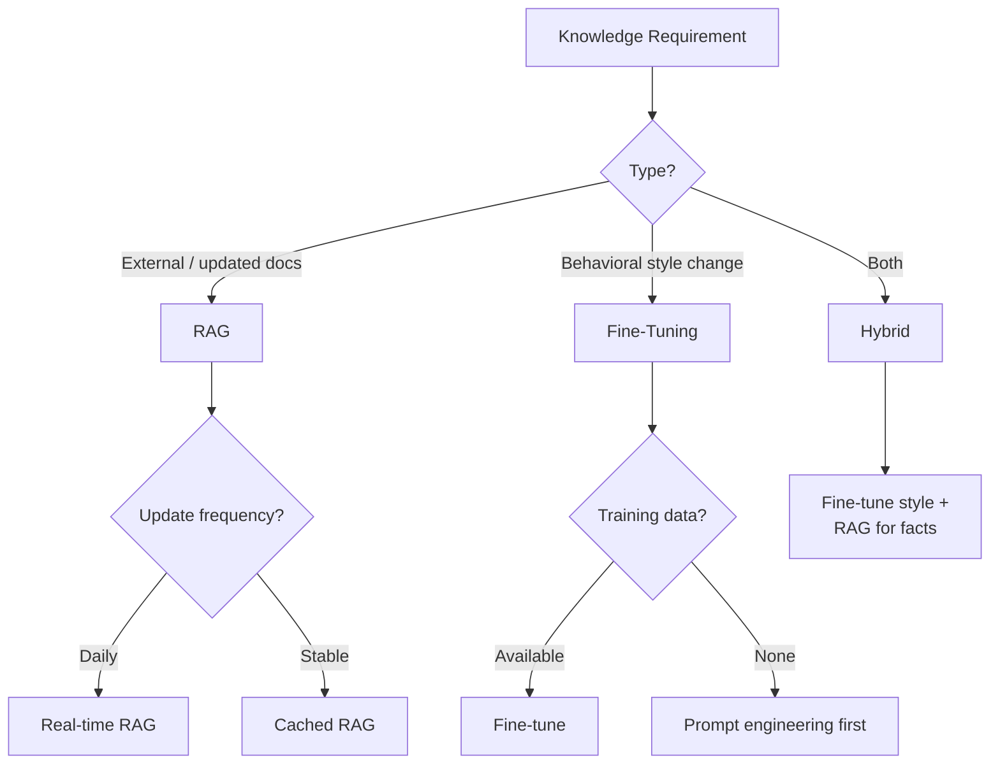

The RAG vs fine-tuning debate occupied a lot of AI engineering discourse for two years. In 2026, the production consensus has emerged: it's not either/or. It's hybrid, with each technique doing what it does best.

The simple version: put volatile knowledge in retrieval. Put stable behaviour in fine-tuning. Stop forcing one tool to do both jobs.

---

## Why the Debate Was Framed Wrong

The question "should I use RAG or fine-tuning?" implies you're choosing one approach for your entire system. That's almost never the right framing.

A real system has both knowledge (facts, documents, data) and behaviour (how to respond, what format to use, what to say and not say). These have different update frequencies and different optimal representations.

**Knowledge** changes frequently. New products ship. Policies update. Database records change. Knowledge that's baked into model weights through fine-tuning is stale by the next training run. Knowledge in a retrieval store is current whenever you update the store.

**Behaviour** is stable. "Respond in formal English," "never discuss competitors," "always include a source citation" — these don't change with every data update. These belong in the model's weights, where they're reliably applied without retrieval overhead.

---

## The Decision Framework

**Use RAG for:**
- Knowledge that changes faster than you can fine-tune (anything that updates more than quarterly)
- Proprietary enterprise data that can't be included in training data
- Long-tail facts that would require enormous training data to encode reliably
- Situations where you need to cite the source of information
- Cases where the model needs to reason over multiple documents together

**Use fine-tuning for:**
- Consistent output format and structure (JSON schema, specific markdown format, response length norms)
- Domain-specific tone and vocabulary that the base model doesn't naturally use
- Stable behavioural constraints ("never do X", "always include Y")
- Tasks where you have high-quality examples and want the model to match them closely
- Reducing prompt length by encoding instructions into model behaviour

**Use both for:**
- Enterprise assistants with both domain knowledge and specific response requirements
- Customer-facing agents with both factual knowledge and brand voice
- Code assistants with both codebase knowledge and coding style norms

---

## The Practical Reality of Fine-Tuning

Fine-tuning is much more accessible than it was 18 months ago. Most frontier model providers offer fine-tuning APIs. The data requirements are lower than previously assumed — quality matters more than quantity.

But fine-tuning still has real costs:

**Cost**: fine-tuning a model on thousands of examples costs hundreds to thousands of dollars. Small fine-tuning runs (dozens of examples) can be cheap, but may not produce reliable results.

**Maintenance**: when the base model updates, your fine-tune may need to be redone. Fine-tuned models on older bases fall behind the capability improvements of new base models.

**Evaluation burden**: fine-tuned models require evaluation to verify the fine-tune did what you wanted and didn't inadvertently affect other behaviours. This is engineering work.

For most enterprise deployments, the verdict: start with RAG. Fine-tune when you have a clear, stable behavioural requirement that RAG can't address, and when you have good training examples.

---

## The Context Length Question

Long context windows (100K+ tokens) are now standard. Does this change the RAG vs fine-tuning calculus?

For knowledge retrieval: long context enables stuffing more documents into a single prompt, which helps in some scenarios. But long context doesn't replace RAG for several reasons:

- **Retrieval precision**: relevant content buried in 100K tokens is harder for the model to surface than relevant content in a 2K window. Performance degrades in the middle of very long contexts.
- **Cost**: 100K tokens of context on every call is expensive even at current prices. RAG retrieves only the relevant subset.
- **Update latency**: documents in a fixed 100K context are static. RAG retrieves from a live index.

Long context is useful for situations where the full document genuinely needs to be in context — detailed code review of a large file, analysis of a long contract. It's not a substitute for well-designed RAG.

---

## Example: Enterprise Knowledge Assistant

A realistic hybrid architecture for an enterprise knowledge assistant:

**Fine-tune:** response format (always cite sources, use bullet points for lists, specific disclaimer language), tone (professional, concise), refusal behaviour (never answer HR questions, escalate compliance questions).

**RAG:** product documentation, policy documents, internal knowledge base, FAQ content — all updated continuously as the business changes.

**Result:** an assistant that consistently behaves correctly (fine-tuned behaviour) and answers accurately based on current information (RAG knowledge).

Neither approach alone achieves this. The hybrid is not a compromise — it's the architecturally correct solution.

---

*Day 8 of the [Production Agentic AI series](/posts/production-agentic-ai-30-day-plan/). Previous: [RAG in Production — Beyond the Basics](/posts/rag-in-production-beyond-the-basics/)*
