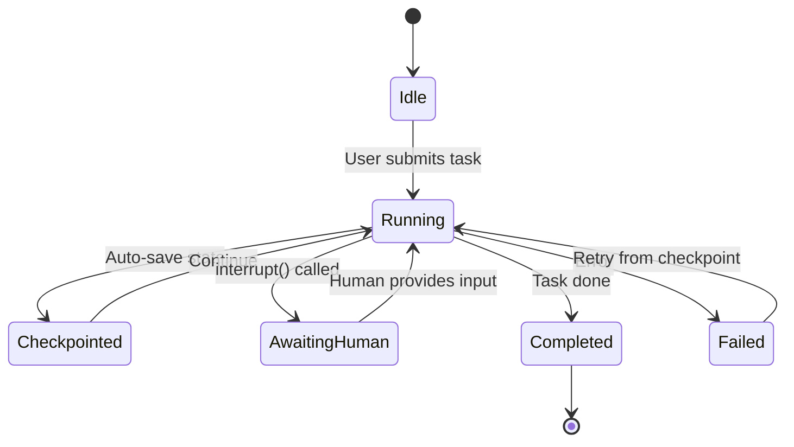

The simplest AI agent architecture is stateless: each request is independent, nothing persists between calls. Stateless agents are easy to build, easy to scale, and fragile for anything non-trivial.

Real tasks take time. Conversations span multiple turns. Networks fail. Users return to continue a task they started yesterday. Stateless agents can't handle any of this gracefully.



---

## What State Agents Need to Manage

**Conversation history**: what has been said in this session. Required for coherent multi-turn interaction.

**Task progress**: for long-running tasks (research, code generation, document analysis), where are we in the workflow? What steps have been completed?

**Intermediate results**: partial outputs from completed steps. If step 3 of 7 fails, step 3's predecessor results shouldn't be re-computed.

**User context**: preferences, authorisation state, previously established facts about the user's situation.

**Tool call state**: idempotency tokens, retry counts, results from previous tool calls.

---

## LangGraph's State Model

LangGraph's core abstraction is an explicitly typed state that flows through the agent graph. Every node reads from and writes to this state. The state is the single source of truth for what's happening in the workflow.

```python
from langgraph.graph import StateGraph, END
from typing import TypedDict, Annotated, Optional
import operator

class ResearchAgentState(TypedDict):
    # Conversation
    messages: Annotated[list, operator.add]  # append-only
    user_query: str
    
    # Task progress
    research_queries: list[str]
    completed_searches: Annotated[list, operator.add]
    retrieved_sources: Annotated[list, operator.add]
    
    # Synthesis state
    draft_answer: Optional[str]
    citations: list[dict]
    
    # Control flow
    iteration_count: int
    max_iterations: int
    is_complete: bool
    requires_human_review: bool
```

The `Annotated[list, operator.add]` pattern is LangGraph's reducer: when a node writes to this field, the new value is appended to the existing list rather than replacing it. This enables concurrent nodes to safely write to shared state.

---

## Persistence: Making State Durable

In-memory state dies with the process. For long-running or resumable agents, persist state to an external store.

LangGraph supports checkpointing — automatically persisting state at defined points:

```python
from langgraph.checkpoint.sqlite import SqliteSaver
from langgraph.checkpoint.postgres import PostgresSaver

# Development: SQLite
memory = SqliteSaver.from_conn_string("checkpoints.db")

# Production: PostgreSQL
memory = PostgresSaver.from_conn_string(os.environ["DATABASE_URL"])

# Compile graph with persistence
app = workflow.compile(checkpointer=memory)

# Each run needs a thread_id for state isolation
config = {"configurable": {"thread_id": "user-session-abc123"}}

# First invocation
result = await app.ainvoke({"user_query": "research X"}, config=config)

# Resume after interruption (same thread_id)
result = await app.ainvoke({"user_query": "continue"}, config=config)
```

The thread_id scopes state to a specific conversation or task. The same agent binary handles thousands of concurrent sessions, each with isolated state.

---

## Human-in-the-Loop with Persistent State

Persistence enables a pattern that's essential for enterprise agents: interrupt-resume workflows where humans review or approve intermediate results.

```python
from langgraph.graph import StateGraph, END, START
from langgraph.types import interrupt

class ApprovalWorkflow(TypedDict):
    draft: str
    approved: bool
    reviewer_comment: str

def generate_draft(state: ApprovalWorkflow) -> ApprovalWorkflow:
    draft = generate_content(...)
    return {"draft": draft}

def human_review(state: ApprovalWorkflow) -> ApprovalWorkflow:
    # This suspends execution and waits for human input
    decision = interrupt({
        "draft": state["draft"],
        "message": "Please review and approve or reject this draft"
    })
    return {"approved": decision["approved"], "reviewer_comment": decision.get("comment", "")}

def route_after_review(state: ApprovalWorkflow) -> str:
    return "publish" if state["approved"] else "revise"
```

When the graph hits the `interrupt()` call, it persists its state and suspends. The API returns a status indicating human input is required. When the reviewer provides input, the graph resumes from exactly where it left off.

---

## Handling Failures in Stateful Agents

The benefit of explicit state: failures are recoverable.

```python
async def robust_node(state: AgentState) -> AgentState:
    node_key = "step_3_result"
    
    # Check if this step was already completed (idempotency)
    if node_key in state.get("completed_steps", {}):
        return state  # Skip, use cached result
    
    try:
        result = await expensive_operation()
        return {
            "completed_steps": {**state.get("completed_steps", {}), node_key: result},
            "retry_count": 0
        }
    except RetryableError as e:
        retry_count = state.get("retry_count", 0) + 1
        if retry_count >= 3:
            return {"error": str(e), "terminal_error": True}
        return {"retry_count": retry_count}
```

When a node stores its result in state, re-running the graph (after a process restart, or after a failure) skips completed steps and resumes from the failure point. This is the agent equivalent of idempotent database operations.

---

*Day 13 of the [Production Agentic AI series](/posts/production-agentic-ai-30-day-plan/). Previous: [Evaluating RAG Pipelines](/posts/evaluating-rag-pipelines-the-metrics-that-matter/)*
