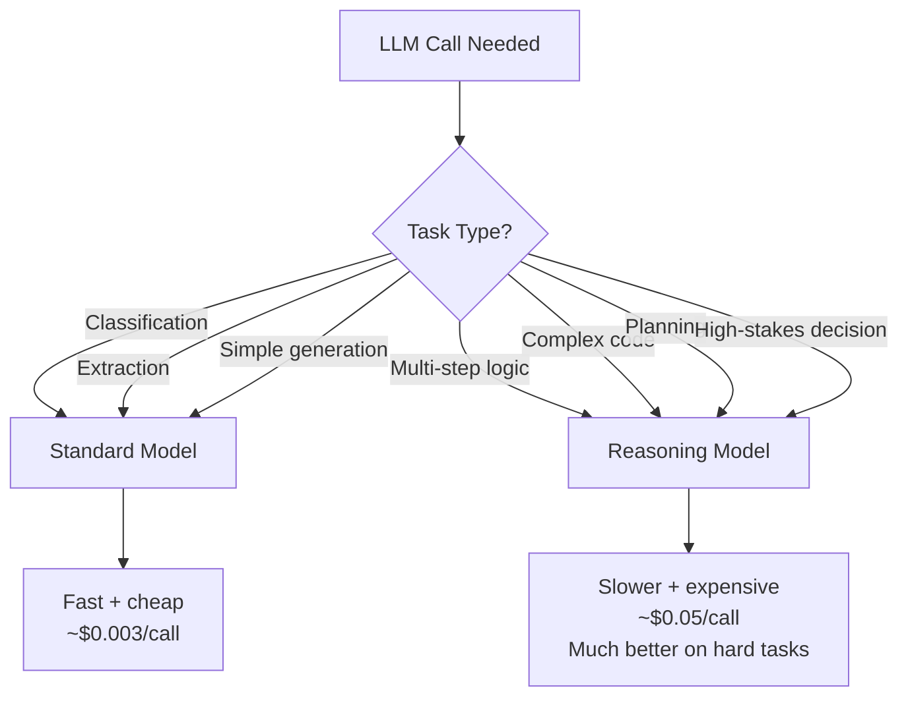

Reasoning Language Models (RLMs) — Claude with extended thinking, GPT-5 with chain-of-thought modes, the Gemini reasoning models — represent a different paradigm from standard next-token prediction. They generate extended internal reasoning before producing a response.

Claude Sonnet 4.5 with reasoning enabled reached 45.4% on long-horizon agentic reasoning benchmarks, compared to 2.6% without reasoning. On hard mathematical and coding problems, the gap is consistently large.

But reasoning tokens are expensive, slow, and not always necessary. The question is: when do you use them?



---

## What Reasoning Models Actually Do

Standard LLMs predict the next token based on the context. They're doing a very fast, very sophisticated pattern match.

Reasoning models add an explicit thinking phase. Before producing the output, the model generates a reasoning trace — working through the problem, considering alternatives, backtracking when an approach fails, verifying intermediate conclusions. This trace is typically not shown to the user but drives the final answer.

The result: on problems that require multi-step logical deduction, error correction, or planning under uncertainty, reasoning models produce substantially better output. On problems that don't require these capabilities, they produce similar output at much higher cost.

---

## The Cost Structure

Reasoning tokens are billed the same as output tokens — at the output rate, which is 5–10x the input rate for most models. And reasoning traces are long — a complex problem might generate 2,000–5,000 thinking tokens before producing a 300-token response.

At Claude Opus 4.8 pricing:
- Standard response (300 output tokens): ~$0.0045
- With reasoning (3,000 thinking tokens + 300 output tokens): ~$0.0495

That's 11x more expensive. At scale (1,000 requests/day), that's the difference between $4.50/day and $49.50/day for this operation alone.

The question is whether the quality improvement is worth the cost and latency differential for your specific task.

---

## When Reasoning Pays Off

**Multi-step mathematical or logical problems.** If the answer requires correctly executing a chain of dependent steps, an error in step 2 invalidates everything that follows. Reasoning models catch and correct these errors in the thinking phase.

**Complex code generation with non-obvious edge cases.** Writing code that must handle five edge cases correctly, some of which interact, benefits from thinking through the logic before generating. Standard models generate the common case correctly and miss edge cases; reasoning models think through the cases explicitly.

**Planning tasks where early decisions constrain later options.** Designing a database schema that must support multiple query patterns. Architecting a system where the choice at layer 1 affects what's possible at layer 3. Reasoning models think ahead.

**High-stakes decisions where errors are expensive.** If an agent is making a decision that's hard to reverse, the cost of reasoning tokens is small compared to the cost of a wrong decision.

---

## When Reasoning Doesn't Pay Off

**Classification and extraction tasks.** Classifying a document as one of five categories doesn't benefit from extended reasoning — the model either knows the category or it doesn't. Reasoning adds cost without improving accuracy.

**Generation from clear specifications.** If the spec is complete and unambiguous, standard generation produces good output. Reasoning helps when the problem is underspecified; it doesn't help when it isn't.

**High-frequency, latency-sensitive operations.** Reasoning adds 2–5 seconds of latency. For a chatbot that responds to conversational messages in real time, this is unacceptable for most turns.

**Batch processing of well-defined tasks.** Processing 10,000 customer records through a standard extraction pipeline — standard models are faster and cheaper with equivalent accuracy.

---

## The Hybrid Pattern for Agents

The most cost-effective approach: use reasoning selectively within an agent workflow.

```python
async def agent_step(state: AgentState, step_type: str) -> dict:
    if step_type in REASONING_REQUIRED_STEPS:
        # Use reasoning model for planning and complex decisions
        response = await llm.with_reasoning().generate(
            prompt=build_prompt(state),
            thinking_budget=8000  # max thinking tokens
        )
    else:
        # Standard model for retrieval, extraction, simple generation
        response = await llm.standard().generate(
            prompt=build_prompt(state)
        )
    return {"output": response}

# Classify which steps need reasoning
REASONING_REQUIRED_STEPS = {
    "plan_approach",       # Planning: needs to think ahead
    "synthesise_findings", # Synthesis: must hold multiple things in mind
    "debug_complex_error", # Debugging: needs logical deduction
    "evaluate_options",    # Decision: comparing complex tradeoffs
}
```

Classification, retrieval, extraction, and simple generation go to the standard model. Planning, synthesis, complex debugging, and decision-making go to the reasoning model.

This pattern captures most of the quality improvement at a fraction of the cost increase. In my own agent implementations, this approach typically uses reasoning for 10–20% of steps, covering the 80% of quality improvement that comes from reasoning on the hard steps.

---

*Day 15 of the [Production Agentic AI series](/posts/production-agentic-ai-30-day-plan/). Previous: [Computer Use Agents](/posts/computer-use-agents-the-new-agentic-paradigm/)*
