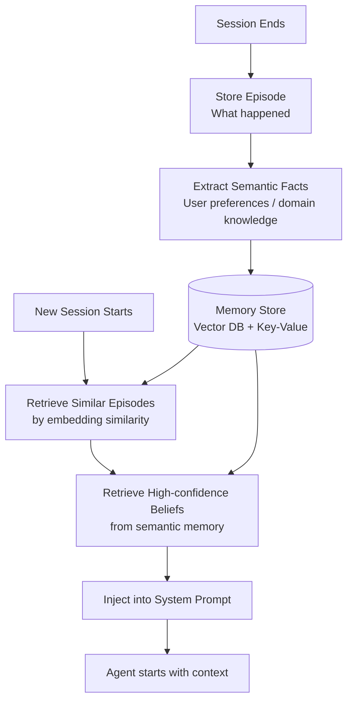

The context window gives agents short-term memory. But context windows clear between sessions. A customer service agent that asks the same clarifying questions every interaction, an engineering assistant that re-learns your codebase conventions each session, a research agent that loses all prior findings on restart — these are agents without long-term memory.

Long-term memory is what allows agents to build on prior interactions rather than starting fresh every time.



---

## The Four Memory Types

**Episodic memory**: records of what happened. "In session 47, the user asked about X and we concluded Y." Stored as structured or unstructured records indexed by time and session.

**Semantic memory**: generalised knowledge extracted from episodes. "This user prefers concise responses." "This codebase uses Repository pattern for data access." Stored as facts that apply across sessions.

**Procedural memory**: learned workflows. "When the user asks about billing issues, always check account status first, then payment history." Stored as structured processes or examples that shape agent behaviour.

**Working memory**: the active context window content — what's being held in mind right now. Covered in Day 9's context window management post.

---

## Implementing Episodic Memory

The simplest memory system: store a structured record after each session and retrieve relevant records at the start of new sessions.

```python
from dataclasses import dataclass, asdict
from datetime import datetime
import json

@dataclass
class EpisodicRecord:
    session_id: str
    timestamp: datetime
    user_id: str
    task_type: str
    summary: str          # What happened in this session
    outcomes: list[str]   # What was accomplished
    key_facts: list[str]  # Facts learned that may be reusable
    embedding: list[float] # For semantic retrieval

async def store_episode(session_data: dict, vector_store) -> None:
    # Generate summary of the session
    summary = await llm.generate(f"""
    Summarise this session in 2-3 sentences, focusing on:
    - What the user was trying to accomplish
    - What was achieved
    - Any important facts or preferences revealed
    
    Session: {json.dumps(session_data)}
    """)
    
    # Extract reusable facts
    facts = await llm.generate(f"""
    Extract any durable facts from this session that would be useful in future sessions.
    Focus on user preferences, domain knowledge, and constraints.
    Return as a JSON list of strings.
    
    Session summary: {summary}
    """)
    
    record = EpisodicRecord(
        session_id=session_data["session_id"],
        timestamp=datetime.now(),
        user_id=session_data["user_id"],
        task_type=session_data["task_type"],
        summary=summary,
        outcomes=session_data.get("outcomes", []),
        key_facts=json.loads(facts),
        embedding=await embed(summary)
    )
    
    await vector_store.upsert(asdict(record))

async def retrieve_relevant_episodes(user_id: str, current_task: str, vector_store) -> list[EpisodicRecord]:
    query_embedding = await embed(current_task)
    return await vector_store.search(
        query_embedding,
        filter={"user_id": user_id},
        top_k=3
    )
```

---

## Implementing Semantic Memory

Episodic records are specific. Semantic memory generalises them into persistent beliefs about the user or domain.

```python
class SemanticMemoryStore:
    def __init__(self, db):
        self.db = db
    
    async def update_belief(self, user_id: str, belief_key: str, new_evidence: str):
        existing = await self.db.get(f"belief:{user_id}:{belief_key}")
        
        if existing is None:
            # First evidence for this belief
            belief = await llm.generate(f"Extract a concise belief from: {new_evidence}")
            confidence = 0.6
        else:
            # Update existing belief with new evidence
            updated = await llm.generate(f"""
            Existing belief: {existing['belief']} (confidence: {existing['confidence']})
            New evidence: {new_evidence}
            
            Update the belief based on the new evidence. Return JSON:
            {{"belief": "updated belief text", "confidence": 0.0-1.0}}
            """)
            result = json.loads(updated)
            belief = result["belief"]
            confidence = result["confidence"]
        
        await self.db.set(f"belief:{user_id}:{belief_key}", {
            "belief": belief,
            "confidence": confidence,
            "last_updated": datetime.now().isoformat()
        })
    
    async def get_relevant_beliefs(self, user_id: str) -> dict:
        keys = await self.db.keys(f"belief:{user_id}:*")
        beliefs = {}
        for key in keys:
            belief_key = key.split(":")[-1]
            beliefs[belief_key] = await self.db.get(key)
        return {k: v for k, v in beliefs.items() if v["confidence"] > 0.5}
```

---

## Memory Injection at Session Start

At the start of each session, retrieve and inject relevant memory into the context:

```python
async def build_session_context(user_id: str, current_task: str) -> str:
    # Retrieve relevant episodes
    episodes = await retrieve_relevant_episodes(user_id, current_task, vector_store)
    
    # Retrieve semantic memory
    beliefs = await memory_store.get_relevant_beliefs(user_id)
    
    if not episodes and not beliefs:
        return ""  # No memory to inject
    
    context_parts = []
    
    if beliefs:
        belief_text = "\n".join([f"- {k}: {v['belief']}" for k, v in beliefs.items()])
        context_parts.append(f"What I know about this user:\n{belief_text}")
    
    if episodes:
        episode_text = "\n".join([f"- {ep['summary']}" for ep in episodes])
        context_parts.append(f"Relevant prior sessions:\n{episode_text}")
    
    return "\n\n".join(context_parts)
```

The memory injection is a system prompt addition. The agent starts the session with relevant context rather than starting cold.

---

## The Privacy and Retention Problem

Long-term memory raises legitimate concerns: what are you storing, who can see it, how long is it retained?

For enterprise agents, answer these explicitly before implementation:
- Is memory user-scoped, team-scoped, or global?
- How long do records persist? (GDPR right-to-erasure applies)
- Who has access to memory records?
- What happens to memory when a user leaves the organisation?

The technical implementation is the easy part. The governance model for what you're allowed to remember is the hard part, and it needs to be decided before you build.

---

*Day 17 of the [Production Agentic AI series](/posts/production-agentic-ai-30-day-plan/). Previous: [Multi-Model Orchestration](/posts/multi-model-orchestration-slm-plus-llm-hybrid-architectures/)*
