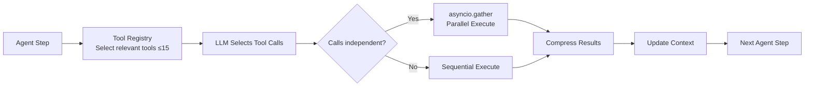

Function calling was the capability that turned LLMs into agents. Give the model a list of tools, it decides which to call, you execute the call, return the result, continue. The basic pattern is well understood.

The basic pattern breaks at scale. When your agent has 40 tools, runs parallel branches, makes 200 tool calls per session, and needs to handle partial failures without re-running everything — you need more than a tool list and a loop.



---

## The Problems That Emerge at Scale

**Tool selection degradation.** With 5 tools, models reliably pick the right one. With 40 tools, selection accuracy drops. The model reads all tool descriptions into its context on every step; description quality and length matter significantly.

**Parallel execution bottlenecks.** Most agent implementations call tools sequentially even when calls are independent. A research agent that needs to query five sources can do this in parallel — sequential execution is 5x slower for no reason.

**Partial failure handling.** If one tool call fails in a sequence of 10, naive implementations fail the whole task. The right behaviour depends on whether the failed step was on the critical path.

**Context window consumption.** Tool results accumulate in context. A session with 50 tool calls, each returning 500 tokens, uses 25,000 tokens just for results — before any reasoning. At scale, you need result compression.

**Cost attribution.** Which tool calls are driving cost? Without attribution, you can't optimise.

---

## Tool Registry Pattern

Instead of passing all tools on every call, maintain a registry and inject only the relevant subset.

```python
from dataclasses import dataclass
from typing import Callable

@dataclass
class Tool:
    name: str
    description: str
    schema: dict
    handler: Callable
    category: str
    estimated_tokens: int  # typical result size

class ToolRegistry:
    def __init__(self):
        self._tools: dict[str, Tool] = {}
    
    def register(self, tool: Tool):
        self._tools[tool.name] = tool
    
    def get_tools_for_task(self, task_type: str, max_tools: int = 15) -> list[Tool]:
        # Return tools relevant to this task type, capped at max_tools
        relevant = [t for t in self._tools.values() if task_type in t.category]
        
        # If still too many, prioritise by relevance score
        if len(relevant) > max_tools:
            relevant = relevant[:max_tools]
        
        return relevant
    
    def get_tool_definitions(self, tools: list[Tool]) -> list[dict]:
        return [
            {
                "name": t.name,
                "description": t.description,
                "input_schema": t.schema
            }
            for t in tools
        ]
```

Giving the model 15 relevant tools rather than 40 all-purpose tools reduces context usage and improves selection accuracy.

---

## Parallel Tool Execution

When the model requests multiple independent tool calls, execute them concurrently:

```python
import asyncio
from anthropic import Anthropic

client = Anthropic()

async def execute_tool_calls_parallel(tool_calls: list[dict], registry: ToolRegistry) -> list[dict]:
    async def execute_single(tool_call: dict) -> dict:
        tool = registry._tools.get(tool_call["name"])
        if not tool:
            return {"tool_use_id": tool_call["id"], "content": f"Unknown tool: {tool_call['name']}"}
        
        try:
            result = await asyncio.wait_for(
                asyncio.coroutine(tool.handler)(**tool_call["input"]),
                timeout=30.0
            )
            return {
                "type": "tool_result",
                "tool_use_id": tool_call["id"],
                "content": str(result)
            }
        except asyncio.TimeoutError:
            return {
                "type": "tool_result",
                "tool_use_id": tool_call["id"],
                "content": "Tool call timed out after 30 seconds",
                "is_error": True
            }
        except Exception as e:
            return {
                "type": "tool_result",
                "tool_use_id": tool_call["id"],
                "content": f"Tool error: {str(e)}",
                "is_error": True
            }
    
    # Execute all tool calls concurrently
    results = await asyncio.gather(*[execute_single(tc) for tc in tool_calls])
    return list(results)
```

Claude's API returns all tool use blocks in a single response. If it calls `search_web`, `query_database`, and `read_file` simultaneously, you can execute all three in parallel — total latency is max(individual latencies) rather than sum.

---

## Result Compression

Long tool results consumed verbatim exhaust context windows. Compress before returning to the model:

```python
async def compress_tool_result(result: str, tool_name: str, max_tokens: int = 500) -> str:
    # Rough token estimate: 1 token ≈ 4 chars
    if len(result) / 4 <= max_tokens:
        return result  # Short enough, return as-is
    
    compressed = await llm.generate(f"""
    Compress this tool result to the key information relevant to an AI agent.
    Preserve: specific data, numbers, names, errors, important findings.
    Remove: boilerplate, verbose formatting, redundant context.
    Target: under {max_tokens} tokens.
    
    Tool: {tool_name}
    Result: {result[:8000]}  # limit input
    """)
    
    return compressed
```

A web search returning a full HTML page can be compressed to the relevant facts. A database query returning 500 rows can be compressed to the aggregate result. The model gets the information it needs without the noise.

---

## Tool Call Tracking and Cost Attribution

```python
from dataclasses import dataclass, field
from datetime import datetime

@dataclass
class ToolCallRecord:
    tool_name: str
    input_tokens: int
    output_tokens: int
    latency_ms: int
    timestamp: datetime
    session_id: str
    success: bool

class ToolCallTracker:
    def __init__(self):
        self.records: list[ToolCallRecord] = []
    
    def record(self, record: ToolCallRecord):
        self.records.append(record)
    
    def cost_breakdown(self, output_token_rate: float = 0.000015) -> dict:
        by_tool = {}
        for r in self.records:
            if r.tool_name not in by_tool:
                by_tool[r.tool_name] = {"calls": 0, "tokens": 0, "cost": 0, "avg_latency_ms": []}
            by_tool[r.tool_name]["calls"] += 1
            by_tool[r.tool_name]["tokens"] += r.output_tokens
            by_tool[r.tool_name]["cost"] += r.output_tokens * output_token_rate
            by_tool[r.tool_name]["avg_latency_ms"].append(r.latency_ms)
        
        for tool in by_tool:
            latencies = by_tool[tool]["avg_latency_ms"]
            by_tool[tool]["avg_latency_ms"] = sum(latencies) / len(latencies)
        
        return by_tool
```

This attribution surfaces which tools are driving token usage and latency. In my production agents, I consistently find two or three tools responsible for 70% of context consumption — usually the ones returning uncompressed external data.

---

## Tool Versioning with MCP

When tools are exposed via MCP servers, versioning becomes important. Tool behaviour changes break agent workflows that depend on specific output formats.

```python
# MCP server with versioned tools
from mcp.server import Server
from mcp.types import Tool

server = Server("data-tools")

@server.list_tools()
async def list_tools():
    return [
        Tool(
            name="search_documents_v2",  # explicit version in name
            description="""Search the document corpus. v2: Returns structured results with source metadata.
            Use this for document retrieval tasks.""",
            inputSchema={
                "type": "object",
                "properties": {
                    "query": {"type": "string"},
                    "top_k": {"type": "integer", "default": 5}
                },
                "required": ["query"]
            }
        )
    ]
```

Naming the version in the tool name lets agents be explicitly directed to use v2, while v1 remains available for backward compatibility during transitions.

---

## The Tool Audit

Before going to production, audit your tool surface:

1. **Scope creep**: Does each tool do one thing? Tools that do multiple things are hard for models to select correctly.
2. **Description clarity**: Read each description cold, as if you'd never seen the tool. Is it unambiguous what it does and doesn't do?
3. **Output consistency**: Does the tool return the same structure on success? Models learn output patterns; inconsistency causes misinterpretation.
4. **Failure modes**: Does every tool have a clear error return? A tool that raises an unhandled exception breaks the agent loop.
5. **Side effects**: Is every tool with side effects (write, send, modify) clearly marked? The model needs to know before calling.

---

*Day 18 of the [Production Agentic AI series](/posts/production-agentic-ai-30-day-plan/). Previous: [Long-Term Memory Patterns](/posts/long-term-memory-patterns-for-production-agents/)*
