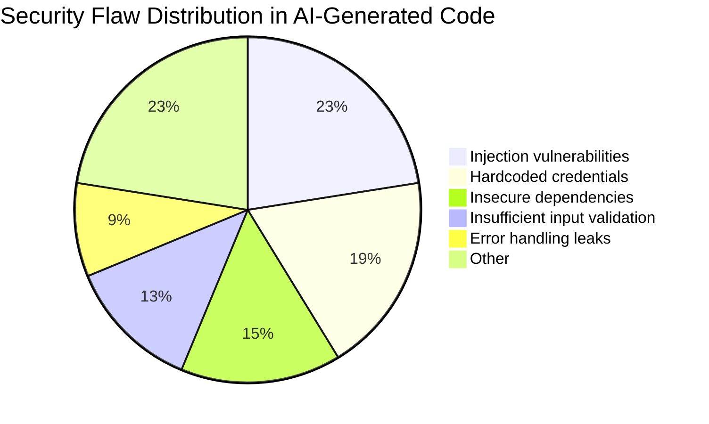

In early 2026, the Cloud Security Alliance published results from a large-scale analysis of AI-generated code. Across models, languages, and task types, 62% of code samples contained at least one security flaw.

That number gets cited a lot. What gets cited less often is the breakdown: what kinds of flaws, in what contexts, and what the implications actually are for teams using AI-assisted development.



---

## What the 62% Actually Contains

The flaw distribution in the CSA analysis wasn't uniform. The headline number covered a range from critical to minor:

**Injection vulnerabilities (SQL, command, LDAP):** ~18% of samples. AI models trained on tutorial code learn patterns like string-formatted SQL queries — code that works, that's everywhere in training data, and that's insecure.

**Hardcoded credentials and secrets:** ~15%. Models generate working examples with placeholder values that look like real values. Developers copy the pattern and sometimes the values.

**Insecure dependencies and imports:** ~12%. AI suggests packages without checking versions; older versions of common packages carry known CVEs.

**Insufficient input validation:** ~10%. Models generate the happy path. Edge cases — malformed input, extreme values, encoding issues — are frequently absent.

**Improper error handling that leaks information:** ~7%. Stack traces returned to API callers. Error messages that reveal internal paths or database structure.

The distribution matters because it tells you where to focus review effort.

---

## Why AI Generates Insecure Code

The training data problem is structural: the internet has a lot of insecure code. Stack Overflow answers optimise for getting something working, not for security hardening. Tutorial sites show the simple case. Internal codebases with injection vulnerabilities contributed to the training corpus.

The model learned to predict what comes next in code — and in a lot of training examples, what came next was insecure.

There's also a task framing problem: when you ask an AI to "add a search endpoint," it generates a search endpoint. The security requirements of that endpoint aren't in the prompt, so they often aren't in the output.

---

## The Review Pipeline That Actually Catches This

**SAST in the CI pipeline, not just on PR merge:**

```yaml
# .github/workflows/security-scan.yml
name: Security Scan

on: [push, pull_request]

jobs:
  sast:
    runs-on: ubuntu-latest
    steps:
      - uses: actions/checkout@v4
      
      - name: Run Semgrep
        uses: returntocorp/semgrep-action@v1
        with:
          config: >-
            p/security-audit
            p/secrets
            p/owasp-top-ten
          generateSarif: "1"
      
      - name: Upload SARIF
        uses: github/codeql-action/upload-sarif@v3
        with:
          sarif_file: semgrep.sarif
```

SAST running on every push — not just on PRs to main — catches issues before they're embedded in review discussions.

**Secret scanning at commit time:**

```bash
# Install pre-commit hooks
pip install pre-commit detect-secrets

# .pre-commit-config.yaml
repos:
  - repo: https://github.com/Yelp/detect-secrets
    rev: v1.4.0
    hooks:
      - id: detect-secrets
        args: ['--baseline', '.secrets.baseline']
```

Secrets caught before commit are never in git history. Secrets caught at PR review are in history even if the PR is rejected.

**Dependency vulnerability scanning:**

```bash
# Python: safety or pip-audit
pip-audit --require-hashes -r requirements.txt

# Node: npm audit
npm audit --audit-level=moderate

# In CI: fail builds on high/critical CVEs
pip-audit --require-hashes --strict -r requirements.txt
```

---

## The AI-Specific Code Review Checklist

When reviewing AI-generated code, go beyond what you'd check for human-written code:

**Injection risks:**
- [ ] Database queries use parameterised statements, not string formatting
- [ ] Shell commands don't include user-controlled input
- [ ] Template rendering uses context-aware escaping

**Input validation:**
- [ ] Function validates input types and ranges at the entry point
- [ ] File paths are validated and restricted to expected directories
- [ ] Deserialized data is validated against a schema before use

**Credential handling:**
- [ ] No hardcoded credentials, API keys, or passwords
- [ ] Secrets loaded from environment or secret management (not config files committed to repo)
- [ ] Connection strings don't contain credentials

**Error handling:**
- [ ] Exception handlers log internally, don't expose to external callers
- [ ] HTTP error responses don't include stack traces or internal paths
- [ ] Sensitive data isn't logged

**Dependencies:**
- [ ] New imports are necessary (AI sometimes adds unused imports from examples)
- [ ] Pinned versions; scan against CVE databases

---

## The Practical Stance

The 62% finding doesn't mean AI-generated code is net negative for security. Human developers introduce security flaws too — the base rate for human code in production is non-trivial.

What it means is that AI-generated code needs the same review discipline you'd apply to junior developer output: systematic, not trusting, focused on the high-risk patterns.

The teams I've seen handle this well have SAST running on every commit (not just nightly), require security review for any AI-generated code touching authentication, external APIs, or data persistence, and run secret scanning as a pre-commit hook that blocks commits rather than warns about them.

The teams that struggle have the tools configured but not enforced — scanning running in advisory mode, security checks that developers can bypass with a flag.

---

*Day 19 of the [Production Agentic AI series](/posts/production-agentic-ai-30-day-plan/). Previous: [Tool Orchestration at Scale](/posts/tool-orchestration-at-scale-beyond-simple-function-calling/)*
