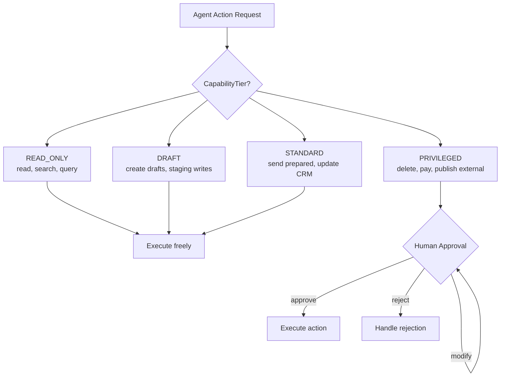

The more capable an agent, the larger its potential blast radius. An agent that can send emails, modify databases, call APIs, and manage infrastructure can cause significant damage if it makes a mistake — or is manipulated into making one.

Blast radius control is the discipline of limiting what can go wrong. It's the agent equivalent of the principle of least privilege, combined with patterns that make harmful actions require explicit human approval.



---

## The Blast Radius Taxonomy

Not all agent errors are equal. Rank potential actions by reversibility:

**Easily reversible:** read operations, draft creation, local computation, logging. Mistakes have no lasting consequence.

**Reversible with effort:** created records (can be deleted), sent drafts (can be recalled in some systems), configuration changes with rollback procedures.

**Difficult to reverse:** sent emails (can't be unsent), published content (even if deleted, may be cached/indexed), triggered webhooks, charges to payment systems.

**Irreversible:** deleted data without backup, executed financial transactions, permanent infrastructure changes, communications to external parties.

The goal is to ensure agents can operate freely in the first two categories, require lightweight review in the third, and require explicit human approval in the fourth.

---

## The Capability Tiering Pattern

Implement capability tiers as named tool sets, and assign agents to tiers:

```python
from enum import Enum
from dataclasses import dataclass

class CapabilityTier(Enum):
    READ_ONLY = "read_only"
    DRAFT = "draft"           # can create but not publish/send
    STANDARD = "standard"     # can take standard reversible actions
    PRIVILEGED = "privileged" # can take irreversible actions (requires approval)

TIER_TOOLS = {
    CapabilityTier.READ_ONLY: [
        "read_document", "search_documents", "query_database_read",
        "list_emails", "read_email", "search_web"
    ],
    CapabilityTier.DRAFT: [
        "create_draft_email", "create_draft_document", 
        "write_to_staging_db", "create_calendar_draft"
    ],
    CapabilityTier.STANDARD: [
        "send_prepared_email", "update_crm_record", 
        "post_to_internal_channel", "create_calendar_event"
    ],
    CapabilityTier.PRIVILEGED: [
        "send_external_email", "delete_records", "execute_payment",
        "modify_infrastructure", "publish_external_content"
    ]
}

def get_tools_for_agent(agent_tier: CapabilityTier) -> list[str]:
    # Each tier includes all tools from lower tiers
    tiers_in_order = list(CapabilityTier)
    agent_tier_index = tiers_in_order.index(agent_tier)
    tools = []
    for tier in tiers_in_order[:agent_tier_index + 1]:
        tools.extend(TIER_TOOLS[tier])
    return tools
```

Most agent tasks don't require privileged operations. Start agents at the lowest tier that allows the task, not the highest tier that wouldn't break it.

---

## Human-in-the-Loop for Irreversible Actions

For any action in the privileged tier, require explicit human approval before execution:

```python
from langgraph.types import interrupt

def request_human_approval(state: dict) -> dict:
    pending_action = state["pending_action"]
    
    # Suspend execution and present the action for review
    decision = interrupt({
        "message": "Agent is requesting approval for the following action:",
        "action_type": pending_action["type"],
        "action_details": pending_action["details"],
        "reason": pending_action["reason"],
        "reversibility": "IRREVERSIBLE",
        "options": ["approve", "reject", "modify"]
    })
    
    if decision["choice"] == "approve":
        return {"approved_action": pending_action, "approval_status": "approved"}
    elif decision["choice"] == "modify":
        return {"pending_action": decision["modified_action"], "approval_status": "pending"}
    else:
        return {"approval_status": "rejected", "rejection_reason": decision.get("reason")}

def route_after_approval(state: dict) -> str:
    status = state["approval_status"]
    if status == "approved":
        return "execute_action"
    elif status == "pending":
        return "request_human_approval"  # loop with modified action
    else:
        return "handle_rejection"
```

The `interrupt()` pattern (from Day 13's stateful agents post) persists state and suspends execution until a human responds. The agent resumes exactly where it left off after approval.

---

## Sandboxed Execution Environments

For agents that run code or interact with systems, use isolated environments:

```python
import docker
import tempfile
import os

class SandboxedCodeRunner:
    def __init__(self):
        self.client = docker.from_env()
    
    async def run_code(self, code: str, language: str = "python") -> dict:
        with tempfile.NamedTemporaryFile(mode='w', suffix='.py', delete=False) as f:
            f.write(code)
            code_path = f.name
        
        try:
            # Run in restricted container: no network, read-only filesystem, memory limited
            container = self.client.containers.run(
                f"python:3.11-slim",
                command=f"python /code/script.py",
                volumes={code_path: {"bind": "/code/script.py", "mode": "ro"}},
                network_mode="none",        # no network access
                read_only=True,             # read-only filesystem
                mem_limit="256m",           # memory cap
                cpu_quota=50000,            # 50% CPU
                remove=True,
                stdout=True,
                stderr=True,
                timeout=30
            )
            return {"success": True, "output": container.decode("utf-8")}
        except docker.errors.ContainerError as e:
            return {"success": False, "error": e.stderr.decode("utf-8")}
        finally:
            os.unlink(code_path)
```

A sandboxed code runner with `network_mode="none"` prevents code from making outbound connections. `read_only=True` prevents filesystem modifications. Memory and CPU limits prevent resource exhaustion.

---

## Audit Logging for All Agent Actions

Every action an agent takes should be logged with enough context to reconstruct what happened:

```python
import logging
import json
from datetime import datetime, timezone

logger = logging.getLogger("agent.audit")

def log_agent_action(
    session_id: str,
    agent_id: str,
    action_type: str,
    action_details: dict,
    result: str,
    success: bool,
    user_id: str | None = None
):
    logger.info(json.dumps({
        "timestamp": datetime.now(timezone.utc).isoformat(),
        "session_id": session_id,
        "agent_id": agent_id,
        "user_id": user_id,
        "action_type": action_type,
        "action_details": action_details,
        "result_summary": result[:200] if result else None,
        "success": success,
    }))
```

Audit logs serve two purposes: incident investigation ("what did the agent do before the data loss?") and drift detection ("has agent behaviour changed from expected patterns?").

---

## The Circuit Breaker for Agents

Agents that encounter unexpected errors sometimes enter retry loops that amplify damage. A circuit breaker stops this:

```python
class AgentCircuitBreaker:
    def __init__(self, failure_threshold: int = 3, recovery_window_seconds: int = 300):
        self.failure_count = 0
        self.failure_threshold = failure_threshold
        self.is_open = False
        self.last_failure_time = None
        self.recovery_window = recovery_window_seconds
    
    def record_failure(self):
        self.failure_count += 1
        self.last_failure_time = datetime.now()
        if self.failure_count >= self.failure_threshold:
            self.is_open = True
            logger.warning("Agent circuit breaker opened — halting agent execution")
    
    def record_success(self):
        self.failure_count = 0
        self.is_open = False
    
    def can_execute(self) -> bool:
        if not self.is_open:
            return True
        # Check if recovery window has passed
        if (datetime.now() - self.last_failure_time).seconds > self.recovery_window:
            self.is_open = False
            self.failure_count = 0
            return True
        return False
```

Three consecutive failures open the circuit and halt the agent. This prevents a buggy agent from making hundreds of failed API calls or creating thousands of invalid records before a human notices.

---

*Day 21 of the [Production Agentic AI series](/posts/production-agentic-ai-30-day-plan/). Previous: [Prompt Injection](/posts/prompt-injection-in-production-agents/)*
