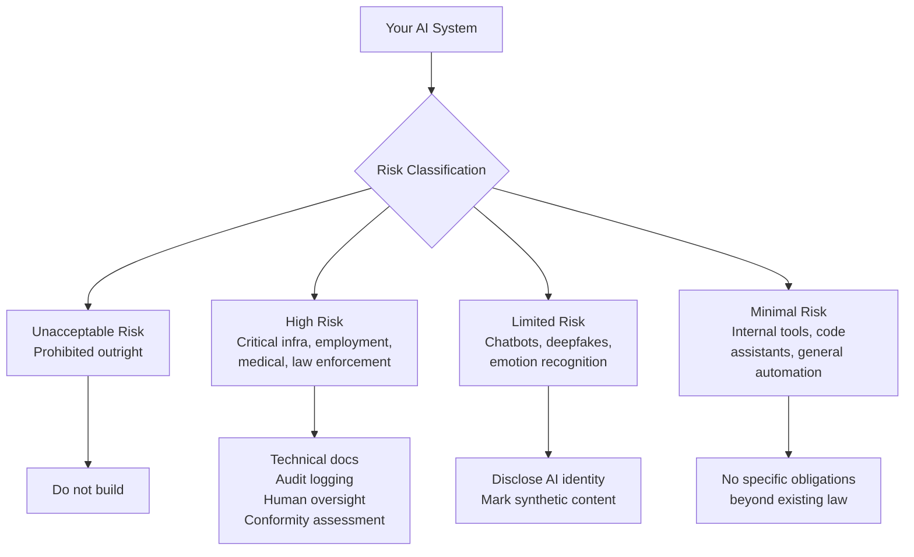

The EU AI Act became fully applicable in August 2026. Most coverage of it reads like legal commentary — risk tiers, obligations, prohibited systems. Useful context, but not what an engineering team needs to start a compliance sprint.

This post is for engineers who've been told "we need to be EU AI Act compliant" and need to know what that means in practice.



---

## The Risk Tier Your System Is In

The Act classifies AI systems into four tiers. Where you land determines your compliance burden.

**Unacceptable risk (prohibited):** Social scoring, real-time biometric surveillance in public spaces, manipulation of vulnerable groups. If you're building these, you already know it. The prohibition is the compliance requirement.

**High risk:** AI in critical infrastructure, employment decisions (CV screening, performance monitoring), education assessments, law enforcement, border control, democratic processes, and medical devices. High-risk systems carry substantial documentation and conformity assessment obligations.

**Limited risk:** Chatbots (must disclose they're AI), deepfake-adjacent content generation (must disclose artificial origin), emotion recognition in certain contexts. Transparency obligations, not operational restrictions.

**Minimal risk:** Everything else. No specific obligations beyond existing law. Most internal productivity tools, code assistants, and general-purpose agents fall here.

The practical question for most engineering teams: is your AI system making or significantly influencing decisions about natural persons in a consequential domain? If yes, you're likely in high-risk. If you're building internal tools, productivity assistants, or general automation, you're almost certainly in minimal risk.

---

## What High-Risk Compliance Actually Requires

If you're building a high-risk system, the Act's technical obligations translate into concrete engineering work:

### Technical Documentation

You need documentation covering:
- System purpose and intended use
- System architecture and how the AI component works
- Training data description (source, volume, characteristics, pre-processing)
- Accuracy, robustness, and cybersecurity measures
- Risk management process

In practice: a `SYSTEM_CARD.md` (analogous to a model card) that captures this, maintained as the system evolves. Not a one-time document — it needs to stay current.

### Data Governance Records

For systems that train or fine-tune models:
- Data collection methodology
- Data labelling quality controls
- Bias identification and mitigation measures
- Data versioning so you can reproduce the training state

For systems using pre-trained models (most of you): documentation of the model(s) used, the provider's transparency documentation, and your own fine-tuning or prompt engineering applied.

### Logging and Traceability

```python
# High-risk AI systems must log enough to reconstruct decisions
import json
from datetime import datetime, timezone

def log_ai_decision(
    system_id: str,
    session_id: str,
    input_data: dict,
    model_output: dict,
    final_decision: str,
    human_override: bool,
    user_id: str | None = None
) -> None:
    record = {
        "timestamp": datetime.now(timezone.utc).isoformat(),
        "system_id": system_id,
        "session_id": session_id,
        "input_summary": sanitize_for_logging(input_data),  # remove PII
        "model_output_summary": model_output.get("summary"),
        "confidence_score": model_output.get("confidence"),
        "final_decision": final_decision,
        "human_override": human_override,
        "user_id_hash": hash_user_id(user_id) if user_id else None,
    }
    # Write to append-only audit log, retained per your data retention policy
    audit_log.write(json.dumps(record))
```

The Act requires logs that can explain an AI-influenced decision to the person affected by it. You need enough to answer: "Why did the system output X for this person's case?"

### Human Oversight Mechanism

High-risk systems must have a mechanism for human review and override:

```python
class HighRiskDecisionPipeline:
    def __init__(self, confidence_threshold: float = 0.85):
        self.confidence_threshold = confidence_threshold
    
    async def process(self, input_data: dict) -> dict:
        ai_result = await self.ai_model.evaluate(input_data)
        
        # Route low-confidence decisions to human review
        if ai_result["confidence"] < self.confidence_threshold:
            return await self.human_review_queue.submit(
                input_data=input_data,
                ai_recommendation=ai_result,
                reason="Below confidence threshold — requires human review"
            )
        
        # Log the decision with full context
        log_ai_decision(
            system_id=self.system_id,
            input_data=input_data,
            model_output=ai_result,
            final_decision=ai_result["decision"],
            human_override=False
        )
        
        return ai_result
```

"Human oversight" doesn't mean every decision needs a human. It means humans can meaningfully review and override decisions, and that the system routes appropriately when confidence is low.

---

## What Limited-Risk Systems Need

If you're running a user-facing chatbot or AI assistant: disclose it's an AI. This is the main obligation. Implement it at the UI layer — a clear disclosure at session start and on AI-generated content.

If you're generating synthetic media (images, audio, video): mark it as AI-generated. The Act specifies machine-readable watermarking for certain content types; for text, a clear disclosure in the interface is the practical minimum.

---

## The GPAI Model Provider Obligations

If your company is releasing a general-purpose AI model (not just using one), there are additional obligations: technical documentation, transparency to downstream providers, compliance with copyright law on training data.

Most engineering teams are model users, not model providers. If you're the provider, you need a lawyer before an engineer.

---

## The Practical Checklist for August 2026

For most teams building on top of existing models:

- [ ] Classify your AI systems by risk tier
- [ ] For high-risk: create and maintain technical documentation (system card)
- [ ] For high-risk: implement audit logging for AI-influenced decisions
- [ ] For high-risk: implement human oversight and override mechanisms
- [ ] For limited-risk: implement clear AI disclosure in user-facing interfaces
- [ ] Document your risk management process (even a simple one)
- [ ] Ensure contracts with AI providers cover their GPAI obligations

The compliance burden is proportional to the consequences of your AI decisions. Internal tooling that generates code drafts for developers to review is minimal risk. A system that scores job applications is high risk. The Act is trying to regulate the latter category; don't build compliance infrastructure appropriate for high-risk systems on minimal-risk ones.

---

*Day 22 of the [Production Agentic AI series](/posts/production-agentic-ai-30-day-plan/). Previous: [Agent Containment](/posts/agent-containment-and-blast-radius-control/)*
