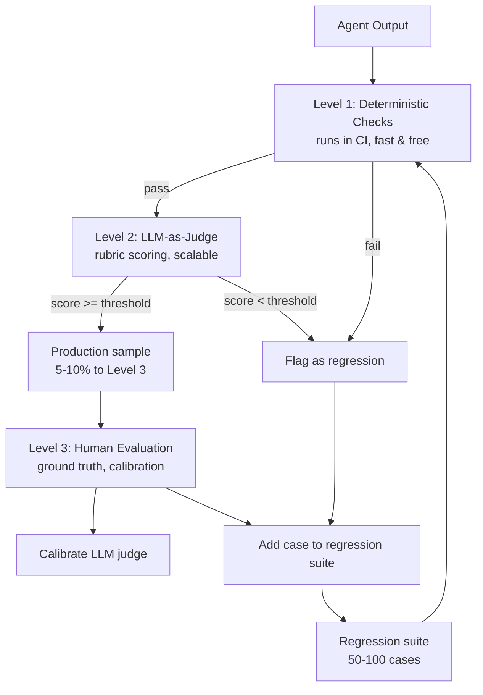

Shipping an agent isn't the end of quality work — it's the beginning. Model versions change, prompts drift, tools evolve, and the distribution of real-world tasks doesn't match what you tested against. Without a systematic evaluation pipeline, you find out an agent regressed when a user files a complaint.



---

## Why Agent Evaluation Is Harder Than LLM Evaluation

Single-turn LLM evaluation: send a prompt, score the response. Straightforward.

Agent evaluation introduces:

**Multi-step trajectories.** Did the agent get the right final answer through the right process, or did it get the right answer by coincidence via a wrong path? Both matter.

**Tool call correctness.** Did the agent call the right tools with the right parameters? An agent that calls `delete_record` when it should have called `archive_record` may produce the correct final state by accident while taking a dangerous path.

**Open-ended outputs.** Scoring a research report as "correct" or "incorrect" is meaningless. Quality is a multi-dimensional judgment.

**Long latency.** A single evaluation run may take minutes. Running 500 evaluations for a regression test suite is an overnight job, not a five-minute check.

---

## The Evaluation Stack

**Level 1 — Deterministic checks (fast, cheap, automated):**

Check what you can check programmatically. These run in CI on every change.

```python
def evaluate_agent_output(task: dict, result: dict) -> dict:
    checks = {}
    
    # Check required fields present
    checks["has_required_fields"] = all(
        field in result for field in task["required_output_fields"]
    )
    
    # Check tool calls were within allowed set
    allowed_tools = task.get("allowed_tools", [])
    if allowed_tools:
        used_tools = [tc["name"] for tc in result.get("tool_calls", [])]
        checks["tools_within_allowed_set"] = all(t in allowed_tools for t in used_tools)
    
    # Check output doesn't contain known failure patterns
    failure_patterns = ["I don't know", "I cannot", "Error:", "undefined"]
    output_text = result.get("output", "")
    checks["no_failure_patterns"] = not any(p in output_text for p in failure_patterns)
    
    # Check latency within bounds
    checks["latency_within_sla"] = result.get("latency_ms", 0) < task.get("max_latency_ms", 30000)
    
    return checks
```

**Level 2 — LLM-as-judge (medium cost, scalable):**

Use a capable model to evaluate outputs against rubrics. Not perfect, but consistent and scalable.

```python
async def llm_judge(
    task_description: str,
    agent_output: str,
    rubric: dict,
    judge_model: str = "claude-opus-4-8-20261001"
) -> dict:
    
    rubric_text = "\n".join([f"- {criterion}: {description}" 
                              for criterion, description in rubric.items()])
    
    result = await llm.generate(
        model=judge_model,
        prompt=f"""
        Evaluate this agent output against the rubric below.
        
        Task: {task_description}
        
        Agent output: {agent_output}
        
        Rubric (score each 1-5):
        {rubric_text}
        
        Return JSON: {{"scores": {{"criterion": score}}, "overall": score, "explanation": "brief reason"}}
        """
    )
    
    return json.loads(result)

# Example rubric for a research agent
RESEARCH_RUBRIC = {
    "factual_accuracy": "Are the facts stated accurate and verifiable?",
    "completeness": "Does the output address all aspects of the task?",
    "source_citation": "Are claims supported by cited sources?",
    "coherence": "Is the output logically structured and readable?",
    "actionability": "Does the output give the user something concrete to act on?",
}
```

**Level 3 — Human evaluation (expensive, ground truth):**

Sample 5-10% of production outputs for human review. This is your calibration signal — it tells you whether your Level 2 LLM judge is scoring well and whether your Level 1 checks catch what matters.

```python
import random

def should_sample_for_human_review(
    result_id: str,
    sampling_rate: float = 0.05,
    force_review_conditions: list = None
) -> bool:
    # Always review on force conditions
    if force_review_conditions:
        return True
    # Random sample
    return random.random() < sampling_rate
```

---

## Regression Testing for Agents

A regression suite is a fixed set of tasks where you know what "good" looks like. Run it on every significant change.

```python
@dataclass
class EvalCase:
    case_id: str
    task: dict
    expected_outcomes: list[str]  # what should happen
    forbidden_outcomes: list[str]  # what should NOT happen
    rubric: dict
    passing_threshold: float = 3.5  # out of 5 on rubric

class AgentEvalSuite:
    def __init__(self, cases: list[EvalCase], agent):
        self.cases = cases
        self.agent = agent
    
    async def run(self) -> dict:
        results = []
        for case in self.cases:
            output = await self.agent.run(case.task)
            scores = await llm_judge(
                task_description=case.task["description"],
                agent_output=output["result"],
                rubric=case.rubric
            )
            
            passed = scores["overall"] >= case.passing_threshold
            results.append({
                "case_id": case.case_id,
                "passed": passed,
                "scores": scores,
                "output": output
            })
        
        pass_rate = sum(1 for r in results if r["passed"]) / len(results)
        return {"pass_rate": pass_rate, "results": results}
```

Keep the regression suite at 50–100 cases. Large enough to be meaningful, small enough to run overnight.

---

## What to Measure in Production

Beyond evaluation runs, instrument production agents for continuous quality signals:

```python
# Track metrics per session
AGENT_METRICS = {
    "task_completion_rate": "Did the agent produce a final output?",
    "user_satisfaction": "Did the user accept the output or immediately retry?",
    "tool_call_efficiency": "Average tool calls per completed task (proxy for efficiency)",
    "error_rate": "Fraction of sessions ending in error state",
    "latency_p95": "95th percentile task latency",
    "token_cost_per_task": "Average token cost per completed task",
}
```

User behaviour is a signal: if users immediately rephrase and retry after an agent response, the first response probably wasn't useful. If users accept the output and continue, it was. This implicit feedback is noisy but free.

---

## The Evaluation Flywheel

The goal is a feedback loop:

1. Production logs surface cases where agent behaviour was unexpected (errors, user retries, LLM judge low scores)
2. Novel cases from production are added to the regression suite
3. Changes to agent (prompts, tools, models) are tested against the suite before deployment
4. Human reviewers calibrate the LLM judge periodically
5. Quality improves over time

Without this loop, you're flying blind. With it, each production failure makes the agent more robust.

---

*Day 23 of the [Production Agentic AI series](/posts/production-agentic-ai-30-day-plan/). Previous: [EU AI Act for Engineers](/posts/eu-ai-act-for-engineers-what-you-actually-need-to-do/)*
