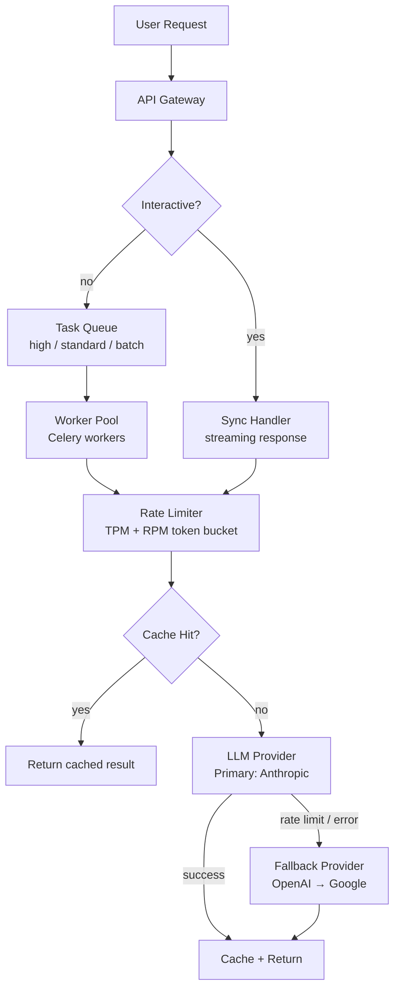

Scaling AI agents is a different problem from scaling traditional web services. The bottleneck isn't your database or your application server — it's the external LLM APIs you depend on, which have their own rate limits, availability characteristics, and cost structures.



---

## The Scaling Bottlenecks

**LLM rate limits.** Every API provider imposes token-per-minute (TPM) and requests-per-minute (RPM) limits. At 1,000 concurrent agent sessions, each making 10 LLM calls, you hit these limits fast.

**Context window constraints per session.** Long-running sessions accumulate context. At 200,000 tokens per session ceiling, sessions with extensive history need active context management before they hit the limit and fail.

**Sequential LLM calls.** Multi-step agents often make calls sequentially even when earlier steps don't determine later steps. The latency compounds.

**Cost per session variability.** An agent session that takes 50 LLM calls costs 10x more than one that takes 5. Without understanding the distribution, capacity planning is guesswork.

---

## Async Task Processing

For non-interactive agent tasks (research, document processing, batch analysis), use async task queues rather than blocking HTTP requests:

```python
from celery import Celery
from kombu import Queue

app = Celery("agent_tasks", broker="redis://redis:6379/0")

app.conf.task_queues = [
    Queue("high_priority", routing_key="high.#"),
    Queue("standard", routing_key="standard.#"),
    Queue("batch", routing_key="batch.#"),
]

@app.task(bind=True, max_retries=3, default_retry_delay=60)
def run_research_agent(self, task_id: str, task_config: dict):
    try:
        result = asyncio.run(research_agent.execute(task_config))
        store_result(task_id, result)
        return {"task_id": task_id, "status": "completed"}
    except RateLimitError as e:
        # Retry with backoff when rate limited
        raise self.retry(exc=e, countdown=int(e.retry_after) + 5)
    except Exception as e:
        logger.error(f"Agent task {task_id} failed: {e}")
        store_error(task_id, str(e))
        raise

# Non-blocking client call
def submit_research_task(config: dict) -> str:
    task_id = generate_task_id()
    run_research_agent.apply_async(
        args=[task_id, config],
        queue="standard",
        task_id=task_id
    )
    return task_id  # client polls or receives webhook when done
```

This decouples the user's HTTP request from the agent execution. The user gets a task ID immediately and polls for completion or receives a webhook callback.

---

## Rate Limit Management

A rate limiter that respects provider limits and queues requests when limits are approached:

```python
import asyncio
from collections import deque
from datetime import datetime

class TokenBucketRateLimiter:
    def __init__(self, tpm_limit: int, rpm_limit: int):
        self.tpm_limit = tpm_limit
        self.rpm_limit = rpm_limit
        self.token_window: deque = deque()  # (timestamp, token_count)
        self.request_window: deque = deque()  # timestamps
        self._lock = asyncio.Lock()
    
    async def acquire(self, estimated_tokens: int) -> None:
        async with self._lock:
            now = datetime.now().timestamp()
            
            # Remove entries older than 60 seconds
            cutoff = now - 60
            while self.token_window and self.token_window[0][0] < cutoff:
                self.token_window.popleft()
            while self.request_window and self.request_window[0] < cutoff:
                self.request_window.popleft()
            
            # Check current usage
            current_tokens = sum(t for _, t in self.token_window)
            current_requests = len(self.request_window)
            
            # Wait if we're at the limit
            while (current_tokens + estimated_tokens > self.tpm_limit * 0.9 or  # 90% buffer
                   current_requests >= self.rpm_limit * 0.9):
                await asyncio.sleep(1)
                now = datetime.now().timestamp()
                # Re-check limits after waiting
                cutoff = now - 60
                while self.token_window and self.token_window[0][0] < cutoff:
                    self.token_window.popleft()
                while self.request_window and self.request_window[0] < cutoff:
                    self.request_window.popleft()
                current_tokens = sum(t for _, t in self.token_window)
                current_requests = len(self.request_window)
            
            # Record this request
            self.token_window.append((now, estimated_tokens))
            self.request_window.append(now)
```

The 90% buffer prevents hitting hard limits and getting 429 errors. Requests queue naturally when limits are approached.

---

## Prompt and Result Caching

Repeated operations with identical inputs can be cached:

```python
import hashlib
import json
from functools import lru_cache

class SemanticCache:
    def __init__(self, redis_client, similarity_threshold: float = 0.95):
        self.redis = redis_client
        self.threshold = similarity_threshold
    
    def _cache_key(self, prompt: str, model: str) -> str:
        return f"llm_cache:{model}:{hashlib.sha256(prompt.encode()).hexdigest()}"
    
    async def get(self, prompt: str, model: str) -> str | None:
        key = self._cache_key(prompt, model)
        return await self.redis.get(key)
    
    async def set(self, prompt: str, model: str, response: str, ttl: int = 3600):
        key = self._cache_key(prompt, model)
        await self.redis.setex(key, ttl, response)

# Use in LLM call wrapper
async def cached_llm_call(prompt: str, model: str, cache: SemanticCache) -> str:
    cached = await cache.get(prompt, model)
    if cached:
        return cached
    
    response = await llm_client.generate(model=model, prompt=prompt)
    await cache.set(prompt, model, response.content)
    return response.content
```

Caching works well for: classification tasks (same document classified multiple times), FAQ-style queries, structured extraction from static content. Cache hit rates of 20-40% are common in production agents with repetitive workloads — meaningful cost savings at scale.

---

## Multi-Region and Fallback

Depend on a single LLM API endpoint and you inherit its availability characteristics. Build fallback:

```python
PROVIDER_CONFIGS = [
    {"model": "claude-sonnet-4-6", "provider": "anthropic", "priority": 1},
    {"model": "gpt-4.5", "provider": "openai", "priority": 2},
    {"model": "gemini-2.5-pro", "provider": "google", "priority": 3},
]

async def llm_call_with_fallback(prompt: str, required_tier: str = "frontier") -> str:
    providers = [p for p in PROVIDER_CONFIGS if meets_tier(p["model"], required_tier)]
    providers.sort(key=lambda p: p["priority"])
    
    last_error = None
    for provider_config in providers:
        try:
            return await call_provider(provider_config, prompt)
        except (APIError, RateLimitError) as e:
            last_error = e
            logger.warning(f"Provider {provider_config['provider']} failed: {e}, trying fallback")
            continue
    
    raise Exception(f"All providers failed. Last error: {last_error}")
```

Multi-provider fallback adds complexity and may introduce output inconsistencies between models. Worth the tradeoff for business-critical agents; overkill for internal tools.

---

## The Cost Optimisation Hierarchy

In order of impact:

1. **Task routing to cheaper models** (covered in Day 16): 60-70% of tasks can use efficient-tier models with negligible quality loss.
2. **Context window management** (covered in Day 9): compressing history reduces input tokens.
3. **Caching** repeated identical calls: 20-40% hit rates on repetitive workloads.
4. **Parallel tool execution** (covered in Day 18): reduces latency without reducing cost, but enables higher throughput.
5. **Prompt optimisation**: shorter prompts cost less. Removing redundant context from system prompts.

Implement these in order. Most teams stop after the first one because the savings are already dramatic.

---

*Day 25 of the [Production Agentic AI series](/posts/production-agentic-ai-30-day-plan/). Previous: [Observability for Agentic Systems](/posts/observability-for-complex-agentic-systems/)*
