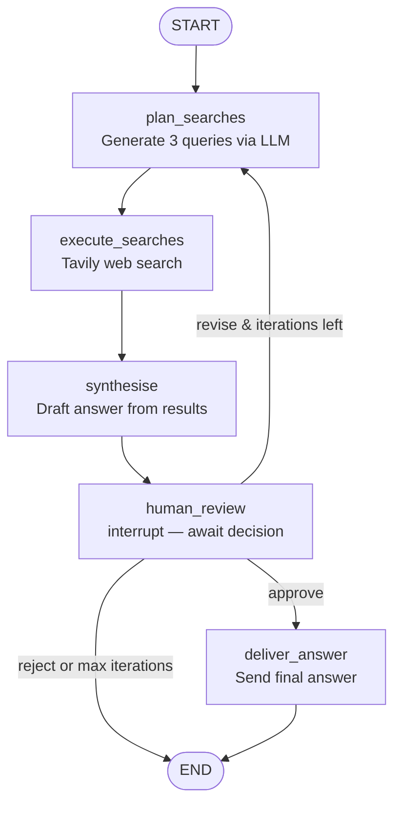

LangGraph's core abstraction — a graph of nodes with typed state flowing between them — maps well to how production agents actually need to work: explicit state transitions, checkpointed persistence, and controllable execution.

This walkthrough builds a complete research agent: it takes a question, searches the web, synthesises findings, and requests human review before delivering a final answer.



---

## The State Schema

Everything the agent needs to know is in the state:

```python
from langgraph.graph import StateGraph, END, START
from langgraph.checkpoint.postgres import PostgresSaver
from langgraph.types import interrupt
from typing import TypedDict, Annotated, Optional
import operator

class ResearchState(TypedDict):
    # Input
    question: str
    user_id: str
    session_id: str
    
    # Research progress
    search_queries: list[str]
    search_results: Annotated[list[dict], operator.add]  # accumulate results
    sources: Annotated[list[str], operator.add]
    
    # Synthesis
    draft_answer: Optional[str]
    
    # Human review
    review_decision: Optional[str]
    reviewer_comment: Optional[str]
    
    # Control
    iteration: int
    max_iterations: int
    error: Optional[str]
```

The `Annotated[list, operator.add]` fields accumulate values across iterations. When two parallel search nodes write to `search_results`, their outputs are combined rather than one overwriting the other.

---

## The Nodes

```python
import anthropic
from tavily import TavilyClient

client = anthropic.Anthropic()
search_client = TavilyClient()

def plan_searches(state: ResearchState) -> ResearchState:
    response = client.messages.create(
        model="claude-sonnet-4-6",
        max_tokens=512,
        messages=[{
            "role": "user",
            "content": f"""Generate 3 specific search queries to answer this question:
            
Question: {state['question']}

Return a JSON list of 3 search query strings. Nothing else."""
        }]
    )
    
    import json
    queries = json.loads(response.content[0].text)
    return {"search_queries": queries, "iteration": state.get("iteration", 0) + 1}

def execute_searches(state: ResearchState) -> ResearchState:
    results = []
    sources = []
    
    for query in state["search_queries"]:
        try:
            search_result = search_client.search(
                query=query,
                max_results=3,
                include_raw_content=False
            )
            for r in search_result["results"]:
                results.append({
                    "query": query,
                    "title": r["title"],
                    "content": r["content"][:1000],  # limit result size
                    "url": r["url"]
                })
                sources.append(r["url"])
        except Exception as e:
            results.append({"query": query, "error": str(e)})
    
    return {"search_results": results, "sources": sources}

def synthesise(state: ResearchState) -> ResearchState:
    results_text = "\n\n".join([
        f"Source: {r.get('url', 'unknown')}\n{r.get('content', r.get('error', ''))}"
        for r in state["search_results"]
    ])
    
    response = client.messages.create(
        model="claude-sonnet-4-6",
        max_tokens=1024,
        messages=[{
            "role": "user",
            "content": f"""Answer this question based on the search results below.
            
Question: {state['question']}

Search results:
{results_text}

Write a clear, factual answer with citations to the sources used."""
        }]
    )
    
    return {"draft_answer": response.content[0].text}

def human_review(state: ResearchState) -> ResearchState:
    decision = interrupt({
        "message": "Please review this research answer",
        "question": state["question"],
        "draft_answer": state["draft_answer"],
        "sources": state["sources"],
        "options": {
            "approve": "Answer is accurate and complete",
            "revise": "Needs revision — please add a comment",
            "reject": "Discard and start over"
        }
    })
    
    return {
        "review_decision": decision["choice"],
        "reviewer_comment": decision.get("comment", "")
    }

def route_after_review(state: ResearchState) -> str:
    decision = state.get("review_decision")
    if decision == "approve":
        return "deliver"
    elif decision == "revise" and state["iteration"] < state["max_iterations"]:
        return "plan_searches"  # loop back with reviewer's comment
    else:
        return END

def deliver_answer(state: ResearchState) -> ResearchState:
    # In a real system, this would send the answer back to the user via webhook/API
    print(f"Final answer delivered for session {state['session_id']}")
    return state
```

---

## The Graph

```python
def build_research_agent():
    workflow = StateGraph(ResearchState)
    
    # Add nodes
    workflow.add_node("plan_searches", plan_searches)
    workflow.add_node("execute_searches", execute_searches)
    workflow.add_node("synthesise", synthesise)
    workflow.add_node("human_review", human_review)
    workflow.add_node("deliver_answer", deliver_answer)
    
    # Define edges
    workflow.add_edge(START, "plan_searches")
    workflow.add_edge("plan_searches", "execute_searches")
    workflow.add_edge("execute_searches", "synthesise")
    workflow.add_edge("synthesise", "human_review")
    
    # Conditional routing after review
    workflow.add_conditional_edges(
        "human_review",
        route_after_review,
        {
            "plan_searches": "plan_searches",
            "deliver": "deliver_answer",
            END: END
        }
    )
    workflow.add_edge("deliver_answer", END)
    
    return workflow

# Compile with PostgreSQL persistence
import os
memory = PostgresSaver.from_conn_string(os.environ["DATABASE_URL"])
app = build_research_agent().compile(checkpointer=memory)
```

---

## Running It

```python
import asyncio

async def run_research(question: str, user_id: str) -> str:
    session_id = f"research-{user_id}-{int(asyncio.get_event_loop().time())}"
    
    initial_state = {
        "question": question,
        "user_id": user_id,
        "session_id": session_id,
        "search_queries": [],
        "search_results": [],
        "sources": [],
        "draft_answer": None,
        "review_decision": None,
        "reviewer_comment": None,
        "iteration": 0,
        "max_iterations": 3,
        "error": None
    }
    
    config = {"configurable": {"thread_id": session_id}}
    
    # Run until interrupt (human review)
    result = await app.ainvoke(initial_state, config=config)
    
    if result.get("__interrupt__"):
        # Return interrupt info for the reviewer
        return {
            "status": "awaiting_review",
            "session_id": session_id,
            "draft_answer": result["draft_answer"],
            "review_payload": result["__interrupt__"][0].value
        }
    
    return {"status": "completed", "answer": result.get("draft_answer")}

async def resume_after_review(session_id: str, decision: str, comment: str = ""):
    config = {"configurable": {"thread_id": session_id}}
    
    result = await app.ainvoke(
        {"review_decision": decision, "reviewer_comment": comment},
        config=config
    )
    return result
```

---

## What This Pattern Gives You

This agent has the properties production systems require:

**Resumable:** Kill the process mid-execution and restart — it continues from the last checkpoint.

**Observable:** Every state transition is logged. You can inspect the state at any point in the execution.

**Controllable:** The human review step is a hard gate. The agent cannot bypass it.

**Extensible:** Adding a new step (fact-checking, formatting, translation) is adding a node and an edge. The state schema extends without breaking existing nodes.

The graph-based model adds overhead compared to a simple loop, but that overhead buys you exactly what makes agents reliable in production.

---

*Day 26 of the [Production Agentic AI series](/posts/production-agentic-ai-30-day-plan/). Previous: [Scaling Agentic Systems](/posts/scaling-agentic-systems-cost-latency-reliability/)*
