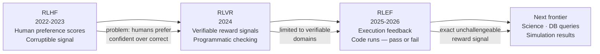

Standard large language models are, at their core, learned functions from input sequences to output probability distributions. They're extraordinarily good at this — the capability that emerges from predicting the next token at scale has proven to be far more general than anyone expected.

But next-token prediction has a ceiling. For problems requiring sequential logical deduction, where each step must be correct before the next is meaningful, a model that generates output in a single forward pass can't verify its intermediate steps. It can't catch its own errors before they compound.

Reasoning models do something different.

---

## What Changed: Test-Time Compute

The insight that produced reasoning models was that you can trade inference cost for quality. Standard models are trained to produce good output efficiently. Reasoning models are trained to produce good output through explicit search — exploring multiple approaches, verifying intermediate conclusions, backtracking when a path fails.

This is called test-time compute: the model is doing more work during inference, not just during training.

The mechanism, as publicly understood from the o-series and Claude reasoning releases:

1. The model generates a chain of thought — extended internal reasoning not shown to the user
2. The reasoning process is trained with reinforcement learning to reward chains that lead to correct answers
3. The model learns to allocate more reasoning steps to harder problems and fewer to easy ones
4. The final output is generated after the reasoning is complete

The training signal is different too: Reinforcement Learning from Verifiable Feedback (RLVF) — using problems with checkable correct answers (math proofs, code that passes tests, logic puzzles) to provide reward signals that are harder to hack than RLHF preference data.

---

## The Benchmark Gap Is Real

The benchmark improvements from reasoning models aren't measurement artifacts. On problem types that require multi-step reasoning:

**Competition mathematics (AIME 2025):** Standard frontier models: 20-30% accuracy. Reasoning models: 70-85%.

**Complex code generation (HumanEval+):** Standard models: ~90%. Reasoning models: ~96%. The gap looks small until you consider that the missing 6% are the hard cases where correctness matters most.

**Long-horizon agentic tasks (MRCL benchmark):** Standard models: 2-6%. Claude Sonnet 4.5 with reasoning: 45.4%.

The last one is the most relevant for this series: reasoning models are dramatically better at the tasks production agents actually need to do.

---

## The Evolution of Training Paradigms

Understanding where reasoning models came from helps predict where they're going:

**RLHF (2022-2023):** Reinforcement Learning from Human Feedback. Human raters score model outputs; the model learns to produce outputs humans prefer. Problem: humans prefer confident-sounding outputs over correct ones. The training signal is corruptible.

**RLVR (2024):** Reinforcement Learning from Verifiable Rewards. Replace human raters with automated verifiers for problem types where correctness can be checked programmatically. More reliable signal, but limited to verifiable domains.

**RLEF (2025-2026):** Reinforcement Learning from Execution Feedback. The model generates code, the code runs, the test results are the reward signal. The program either passes or fails — the reward signal is exact and unchallengeable. This is how reasoning models got dramatically better at coding.

The next frontier: extending execution feedback to domains beyond code. Science experiments, database queries, simulation results — any domain where an action has an observable outcome is a candidate for RLEF-style training.

---

## The Architecture Implications

Reasoning models change how you design agent systems:

**Single reasoning call vs. multi-step architecture:** A reasoning model doing 5,000 thinking tokens may produce a better plan than a multi-step agentic workflow using standard models. For planning tasks, test whether the reasoning model handles it in one call before building a complex multi-step system.

**The cost-quality frontier has shifted:** The same quality level that required a multi-step workflow with Claude Sonnet 3.5 may now be achievable with a single Claude Sonnet 4.6 reasoning call. The workflow had overhead (orchestration, error handling, state management) that the reasoning call doesn't.

**When to still use multi-step:** When you need tool calls during the reasoning process — look something up, then reason about what you found. Reasoning happens inside the model; tool calls require breaking out to your infrastructure. Multi-step agents handle this naturally; single-call reasoning doesn't.

---

## The Honest Current Limits

Reasoning models are better on hard problems and equivalent or slightly better on easy ones. But:

**They're expensive.** 5,000 thinking tokens at Opus pricing is ~$0.375 before the output. This is the right call for complex decisions; it's not the right call for classification tasks.

**They're slower.** A 30-second reasoning trace before a 3-second response is 33 seconds total. For interactive applications, this matters.

**They can be confidently wrong.** More reasoning doesn't guarantee correct reasoning. On problems far outside the training distribution, reasoning models can produce elaborate wrong answers with high apparent confidence.

**They don't improve recall.** Reasoning models reason better about what they know. They don't know more. Factual questions about obscure topics are still subject to hallucination.

---

## Where It's Going

The trajectory is clear: reasoning capability will continue improving faster than other dimensions of model quality, because execution feedback provides a reliable training signal that scales well. The cost and latency of reasoning will decrease as inference hardware and quantisation improve.

By 2027, the distinction between "reasoning model" and "standard model" will likely blur — reasoning capabilities will be a dial, not a binary mode, and models will dynamically allocate compute based on problem complexity.

The strategic implication for engineers: design systems to use reasoning capability where it matters (planning, complex debugging, multi-constraint optimisation) and efficient models where it doesn't. This isn't a permanent architectural choice — as reasoning gets cheaper, the threshold for using it will shift.

---

*Day 28 of the [Production Agentic AI series](/posts/production-agentic-ai-30-day-plan/). Previous: [CrewAI for Enterprise Workflows](/posts/crewai-for-enterprise-multi-agent-workflows/)*
