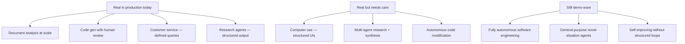

This is the final post in a 30-day series on production agentic AI engineering. It's a good moment to step back from the tactical and say something honest about where we are and where this is going.

---

## What the Hype Gets Wrong

**"Agents will replace developers."** Current coding agents significantly augment developer productivity — they accelerate boilerplate, accelerate understanding of unfamiliar codebases, accelerate iteration on known patterns. They don't architect systems, make engineering tradeoffs, or build things that don't have precedent in training data. The 62% security flaw rate in AI-generated code isn't a reason to not use AI coding assistance; it's a description of the current human-AI collaboration model: AI generates, humans verify.

**"Autonomous agents are ready for production without oversight."** The computer use agents, the autonomous coding agents, the research agents — they're powerful tools when designed with appropriate oversight structures. The failure mode that gets companies in trouble is deploying agents with blast radius that exceeds their verification capability. An agent that can send emails, modify databases, and make API calls without human review isn't autonomous — it's uncontrolled.

**"Just prompt it and it works."** The gap between a demo and a production system is all the engineering covered in this series: state management, error recovery, evaluation pipelines, observability, security hardening, cost optimisation. The demo works because edge cases aren't explored. Production works because edge cases are handled.

---

## What Is Genuinely Changing

**The speed of capable agent development.** The combination of MCP for tool connectivity, LangGraph/CrewAI for orchestration, and frontier reasoning models for planning has compressed the time to build a capable production agent from months to weeks. This is genuinely new.

**The quality ceiling is rising.** Reasoning models on hard tasks are meaningfully better than what was available 12 months ago. Claude Sonnet 4.5 at 45.4% on long-horizon agentic benchmarks vs. 2.6% for the same model without reasoning is a step function improvement, not incremental progress.

**Cost has collapsed to the point where economics are no longer the primary constraint.** At $0.10/M input tokens for efficient models, the question "is this workload worth running through an LLM?" has a much lower bar to clear. The constraint has shifted from cost to quality and reliability.

**Enterprise governance is maturing.** The EU AI Act, NIST standards for autonomous systems, and enterprise AI policy frameworks are giving organisations the structure to deploy AI systems responsibly rather than choosing between "block everything" and "allow everything."

---

## The Capabilities That Are Real vs. Demo-Ware

**Real in production today:**
- Document analysis and information extraction at scale
- Code generation with human review in the loop
- Customer service agents for well-defined query types
- Research agents with structured output requirements
- Internal workflow automation for repeatable processes

**Real but requires careful deployment:**
- Computer use agents for legacy system automation (reliable on structured tasks, unreliable on complex UIs)
- Multi-agent research and synthesis workflows (powerful with human checkpoints, risky without)
- Autonomous code modification agents (need strong test suites and human review gates)

**Still demo-ware:**
- Fully autonomous software engineering without human oversight
- General-purpose agents that handle novel situations reliably
- Agents that improve themselves significantly without structured feedback loops

The demo-ware category will move to "real but requires careful deployment" over the next two years. That's a realistic trajectory, not hype.

---

## The Engineering Skills That Will Matter

**Evaluation design.** The hardest part of production AI is knowing whether it's working. LLM-as-judge, human evaluation pipelines, regression suites, production monitoring — these are the skills that separate teams that ship reliable AI products from teams that ship demos.

**System design for AI-native systems.** Designing around context windows, reasoning about token budgets, understanding failure modes in non-deterministic systems, designing human oversight into workflows appropriately — these are different skills from traditional software engineering and they compound.

**Security for AI systems.** Prompt injection, blast radius control, SAST for AI-generated code, and the governance requirements of the EU AI Act are not going away. They're getting more important as AI systems take more consequential actions.

**Cost engineering.** The multi-tier model routing, context management, caching, and async architecture patterns covered in this series translate directly to the difference between an economically viable AI product and one that costs more than it generates.

---

## The Productive Frame

The most useful frame I've found for thinking about agentic AI in 2026: these are amplifiers, not replacements. They amplify the capability of engineers who understand the domain, design systems thoughtfully, and verify output rigorously. They don't replace that domain expertise and thoughtful design — they depend on it.

The teams doing this well treat AI systems as junior team members: capable, fast, useful, but requiring guidance, review, and oversight that decreases as trust is established through demonstrated performance.

The teams doing it poorly either over-trust AI outputs and skip verification, or under-trust them and don't benefit from the acceleration. The calibration is the skill.

---

## What's Coming

Over the next 18 months, I expect:

**Reasoning capability to become table stakes.** The distinction between "reasoning" and "standard" modes will blur as more reasoning capability is baked into base models by default.

**Agent frameworks to consolidate.** The LangGraph/CrewAI/AutoGen/LangChain landscape will settle — probably into two or three dominant frameworks, similar to how the ML framework landscape consolidated around PyTorch.

**Self-improving agent systems to become viable.** Not general self-improvement — structured feedback loops where agents improve their prompts, tool use, and routing decisions based on production outcomes. The evaluation infrastructure built now becomes the training signal for improvement later.

**Enterprise governance requirements to expand.** The EU AI Act is the first of many. More jurisdictions will follow with similar frameworks. The governance infrastructure built now will become a competitive advantage as compliance becomes mandatory rather than optional.

---

None of this requires AGI or any qualitative leap from current architectures. It's the compounding of what's already working: better models, cheaper inference, more mature frameworks, better tooling, more engineering knowledge. That compounding is real and it's significant.

Build the foundations correctly now — evaluation, observability, security, cost management — and you're positioned to take advantage of what comes next without rebuilding from scratch.

---

*Day 30 of the [Production Agentic AI series](/posts/production-agentic-ai-30-day-plan/).*

*This series covered: [Model Convergence](/posts/the-model-wars-are-over-what-convergence-means-for-engineers/) · [MCP](/posts/mcp-explained-the-protocol-that-connects-ai-to-everything/) · [A2A Protocol](/posts/a2a-protocol-agent-to-agent-communication-at-scale/) · [LangGraph vs CrewAI](/posts/langgraph-vs-crewai-picking-the-right-framework-in-2026/) · [Enterprise Adoption](/posts/the-13-percent-problem-why-enterprise-ai-adoption-is-failing/) · [LLM Pricing Collapse](/posts/llm-pricing-collapse-how-cheap-tokens-change-architecture/) · [Production RAG](/posts/rag-in-production-beyond-the-basics/) · [RAG vs Fine-Tuning](/posts/rag-vs-fine-tuning-the-hybrid-answer-in-2026/) · [Context Management](/posts/context-window-management-in-production-agents/) · [Vector Databases](/posts/vector-databases-in-2026-which-to-use-and-when/) · [Chunking Strategies](/posts/chunking-strategies-that-actually-work-in-production/) · [RAG Evaluation](/posts/evaluating-rag-pipelines-the-metrics-that-matter/) · [Stateful Agents](/posts/stateful-agents-managing-state-in-production/) · [Computer Use](/posts/computer-use-agents-the-new-agentic-paradigm/) · [Reasoning Models](/posts/reasoning-models-for-agents-when-thinking-tokens-are-worth-it/) · [Multi-Model Orchestration](/posts/multi-model-orchestration-slm-plus-llm-hybrid-architectures/) · [Long-Term Memory](/posts/long-term-memory-patterns-for-production-agents/) · [Tool Orchestration](/posts/tool-orchestration-at-scale-beyond-simple-function-calling/) · [AI Code Security](/posts/the-62-percent-problem-security-flaws-in-ai-generated-code/) · [Prompt Injection](/posts/prompt-injection-in-production-agents/) · [Agent Containment](/posts/agent-containment-and-blast-radius-control/) · [EU AI Act](/posts/eu-ai-act-for-engineers-what-you-actually-need-to-do/) · [Agent Evaluation](/posts/evaluating-agent-quality-at-production-scale/) · [Observability](/posts/observability-for-complex-agentic-systems/) · [Scaling](/posts/scaling-agentic-systems-cost-latency-reliability/) · [LangGraph Walkthrough](/posts/building-production-agents-with-langgraph/) · [CrewAI Enterprise](/posts/crewai-for-enterprise-multi-agent-workflows/) · [Reasoning Revolution](/posts/the-reasoning-model-revolution-beyond-next-token-prediction/) · [Open-Source vs Commercial](/posts/open-source-vs-commercial-models-the-2026-decision/)*
