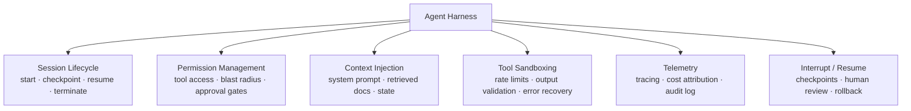

There's a pattern that keeps surfacing in teams building production AI agents: the engineers who get reliable results aren't necessarily using better models. They're using better harnesses.

A harness is the execution environment wrapping an AI agent — the infrastructure layer that manages how the agent runs, what it can access, how failures are handled, and how the whole thing is observed and controlled. It's the difference between an LLM with tool access and a production system.



---

## Why Harness Architecture Matters More Than Model Choice

A common mistake in early agent development: spending the most time on model selection and the least on the environment the model runs in.

The harness determines:

- **Reliability** — whether the agent recovers from failures or propagates them
- **Safety** — what actions the agent can take and what requires human review
- **Cost** — how much context is passed on each call, whether intermediate results are cached
- **Observability** — whether you can understand what happened when something goes wrong

A well-designed harness running a mid-tier model will outperform a poorly designed harness running a frontier model on most production tasks. The harness is the multiplier.

---

## The Components of a Production Harness

### Session Lifecycle Management

A harness manages the full lifecycle of an agent session: initialisation, execution, checkpointing, suspension, and termination.

```python
class AgentHarness:
    def __init__(self, agent_config: AgentConfig, checkpointer: Checkpointer):
        self.config = agent_config
        self.checkpointer = checkpointer
        self.session_id = None

    def start_session(self, task: Task) -> Session:
        self.session_id = generate_session_id()
        initial_state = self._build_initial_state(task)
        self.checkpointer.save(self.session_id, initial_state)
        return Session(id=self.session_id, state=initial_state)

    def resume_session(self, session_id: str) -> Session:
        state = self.checkpointer.load(session_id)
        if state is None:
            raise SessionNotFound(session_id)
        return Session(id=session_id, state=state)

    def checkpoint(self, session: Session) -> None:
        self.checkpointer.save(session.id, session.state)

    def terminate(self, session: Session, reason: str) -> None:
        self.checkpointer.mark_complete(session.id, reason)
        self._emit_telemetry("session_ended", {"reason": reason})
```

Checkpointing is what makes agents resumable after failures or interruptions. Without it, every failure is a restart from scratch.

### Tool Space Management

The harness controls which tools an agent can access and enforces the minimum-access principle. Not the agent — the harness.

```python
class ToolRegistry:
    def __init__(self):
        self._tools: dict[str, Tool] = {}
        self._permission_matrix: dict[str, set[str]] = {}

    def register(self, tool: Tool, required_permissions: set[str]):
        self._tools[tool.name] = tool
        self._permission_matrix[tool.name] = required_permissions

    def get_available_tools(self, agent_permissions: set[str]) -> list[Tool]:
        return [
            tool for name, tool in self._tools.items()
            if self._permission_matrix[name].issubset(agent_permissions)
        ]

    def execute(self, tool_name: str, inputs: dict, agent_permissions: set[str]) -> ToolResult:
        required = self._permission_matrix.get(tool_name, set())
        if not required.issubset(agent_permissions):
            raise PermissionDenied(f"{tool_name} requires {required - agent_permissions}")
        return self._tools[tool_name].execute(inputs)
```

Reducing the tool space presented to an agent is one of the highest-leverage reliability interventions available. Agents with fewer tools make simpler plans with fewer failure modes.

### Context Injection

The harness owns what goes into each model call — not the agent itself. This is the context engineering layer.

```python
class ContextBuilder:
    def __init__(self, retriever: Retriever, token_budget: int):
        self.retriever = retriever
        self.token_budget = token_budget

    def build(self, task: Task, conversation_history: list, state: dict) -> Context:
        # Allocate token budget across context components
        system_budget = int(self.token_budget * 0.15)
        history_budget = int(self.token_budget * 0.35)
        retrieval_budget = int(self.token_budget * 0.35)
        state_budget = int(self.token_budget * 0.15)

        system_prompt = self._build_system_prompt(task, system_budget)
        trimmed_history = self._trim_history(conversation_history, history_budget)
        retrieved_docs = self.retriever.retrieve(task.query, retrieval_budget)
        serialised_state = self._serialise_state(state, state_budget)

        return Context(
            system=system_prompt,
            history=trimmed_history,
            retrieved=retrieved_docs,
            state=serialised_state
        )
```

The harness treats the context window as a finite resource to be allocated deliberately — not an unlimited container to stuff with everything available.

### Verification Loops

Production harnesses add verification steps between agent actions and execution. This is where human-in-the-loop patterns live.

```python
class VerificationLayer:
    def __init__(self, approval_policy: ApprovalPolicy):
        self.policy = approval_policy

    def before_execute(self, action: Action, session: Session) -> VerificationResult:
        risk = self.policy.assess_risk(action, session.context)

        if risk.level == RiskLevel.LOW:
            return VerificationResult.approved()
        elif risk.level == RiskLevel.MEDIUM:
            # Automated verification — check preconditions
            preconditions = self.policy.check_preconditions(action)
            if preconditions.all_met:
                return VerificationResult.approved()
            return VerificationResult.blocked(preconditions.failures)
        else:
            # HIGH risk — require human approval
            return VerificationResult.requires_human_approval(
                reason=risk.explanation,
                action_summary=action.human_readable_summary()
            )
```

---

## The Harness vs. the Agent

A useful mental model: the agent is the reasoning engine, the harness is the operating environment. The agent decides what to do. The harness decides whether it's allowed, how it's executed, and what happens if it fails.

| Concern | Agent Responsibility | Harness Responsibility |
|---------|---------------------|----------------------|
| Planning | ✅ | |
| Tool selection | ✅ | |
| Tool execution | | ✅ |
| Permission checking | | ✅ |
| Error recovery | ✅ (reasoning) | ✅ (retry logic) |
| Checkpointing | | ✅ |
| Cost tracking | | ✅ |
| Observability | | ✅ |

This separation matters because it means you can swap agents (models, system prompts) without changing your safety and reliability infrastructure. The harness accumulates improvements over time independent of which model powers the agent.

---

## Building Your First Harness

The minimum viable harness for a production agent:

1. **Session ID and checkpointing** — so failures don't mean starting over
2. **Tool permission registry** — so the agent can't do more than it should
3. **Structured error returns** — so the agent can reason about failures
4. **Cost tracking per call** — so you catch runaway sessions before the bill arrives
5. **Audit log** — every tool call with inputs, outputs, and timestamps

Start with these five. Each adds reliability that no amount of model improvement can substitute for.

---

*First in a new 7-part series on AI engineering patterns for mid-2026. Next: [Context Engineering — The Discipline That Replaced Prompt Engineering](/posts/context-engineering-not-prompt-engineering/)*
