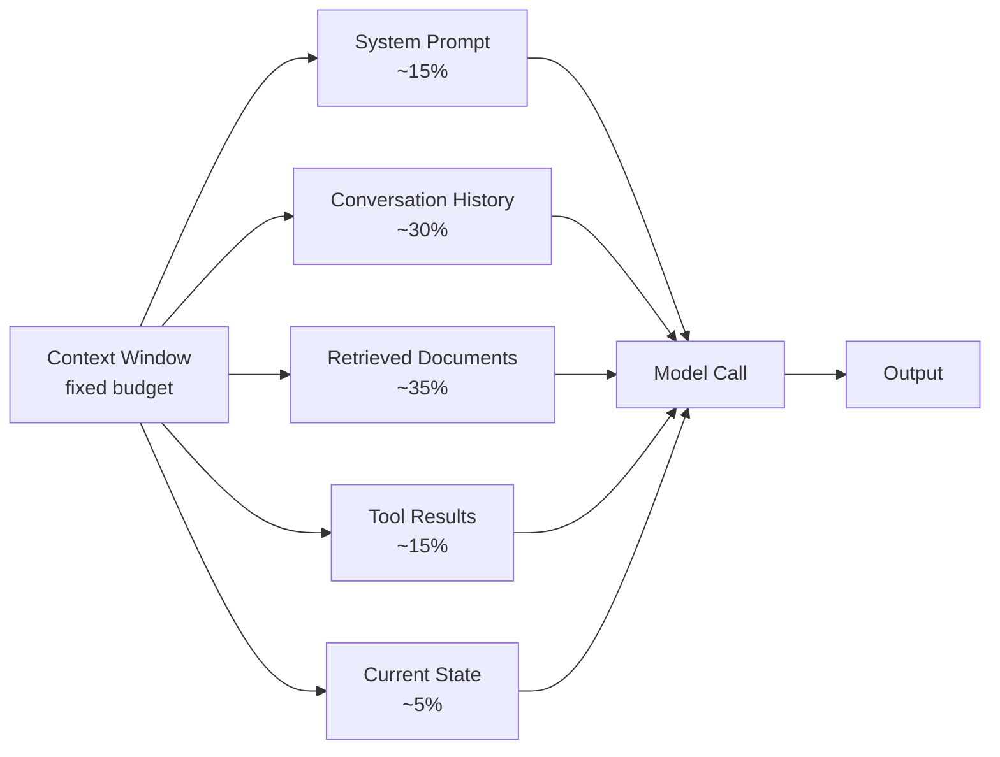

Andrej Karpathy's framing landed clearly: the job isn't prompt engineering anymore, it's context engineering. The distinction matters more than it might seem.

Prompt engineering is about crafting the right words for a single model call. Context engineering is about designing what information the model has access to across an entire workflow — what's in the system prompt, what's in the conversation history, what's retrieved, what's in tool results, and crucially, what's deliberately left out.

For single-turn chat, the distinction is minor. For production agents running multi-step tasks over minutes or hours, it's the difference between a system that works and one that doesn't.



---

## What Context Engineering Actually Covers

**The system prompt** is the most durable part of the context — it persists across every turn of a conversation. System prompt engineering is architectural: decisions made here affect every model call in the session. Length, structure, ordering of instructions, what constraints to include, what to leave out for the model to infer — all of these are design decisions with measurable quality impact.

**Conversation history** grows with every turn and must be managed. In a long-running agent, unmanaged conversation history eventually fills the context window and pushes out more relevant information. Context engineering means deciding how to compress, summarise, or selectively retain history as a session progresses.

**Retrieved documents** are where RAG meets context engineering. The quality of what gets retrieved, how much is retrieved, in what order it's presented, and how it's formatted in the context all affect output quality more than the retrieval algorithm itself.

**Tool results** are often the largest and most variable part of the context in agent workflows. A tool that returns 50KB of JSON for a simple query is a context engineering problem, not a model capability problem.

**State serialisation** — how you represent the agent's current understanding of the task — is a context engineering concern that most agent frameworks handle poorly by default.

---

## The Context Window as Architecture

A useful reframe: the context window is a resource to be architected, like memory in a constrained system.

```python
class ContextBudgetManager:
    ALLOCATION = {
        "system_prompt": 0.15,
        "task_definition": 0.10,
        "conversation_history": 0.25,
        "retrieved_documents": 0.35,
        "tool_results": 0.10,
        "state": 0.05,
    }

    def __init__(self, model_context_limit: int, safety_margin: float = 0.85):
        self.total_budget = int(model_context_limit * safety_margin)

    def allocate(self) -> dict[str, int]:
        return {
            component: int(self.total_budget * fraction)
            for component, fraction in self.ALLOCATION.items()
        }

    def trim_to_budget(self, content: str, budget: int, tokeniser) -> str:
        tokens = tokeniser.encode(content)
        if len(tokens) <= budget:
            return content
        return tokeniser.decode(tokens[:budget])
```

The specific percentages here aren't universal — they depend on your task type. What matters is treating the allocation explicitly rather than letting components grow until something breaks.

---

## Techniques That Actually Work

### Sliding Window History

Rather than keeping all conversation history, maintain a sliding window of the most recent N turns, plus a compressed summary of earlier turns.

```python
def build_history_context(
    full_history: list[dict],
    recent_turns: int = 6,
    summariser: Callable = None
) -> list[dict]:
    if len(full_history) <= recent_turns:
        return full_history

    older = full_history[:-recent_turns]
    recent = full_history[-recent_turns:]

    if summariser and older:
        summary = summariser(older)
        return [{"role": "system", "content": f"Earlier conversation summary: {summary}"}] + recent

    return recent
```

### Tool Result Compression

Tool results are the most common source of context bloat. Compress before injecting.

```python
def compress_tool_result(result: dict, max_tokens: int, tokeniser) -> str:
    # Extract the most relevant fields first
    if "error" in result:
        return f"Error: {result['error']}"

    serialised = json.dumps(result, indent=2)
    if tokeniser.count(serialised) <= max_tokens:
        return serialised

    # Truncate intelligently: keep structure, cut content
    if isinstance(result, dict):
        summary = {k: v for k, v in list(result.items())[:10]}
        summary["_truncated"] = f"({len(result) - 10} more fields omitted)"
        return json.dumps(summary, indent=2)

    return serialised[:max_tokens * 4]  # rough char estimate
```

### Tiered Retrieval

Not all retrieved content deserves equal position in the context. Use a tiered approach: exact matches first, semantic matches second, background context last.

```python
def build_retrieval_context(query: str, retriever, budget: int) -> str:
    # Tier 1: exact keyword matches (highest priority)
    exact = retriever.keyword_search(query, limit=3)

    # Tier 2: semantic similarity
    semantic = retriever.semantic_search(query, limit=5)

    # Tier 3: background/related content
    related = retriever.related_search(query, limit=3)

    # Fill budget in tier order
    sections = []
    remaining = budget

    for tier, results in [("Exact match", exact), ("Related", semantic), ("Background", related)]:
        for doc in results:
            content = f"[{tier}] {doc.title}\n{doc.content}\n"
            tokens = tokeniser.count(content)
            if tokens <= remaining:
                sections.append(content)
                remaining -= tokens

    return "\n---\n".join(sections)
```

---

## What Goes Out Is As Important As What Goes In

Context engineering is as much about what you exclude as what you include.

Common things that should be excluded but often aren't:

- **Full file contents** when only a section is relevant. Pass the relevant function, not the entire 500-line file.
- **Verbose tool schemas** for tools not relevant to the current step. Filter the tool list per task phase.
- **Raw API responses** when only a few fields matter. Extract before injecting.
- **Redundant state** — if the agent just wrote a file and you confirmed it, you don't need the full file content in the next turn.
- **Conversation history before the last task reset** — if the agent finished one sub-task and started another, summarise and move on.

The discipline is the same as any information architecture: ruthless prioritisation of what the reader (the model) needs right now.

---

## The Shift in Mindset

Prompt engineering asks: "What should I say to get the output I want?"

Context engineering asks: "What information environment do I need to build so the model reliably produces the right output across all the cases I care about?"

The first is a writing task. The second is a systems design task. The second is what production requires.

---

*Day 2 of 7. Previous: [Harness Engineering](/posts/harness-engineering-the-ai-control-plane/).*
