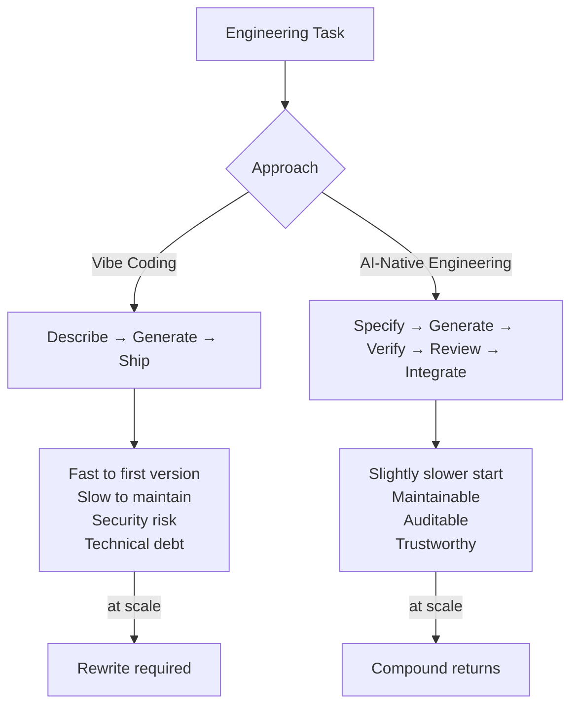

Vibe coding is real and it works — for certain definitions of works. You describe what you want, the model generates it, you iterate until it looks right, you ship it. For prototypes, personal projects, throwaway scripts, and early demos, this is genuinely useful.

The problems start when vibe coding is applied to production software, when the codebase grows large enough that nobody understands all of it, when security matters, when other engineers need to work in it, and when the "vibe" that seemed right on day one becomes a maintenance burden by month three.

The backlash is well-earned. But the answer isn't to reject AI coding assistance — it's to understand what disciplined AI-native engineering actually looks like.



---

## Where Vibe Coding Breaks Down

**Security.** The 62% security flaw rate in AI-generated code (Cloud Security Alliance, 2025) isn't a headline to dismiss — it's a description of what happens when generated code isn't reviewed for security by someone who understands the domain. The model generates plausible code that does what was asked. Plausible and secure are not the same thing.

**Architectural coherence.** Each vibe-coded addition is locally coherent. The system as a whole often isn't. The model doesn't understand your architecture; it understands the code it can see. Vibe-coded systems accumulate architectural inconsistency that nobody planned and nobody fully understands.

**Testability.** Vibe-coded code is often designed around making the happy path work. Edge case handling, error paths, and the testable interfaces that enable meaningful automated testing are afterthoughts. Coverage metrics look fine. The tests test the wrong things.

**Debuggability.** When something goes wrong in a vibe-coded system, the debugging process is harder because nobody wrote the code with an understanding of it. The code is there, but the mental model isn't.

None of these are arguments against AI coding assistance. They're arguments for using it more deliberately.

---

## The Five Building Blocks of AI-Native Engineering

### 1. Specification Before Generation

AI-native engineering starts with a specification, not a description. A description says what you want. A specification says what the system must do, what constraints it must satisfy, and what success looks like.

The specification is the input to the AI, not the prompt. The prompt is how you communicate the spec.

```markdown
# Specification: User Session Management

## Behaviour
- Sessions expire after 30 minutes of inactivity
- Users can have at most 3 concurrent active sessions
- Session tokens are cryptographically random, minimum 32 bytes
- Token rotation occurs on privilege escalation

## Constraints
- No session data stored in client-accessible storage
- Session invalidation must propagate within 5 seconds
- Rate limit: 10 session creation attempts per user per hour

## Out of scope
- Remember-me functionality (separate ticket)
- OAuth token management
```

This takes longer than describing what you want. It produces better code and far fewer surprises.

### 2. Generation with Constraints

When you use AI to generate code, structure the generation to respect the specification explicitly.

```python
SYSTEM_PROMPT = """You are implementing the session management module described in the spec below.

Requirements:
- All constraints in the spec are hard requirements, not suggestions
- Generate code that can be unit tested without mocking implementation details
- Flag any spec ambiguities as comments rather than silently choosing an interpretation
- Prefer explicit error handling over implicit failure

Spec:
{specification}
"""
```

The difference between "generate session management code" and generating against a concrete spec is the difference between vibe coding and AI-native engineering.

### 3. Systematic Verification

Generated code must be verified — not eyeballed. Systematic verification means:

**Automated tests that test behaviour, not implementation.** Tests written against the specification, not the generated code. If the spec says sessions expire after 30 minutes, the test creates a session, advances time 31 minutes, and verifies the session is invalid. It doesn't test internal data structures.

**Security scanning before merging.** Static analysis tools (Semgrep, Bandit, CodeQL) run against all AI-generated code before review. Not as a substitute for review — as a filter that catches common patterns reviewers miss under time pressure.

**Constraint checking.** For each constraint in the spec, verify the generated code satisfies it. Automate where possible; review where not.

### 4. Informed Human Review

AI-native engineering doesn't skip human review — it changes what humans are reviewing for.

Instead of reviewing whether the code does what the spec says (that's what tests are for), reviewers focus on:

- **Architectural fit** — does this integrate cleanly with what exists?
- **Maintainability** — will a future engineer understand this?
- **Non-obvious failure modes** — what does this code do under adversarial input?
- **Domain correctness** — does this code reflect how the business domain actually works?

These are the questions that require human judgment. Tests can verify behaviour; humans verify intent.

### 5. Continuous Evaluation

AI-native teams measure the quality of AI-generated code as a continuous metric, not a one-time audit.

Track:
- Revision rate on AI-generated code (how often does a human rewrite it?)
- Bug rate by code origin (AI-generated vs human-written)
- Security findings by code origin
- Test coverage of AI-generated code vs human-written code

The teams doing this well find that the metrics improve over time as they learn which tasks AI handles reliably and which require more human scaffolding. The metrics also surface when a change in model or tooling shifts quality in either direction.

---

## The Vibe Coding Sweet Spot

None of this means vibe coding has no place. It's excellent for:

- Prototyping to validate an idea before investing in proper implementation
- Generating boilerplate that will be reviewed and adapted
- Exploring an unfamiliar API or library to understand what's possible
- One-off scripts where longevity isn't a concern

The mistake isn't using vibe coding — it's applying the vibe coding workflow to code that needs to be production-quality, maintainable, and secure.

AI-native engineering isn't slower than vibe coding. It's slower to the first version. It's faster to a production-grade system, because you skip the rewrite.

---

*Day 3 of 7. Previous: [Context Engineering](/posts/context-engineering-not-prompt-engineering/).*
