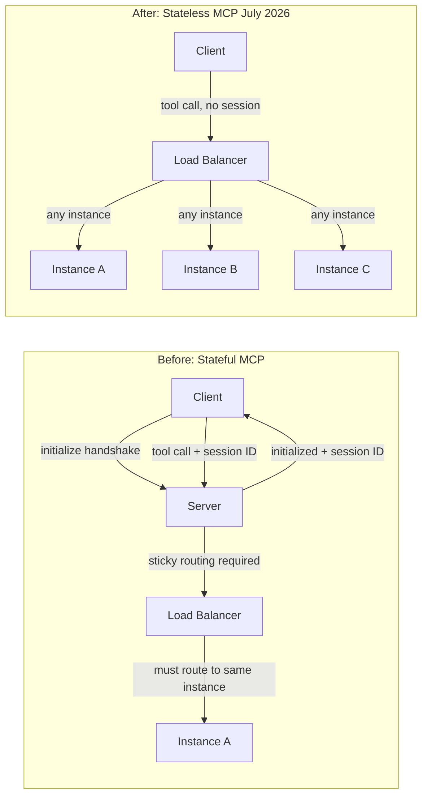

The Model Context Protocol July 2026 release candidate is a significant architectural shift. The headline change: session management is gone. The protocol is now stateless by design.

If you have MCP servers in production today, this affects your deployment architecture, your client implementation, and your understanding of which features to build on going forward. Here's what actually changed and what you need to do about it.



---

## The Core Change: Stateless by Default

The `initialize`/`initialized` handshake — the mechanism that established a session between client and server — has been removed from the protocol entirely.

What this means in practice:

**Before:** Starting an MCP connection required a handshake sequence. The server returned a session identifier. Subsequent requests from that client had to be routed to the same server instance. This meant sticky sessions on your load balancer, shared session stores if you ran multiple instances, or running a single instance that couldn't horizontally scale.

**After:** Each tool call is independent. No handshake, no session ID, no routing constraint. A round-robin load balancer works out of the box. You can scale to any number of instances without shared state.

For teams running MCP servers at scale, this is a significant operational improvement. The complexity of sticky-session load balancing and session store management simply goes away.

### What to Change in Your Servers

If your MCP server implementation currently handles the `initialize` request and tracks session state:

1. Remove the `initialize`/`initialized` handler
2. Move any per-session state to the tool call itself (pass it in parameters) or to an external store keyed on something the client provides
3. Update your load balancer configuration to remove sticky routing
4. Test that your server handles concurrent calls from different clients without shared state issues

---

## What's Deprecated (But Still Works)

Three previously core features are formally deprecated in the RC. They continue to function — this is annotation-only deprecation — but should not be built on for new implementations.

### Roots → Tool Parameters and Resource URIs

**What it was:** A mechanism for the client to expose file system roots to the server, giving the server context about what the client could access.

**Why it's deprecated:** The same information can be passed via tool parameters or resource URIs, which are more explicit and don't require the roots protocol.

**Migration:** If your server uses roots to understand what the client can access, move that information into tool parameters. Instead of relying on the client to expose `/workspace` as a root, have the client pass the relevant path as a parameter to the tool call.

### Sampling → Direct LLM Provider Integration

**What it was:** A mechanism allowing MCP servers to make LLM calls through the client, rather than directly.

**Why it's deprecated:** Direct LLM provider API integration is clearer and more flexible. Routing LLM calls through the client added complexity without clear benefit for most use cases.

**Migration:** If your server uses sampling to make LLM calls, switch to calling the LLM provider API directly from the server.

### Logging → stderr and OpenTelemetry

**What it was:** A protocol-level logging mechanism for servers to send log messages to clients.

**Why it's deprecated:** stderr and OpenTelemetry are the standard answers for logging and observability. A bespoke protocol logging mechanism competes with existing infrastructure rather than integrating with it.

**Migration:** Switch server log output to stderr. Use OpenTelemetry for structured observability.

---

## The Extensions Framework

New in the RC: a formal mechanism for extending the protocol beyond the core specification.

Extensions use reverse-DNS identifiers (`com.example.myextension`), carry independent version numbers, and live in their own repositories with delegated maintainers. This means community-built protocol extensions can be developed, versioned, and governed outside the core MCP repository.

```json
{
  "extensions": [
    {
      "id": "com.anthropic.computer-use",
      "version": "1.2.0",
      "required": false
    },
    {
      "id": "org.opentelemetry.mcp-traces",
      "version": "0.8.1",
      "required": false
    }
  ]
}
```

For extension builders, this creates a stable, governed path for distributing protocol extensions. For extension consumers, reverse-DNS identifiers mean you can identify the maintainer and find the documentation without ambiguity.

---

## Tasks Extension: Redesigned for Statelessness

The Tasks extension — for long-running asynchronous operations — has been redesigned to fit the stateless model.

**Old model:** The server held task state in memory and streamed progress via SSE. This required the client to maintain a connection to the same server instance.

**New model:** When a tool call initiates a long-running operation, the server responds with a task handle. The client then drives progress:

```json
// Initial tool call response — returns a task handle
{
  "task": {
    "id": "task_abc123",
    "status": "running",
    "href": "/tasks/task_abc123"
  }
}

// Client polls for progress
// GET /tasks/task_abc123 or tasks/get tool call

// Client can update or cancel
// tasks/update, tasks/cancel
```

Task state is now stored externally (database, cache) rather than in server memory. Any server instance can respond to `tasks/get` for any task. This is the right design for stateless scale-out.

---

## List Response Caching

A quieter but practically important addition: list responses (`tools/list`, `resources/list`, `prompts/list`) now carry TTL and cache scope metadata modelled on HTTP Cache-Control.

```json
{
  "tools": [...],
  "cache": {
    "ttlMs": 300000,
    "scope": "client"
  }
}
```

This means clients can cache the tool list rather than requesting it on every session initialisation. At scale — many concurrent agents, each starting a session — this reduces load on MCP servers significantly. Implement caching on the client side now if you haven't already.

---

## What This Means for Your Stack

**If you're building new MCP servers:** Build stateless from day one. Don't implement `initialize`/`initialized`. Don't use Roots, Sampling, or Logging. Use the Tasks extension for async operations. Emit to stderr and OpenTelemetry for observability.

**If you have existing MCP servers:** Plan the migration, but don't panic — deprecated features still work. Prioritise removing session management first (the operational benefits are immediate), then migrate away from deprecated features in order of how much you use them.

**If you're running at scale:** The stateless deployment story is the headline improvement. Remove sticky-session routing as soon as your server is stateless-compatible.

---

*Day 4 of 7. Previous: [Beyond Vibe Coding](/posts/beyond-vibe-coding-ai-native-engineering/). Next: [Autonomous PR Agents](/posts/autonomous-pr-agents-reviewing-ai-written-code/)*
