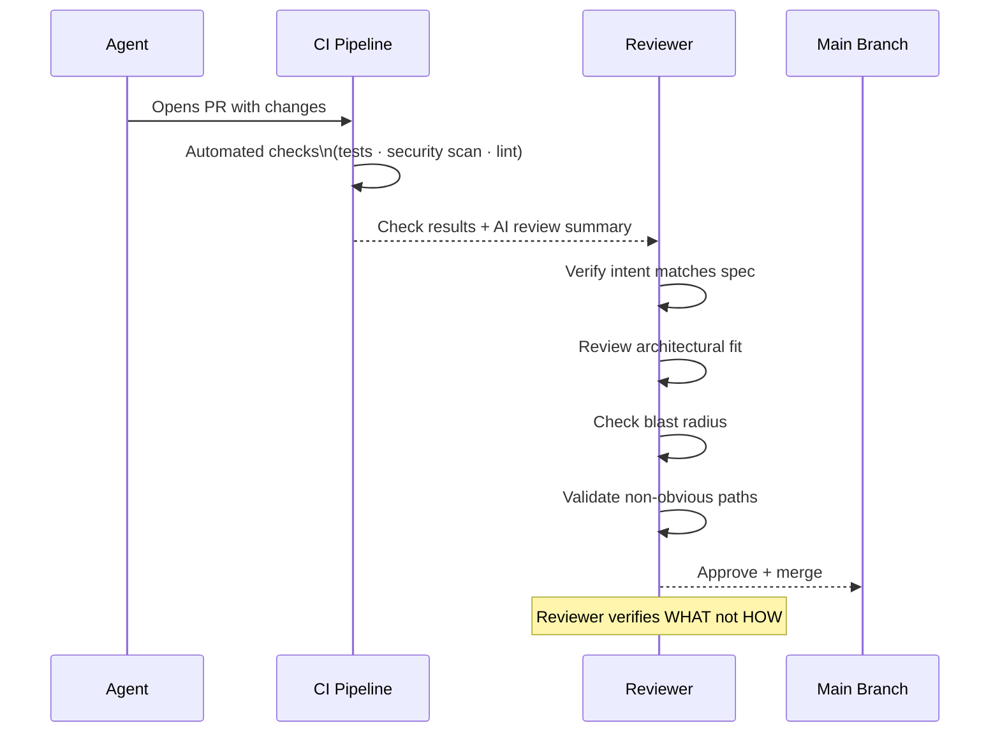

GitHub Engineering's headline says it plainly: agent pull requests are everywhere. The question has shifted from "should we allow AI agents to open PRs?" to "how do we review them well?"

The short answer is that the review process needs to change — not because AI-generated code needs less scrutiny, but because it fails in different ways than human-generated code and requires different review instincts.



---

## How Agent PRs Differ from Human PRs

**The code is often cleaner but less intentional.** AI agents write syntactically correct, stylistically consistent code. They follow patterns they've seen. What they don't have is intent beyond the immediate task. A human writing a caching layer thinks about what else might use it. An agent writing a caching layer implements exactly what was asked for and nothing more — which sounds fine until you realise that "nothing more" means missing the obvious extension points a human would have included.

**The diff is larger and more uniform.** Agents don't get tired, don't cut corners, and don't defer the boring parts. An agent asked to add input validation to an API will add it consistently to every endpoint. The diff is larger than what a human would typically produce in one PR, and the changes are more uniform in style. This is good for correctness; it makes the diff harder to review because there's more of it and it all looks the same.

**The failure modes are specific.** Agent-generated code has characteristic failure modes that differ from human-generated code:
- Missing domain context that isn't in the codebase
- Plausible-but-wrong business logic
- Security issues in generated code that handles user input
- Inconsistency with existing patterns in rarely-accessed files the agent didn't read
- Overconfident handling of edge cases the agent assumed away

**The blame graph is different.** When something goes wrong with human-written code, the commit history and PR conversation tell you what the author was thinking. With agent-written code, the "author" is a model that ran once. The PR description and the specification that drove it are the primary sources of intent.

---

## What to Look for in the Review

### 1. Does the Code Match the Specification?

Before reviewing the code itself, verify that the agent did what was asked. This sounds obvious; it's often skipped.

The agent may have done something slightly different from the spec — taking a shortcut that satisfies the stated requirement while missing the underlying intent, or implementing a plausible interpretation of an ambiguous spec that isn't what was wanted.

Read the spec. Read the PR description. Then look at the diff. Are these the same thing?

### 2. Does the Agent Have the Full Picture?

Agents work with the context they were given. If the spec omitted a constraint, the agent doesn't know about it. If the relevant code was in a file the agent didn't read, the implementation may be inconsistent with it.

Check for:
- Assumptions about how the system works that may not hold
- Missing integration with existing components the agent wasn't shown
- Inconsistency with patterns in areas of the codebase the agent didn't access

This is the review question that requires the most domain knowledge. It can't be automated.

### 3. What's the Blast Radius?

Agent PRs can be large. Before approving a large PR, understand what breaks if it's wrong.

- What does this touch?
- What else depends on what this touches?
- If the most plausible error in this PR occurred in production, what would the impact be?

High blast-radius PRs from agents warrant more scrutiny, tighter rollout (feature flags, staged deployment), and sometimes breaking into smaller PRs before merge.

### 4. Security Review the Generated Code

AI-generated code that handles user input, authentication, authorisation, or external data warrants explicit security review. Not a full security audit on every PR — a focused check on the patterns most likely to be wrong.

```python
# Patterns to specifically look for in agent-generated code:

# 1. SQL queries — does this use parameterised queries or string formatting?
query = f"SELECT * FROM users WHERE email = '{user_input}'"  # BAD
query = "SELECT * FROM users WHERE email = %s"  # GOOD

# 2. File operations — is the path validated against a whitelist?
path = f"/data/{user_supplied_filename}"  # BAD — path traversal
path = os.path.join(SAFE_DIR, os.path.basename(user_supplied_filename))  # BETTER

# 3. Deserialization — is untrusted data being deserialised?
obj = pickle.loads(user_data)  # BAD
obj = json.loads(user_data)  # SAFER, but still needs schema validation
```

The agent won't always get these wrong — but it doesn't have the defensive instinct that experienced engineers develop. Security review fills that gap.

### 5. Are the Tests Testing the Right Things?

If the agent wrote tests, verify they test behaviour rather than implementation. The characteristic agent test failure mode: tests that pass when the code is right and also pass when the code is wrong in the specific ways that matter.

For each test, ask: if the code this test is supposed to catch broke, would this test fail?

---

## Building an Agent PR Review Workflow

A structured review process for agent PRs reduces cognitive load and ensures consistent coverage:

```markdown
## Agent PR Review Checklist

### Before reading the diff
- [ ] Does the PR description accurately describe what changed?
- [ ] Is there a spec/task linked that I can reference?
- [ ] Do the CI checks pass (tests, security scan, lint)?

### Intent verification
- [ ] Does the implementation match the spec intent (not just the literal requirements)?
- [ ] Are there spec ambiguities the agent resolved — are the resolutions correct?

### Contextual correctness
- [ ] Does this integrate correctly with components the agent may not have seen?
- [ ] Are there existing patterns in the codebase this should follow?

### Security (for PRs touching auth, input handling, data access)
- [ ] Input validation present and correct?
- [ ] No SQL/command injection vectors?
- [ ] File access properly sandboxed?
- [ ] Sensitive data handled correctly?

### Blast radius
- [ ] What's the impact if the most likely error in this PR occurs in production?
- [ ] Is staged rollout or a feature flag warranted?

### Test quality
- [ ] Tests verify behaviour, not implementation?
- [ ] Edge cases from the spec are tested?
```

---

## The Underlying Principle

Reviewing agent PRs well requires shifting from "does this code look right?" to "does this code do the right thing?" The code often looks right — agents write clean, consistent code. The question is whether it does what the system actually needs, handles the cases that matter, and integrates cleanly with what exists.

That shift is fundamentally a domain knowledge problem, not a code reading problem. The reviewers who add the most value on agent PRs are the ones who understand the system, the business domain, and the failure modes — not necessarily the ones who are best at reading code.

---

*Day 5 of 7. Previous: [MCP Goes Stateless](/posts/mcp-goes-stateless-july-2026-rc/).*
