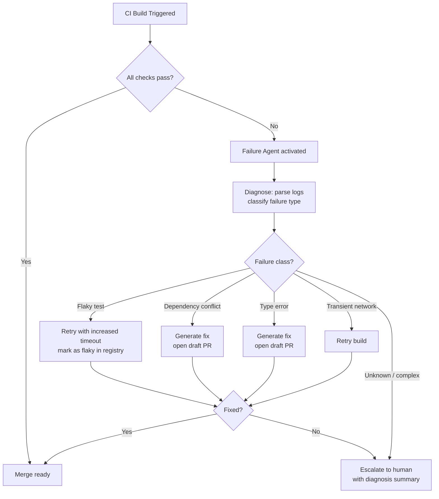

CI pipelines fail for predictable reasons. Flaky tests. Dependency version conflicts. Transient network errors. Environment drift. Type errors introduced by an unrelated merge. Most failures are diagnosable from the logs; most are fixable by an engineer with ten minutes and the right context.

Agentic CI takes that diagnosable, fixable class of failure and handles it without the engineer. Not all failures — autonomous systems shouldn't be pushing code to unblock builds without human review on consequential changes. But the large category of mechanical failures that interrupt engineers unnecessarily is a legitimate target for automation.



---

## What Agentic CI Actually Does

The pattern isn't novel — it's the same observe-reason-act loop as any agent. What makes it useful in CI is the specificity of the domain: build failures have structured outputs (logs, exit codes, test results), well-defined failure modes, and clear success criteria.

A CI failure agent:

1. **Receives failure context** — logs, the failing step, the git diff that triggered the build
2. **Classifies the failure** — is this a test failure, a linting error, a type error, a dependency issue, a transient infra failure?
3. **Decides on the response** — retry, auto-fix, or escalate
4. **Executes the response** — and verifies it worked

The classification step is where most of the value is. Even if the agent doesn't fix the failure, correctly classifying it and summarising the relevant context saves the engineer significant time.

---

## Building the Failure Classifier

```python
import anthropic
import json
from dataclasses import dataclass
from enum import Enum

class FailureType(Enum):
    FLAKY_TEST = "flaky_test"
    TYPE_ERROR = "type_error"
    DEPENDENCY_CONFLICT = "dependency_conflict"
    LINT_ERROR = "lint_error"
    TRANSIENT_INFRA = "transient_infra"
    BUILD_ERROR = "build_error"
    UNKNOWN = "unknown"

@dataclass
class FailureDiagnosis:
    failure_type: FailureType
    confidence: float
    summary: str
    relevant_log_lines: list[str]
    suggested_action: str
    can_auto_fix: bool

def classify_ci_failure(
    logs: str,
    failing_step: str,
    git_diff: str,
    client: anthropic.Anthropic
) -> FailureDiagnosis:

    response = client.messages.create(
        model="claude-sonnet-4-6",
        max_tokens=1024,
        messages=[{
            "role": "user",
            "content": f"""Analyse this CI failure and classify it.

Failing step: {failing_step}

Recent git diff (truncated):
{git_diff[:2000]}

Relevant log output (last 100 lines):
{chr(10).join(logs.splitlines()[-100:])}

Return JSON with:
- failure_type: one of {[t.value for t in FailureType]}
- confidence: 0.0 to 1.0
- summary: one sentence explaining the failure
- relevant_log_lines: the 3-5 most diagnostic log lines
- suggested_action: what to do to fix it
- can_auto_fix: boolean — can this be fixed without human review?"""
        }]
    )

    data = json.loads(response.content[0].text)
    return FailureDiagnosis(
        failure_type=FailureType(data["failure_type"]),
        confidence=data["confidence"],
        summary=data["summary"],
        relevant_log_lines=data["relevant_log_lines"],
        suggested_action=data["suggested_action"],
        can_auto_fix=data["can_auto_fix"]
    )
```

---

## Auto-Fix Strategies by Failure Type

### Transient Failures: Retry

Transient network errors, flaky DNS, intermittent test infrastructure — retry. No code change needed.

```python
def handle_transient_failure(build: Build, diagnosis: FailureDiagnosis) -> FixResult:
    if diagnosis.failure_type == FailureType.TRANSIENT_INFRA:
        result = build.retry(delay_seconds=30)
        return FixResult(
            success=result.passed,
            action_taken="retried_build",
            description=f"Retried after transient infra failure: {diagnosis.summary}"
        )
```

### Flaky Tests: Retry and Flag

Retry the build. Separately, log the test as a flaky candidate for the flaky test registry.

```python
def handle_flaky_test(build: Build, diagnosis: FailureDiagnosis, flaky_registry) -> FixResult:
    # Retry with longer timeout
    result = build.retry(timeout_multiplier=1.5)

    # Record the flaky candidate regardless of retry outcome
    flaky_registry.record_candidate(
        test_name=extract_test_name(diagnosis.relevant_log_lines),
        build_id=build.id,
        failure_signature=diagnosis.summary
    )

    return FixResult(
        success=result.passed,
        action_taken="retried_with_flaky_flag",
        description=f"Retried (flaky candidate recorded): {diagnosis.summary}"
    )
```

### Type Errors and Lint: Generate Fix

For mechanical errors with deterministic fixes, generate a fix and open a draft PR.

```python
def handle_fixable_error(
    build: Build,
    diagnosis: FailureDiagnosis,
    repo,
    client: anthropic.Anthropic
) -> FixResult:

    # Generate the fix
    fix_response = client.messages.create(
        model="claude-sonnet-4-6",
        max_tokens=2048,
        messages=[{
            "role": "user",
            "content": f"""Fix this CI failure. Return ONLY a JSON patch with file changes.

Failure: {diagnosis.summary}
Relevant lines: {diagnosis.relevant_log_lines}
Suggested fix: {diagnosis.suggested_action}

Current file content:
{repo.read_relevant_files(diagnosis.relevant_log_lines)}

Return: {{"file_path": "...", "old_content": "...", "new_content": "..."}}"""
        }]
    )

    patch = json.loads(fix_response.content[0].text)

    # Create a draft PR — do not auto-merge
    pr = repo.create_draft_pr(
        branch=f"ci-autofix/{build.id}",
        title=f"[CI Auto-fix] {diagnosis.summary}",
        body=f"""## Automated CI fix

**Build:** {build.url}
**Failure type:** {diagnosis.failure_type.value}
**Diagnosis:** {diagnosis.summary}

**Suggested action:** {diagnosis.suggested_action}

---
This PR was generated automatically. Review before merging.
        """,
        patch=patch
    )

    return FixResult(
        success=True,
        action_taken="draft_pr_created",
        description=f"Draft fix PR opened: {pr.url}"
    )
```

---

## The Escalation Path

Auto-fix applies to a specific class of failure: mechanical, well-understood, low blast radius. Everything else escalates to a human — but with a structured diagnosis rather than a raw log dump.

```python
def escalate_to_human(
    build: Build,
    diagnosis: FailureDiagnosis,
    notify: NotificationService
) -> None:

    message = f"""🔴 CI failure requires human attention

**Build:** {build.url}
**PR:** {build.pr_url}

**Diagnosis:** {diagnosis.summary}
**Failure type:** {diagnosis.failure_type.value}
**Confidence:** {diagnosis.confidence:.0%}

**Relevant log lines:**
{chr(10).join(f'  {line}' for line in diagnosis.relevant_log_lines)}

**Suggested action:** {diagnosis.suggested_action}

*(Automated fix not attempted — confidence below threshold or failure type requires human review)*"""

    notify.send(
        channel=build.pr.author.notification_channel,
        message=message,
        urgency="normal" if build.pr.is_draft else "high"
    )
```

The diagnosis in the escalation message is the primary value of the system even when auto-fix doesn't apply. An engineer who arrives to a build failure with a structured diagnosis fixes it faster than one who starts from raw logs.

---

## What Not to Auto-Fix

Clear boundaries on what the CI agent should not touch without human review:

- **Test logic changes** — tests are the specification of expected behaviour; changing them to make them pass is not a fix
- **Security-relevant code** — authentication, authorisation, data handling
- **Database migrations** — irreversible changes to production data structures
- **External API integrations** — changes that affect what you send to third parties
- **Any change affecting more than N files** — large changes have unpredictable blast radius

These rules go in the agent's system prompt and in explicit guards in the code. The system should be able to explain why it's escalating rather than fixing.

---

## Measuring the System

Track these to know if your agentic CI is working:

- **Classification accuracy** — percentage of failures correctly classified (measure against human resolution)
- **Auto-fix success rate** — percentage of auto-fix attempts that result in a passing build
- **Mean time to resolution** — with and without the agent, by failure type
- **Escalation precision** — are escalated failures genuinely requiring human attention, or is the agent being too conservative?

The goal isn't to eliminate human involvement in CI failures. It's to ensure human attention goes to failures that actually need it.

---

*Day 6 of 7. Previous: [Autonomous PR Agents](/posts/autonomous-pr-agents-reviewing-ai-written-code/).*
