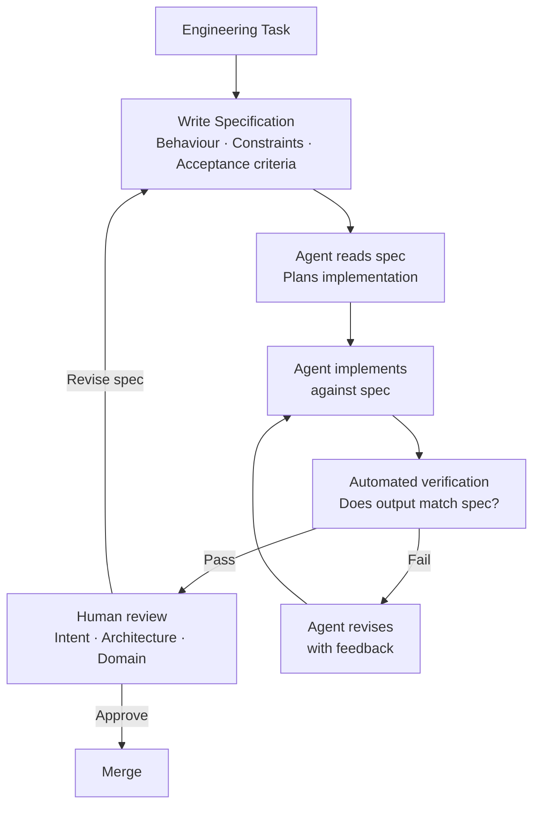

The most durable pattern emerging from teams using AI coding agents seriously: the engineers who get the most consistent results write specifications first and let the agent interpret them, rather than writing prompts and iterating until the output looks right.

This isn't a new idea — specification-driven development predates AI. What's changed is that AI agents can now act on well-written specifications directly, collapsing the distance between "here's what this should do" and "here's working code."



---

## What Makes a Spec Executable

An executable specification has three properties:

**Completeness** — it covers the behaviour space the agent needs to implement. Gaps in the spec become either assumptions (often wrong) or questions (which require back-and-forth).

**Verifiability** — it can be tested. "The system should be fast" is not verifiable. "The p95 latency for search queries must be under 200ms" is.

**Unambiguity** — it has one correct interpretation. "The API should return relevant results" is ambiguous. "The API must return results in descending order of relevance score, returning a maximum of 20 results, with an empty array when no results match" is not.

---

## The AGENTS.md Pattern

One of the more useful conventions emerging from teams doing this at scale: an `AGENTS.md` file at the repository root that gives AI agents persistent context about the codebase.

```markdown
# AGENTS.md — Context for AI coding agents

## Repository Overview
This is a Python FastAPI service for [purpose]. The main entry point is
`src/main.py`. Tests use pytest and are in `tests/`.

## Architecture Decisions
- Authentication: JWT tokens, validated in `src/middleware/auth.py`
- Database: PostgreSQL via SQLAlchemy async. Never use raw SQL — always use the ORM.
- Error handling: Raise domain exceptions from `src/exceptions.py`. Never catch
  and swallow exceptions silently.
- Logging: Use `src/logging.py:get_logger(__name__)`. Never use `print()`.

## Code Patterns
- New API endpoints: follow the pattern in `src/routers/users.py`
- New database models: follow `src/models/user.py`. Always include `created_at` and `updated_at`.
- New tests: follow `tests/test_users.py`. Use the fixtures in `tests/conftest.py`.

## What NOT to do
- Do not modify `src/config.py` — configuration is managed externally
- Do not add new dependencies without noting them in the spec
- Do not write tests that require network access — use the mock client in conftest

## Running Tests
`pytest tests/ -v`

## Type Checking
`mypy src/ --strict`
```

This file is read by the agent before each task and gives it the context that would otherwise be missing. It's the difference between an agent that works correctly in your codebase from day one and one that rediscovers your conventions through trial and error.

---

## Writing a Task Specification

A good task spec has four sections:

```markdown
# Spec: Rate Limiting for Public API Endpoints

## Behaviour
- Apply rate limiting to all endpoints under `/api/v1/public/`
- Limit: 100 requests per minute per API key
- Limit: 1000 requests per hour per API key  
- When limit is exceeded, return HTTP 429 with a JSON body:
  `{"error": "rate_limit_exceeded", "retry_after_seconds": N}`
- Include headers in all responses: `X-RateLimit-Remaining`, `X-RateLimit-Reset`

## Constraints
- Rate limit counters must survive service restarts (use Redis, not in-memory)
- Redis key format: `ratelimit:{api_key}:{window}` where window is minute or hour
- Do not rate limit internal endpoints (under `/api/v1/internal/`)
- Rate limit middleware must not add more than 5ms p99 latency

## Dependencies
- Redis client: already configured in `src/cache.py:get_redis_client()`
- API key extraction: use `src/middleware/auth.py:extract_api_key(request)`
- No new dependencies should be required

## Acceptance Criteria
- [ ] 100th request per minute returns 429
- [ ] 101st request per minute returns 429 with correct retry_after
- [ ] Request counter resets after the window expires
- [ ] Headers present on all responses, including non-rate-limited ones
- [ ] Internal endpoints bypass rate limiting
- [ ] Redis unavailability does not break the API (fail open with warning log)
- [ ] Tests cover all acceptance criteria above
```

This spec can be handed to an agent directly. The agent knows exactly what to build, what constraints to satisfy, how to verify it worked, and what to use from the existing codebase.

---

## The Specification Workflow

```python
def run_spec_driven_agent(spec_path: str, repo_path: str) -> AgentResult:
    client = anthropic.Anthropic()

    # Load context
    agents_md = read_file(f"{repo_path}/AGENTS.md")
    spec = read_file(spec_path)

    system_prompt = f"""You are an AI coding agent implementing a specification.

Repository context:
{agents_md}

Your task:
1. Read the specification carefully
2. Identify the files to create or modify
3. Implement the specification completely
4. Write tests for all acceptance criteria
5. Report what you've done and what (if anything) you couldn't implement

Do not implement anything beyond what the specification requires.
Flag any spec ambiguities rather than silently choosing an interpretation."""

    messages = [{"role": "user", "content": f"Implement this specification:\n\n{spec}"}]

    # Agentic loop
    while True:
        response = client.messages.create(
            model="claude-sonnet-4-6",
            max_tokens=8192,
            system=system_prompt,
            tools=get_repo_tools(repo_path),
            messages=messages
        )

        messages.append({"role": "assistant", "content": response.content})

        if response.stop_reason == "end_turn":
            return AgentResult(
                success=True,
                summary=extract_text(response.content),
                files_modified=get_modified_files(repo_path)
            )

        # Process tool calls
        tool_results = process_tool_calls(response.content, repo_path)
        messages.append({"role": "user", "content": tool_results})
```

---

## Verification Against the Spec

After the agent implements, verify against the acceptance criteria — not just run the tests.

```python
def verify_against_spec(spec: str, agent_result: AgentResult, client) -> VerificationResult:
    response = client.messages.create(
        model="claude-sonnet-4-6",
        max_tokens=1024,
        messages=[{
            "role": "user",
            "content": f"""Verify that this implementation satisfies the specification.

Specification:
{spec}

What the agent implemented:
{agent_result.summary}

Files modified:
{agent_result.files_modified}

For each acceptance criterion in the spec, determine:
1. Is there a test for it?
2. Does the implementation satisfy it?
3. Is there anything in the spec that was NOT implemented?

Return a structured assessment."""
        }]
    )

    return parse_verification(response.content[0].text)
```

This is a second model call that checks the agent's work against the spec. It catches cases where the agent implemented the spec's literal words but missed the intent, or where an acceptance criterion was overlooked.

---

## Why This Scales

The prompt-and-iterate approach doesn't scale because it depends on the engineer knowing exactly what they want well enough to recognise it in AI output. When the task is complex, the engineer doesn't always know exactly what they want until they see something wrong.

Specification-driven development inverts this: the engineer defines what correct looks like before generation starts. This scales because:

- The spec is reusable — give the same spec to a different model, a different agent, or a human and get comparable results
- The spec is auditable — compliance can be checked programmatically and in review
- The spec is the documentation — it describes what the code does more precisely than most inline comments
- The spec accumulates — a library of tested specs becomes a catalogue of what your systems are capable of

The investment is writing better specifications. The return is generation that's more reliable, review that's more focused, and code that's more maintainable.

---

*Day 7 of 7. Previous: [Self-Healing CI](/posts/self-healing-ci-agentic-pipelines/).*

*Series: [Harness Engineering](/posts/harness-engineering-the-ai-control-plane/) · [Context Engineering](/posts/context-engineering-not-prompt-engineering/) · [Beyond Vibe Coding](/posts/beyond-vibe-coding-ai-native-engineering/) · [MCP Goes Stateless](/posts/mcp-goes-stateless-july-2026-rc/) · [Autonomous PR Agents](/posts/autonomous-pr-agents-reviewing-ai-written-code/) · [Self-Healing CI](/posts/self-healing-ci-agentic-pipelines/)*
